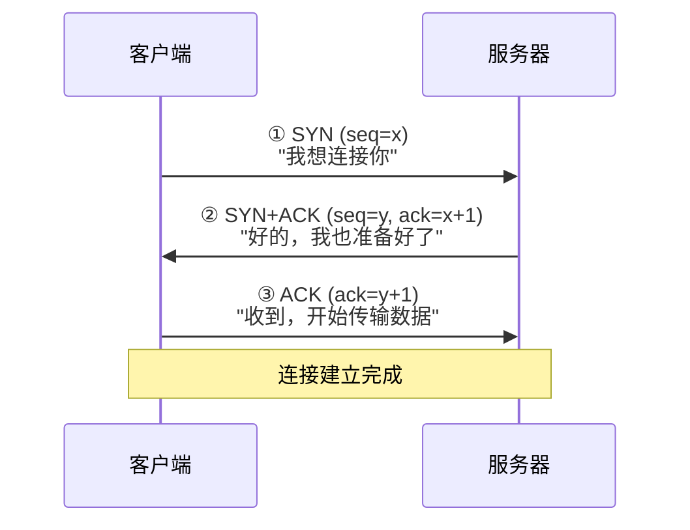

# 基本网络概念详细知识点剖析

## 📑 目录

- [一、网络的核心定义与本质](#一网络的核心定义与本质)
- [二、网络的分类（按核心维度划分）](#二网络的分类按核心维度划分)
- [三、网络的核心组成部分（硬件 + 软件）](#三网络的核心组成部分硬件--软件)
- [四、核心网络协议（TCP/IP协议簇）](#四核心网络协议tcpip协议簇)
- [五、网络的核心功能](#五网络的核心功能)
- [六、常见网络术语（易混淆、必掌握）](#六常见网络术语易混淆必掌握)
- [七、易错点辨析（避免踩坑）](#七易错点辨析避免踩坑)
- [八、知识体系速查表](#八知识体系速查表)
- [九、总结](#九总结)

---

## 一、网络的核心定义与本质

计算机网络，本质是将**地理上分散、具有独立功能的多台计算机**（及其他网络设备），通过**通信线路和通信设备**连接起来，在网络操作系统、网络协议及网络管理软件的协调下，实现**资源共享**和**信息传递**的系统。

### 核心关键点

| 序号 | 关键点 | 说明 |
|:----:|--------|------|
| ① | 多台独立设备 | 不是单台计算机，而是多台具备独立处理能力的设备互联 |
| ② | 连接介质+协议 | 硬件（网线/光纤/无线）+ 软件（TCP/IP等协议）缺一不可 |
| ③ | 资源共享 | 文件、硬件（打印机）、软件等资源的共用 |
| ④ | 信息传递 | 数据、消息在不同设备间的传输 |

> 网络的价值在于**"连接"与"协同"**——单台设备的功能有限，通过网络将设备联动，可突破地理限制、提升效率。

---

## 二、网络的分类（按核心维度划分）

### （一）按地理覆盖范围划分（最常用）

| 网络类型 | 英文 | 覆盖范围 | 典型场景 | 核心特点 |
|----------|------|----------|----------|----------|
| **局域网** | LAN | 1km以内 | 家庭、办公室、学校机房 | 速率高、延迟低、成本低 |
| **城域网** | MAN | 1km~100km | 城市宽带骨干网 | 速率介于LAN和WAN之间 |
| **广域网** | WAN | 100km以上 | 互联网、企业跨区域专网 | 速率较低、延迟较高 |
| **个人区域网** | PAN | 10m以内 | 蓝牙耳机、智能手表 | 短距离无线 |

### （二）按传输介质划分

| 介质类型 | 优点 | 缺点 | 适用场景 |
|----------|------|------|----------|
| 双绞线（网线） | 成本低、部署方便 | 传输距离有限(≤100m) | 家庭、办公室局域网 |
| 光纤 | 速率高、距离远、抗干扰 | 成本高、易折断 | 骨干网、跨楼宇连接 |
| 无线(WiFi/4G/5G) | 灵活、移动方便 | 稳定性受环境干扰 | 移动设备、不方便布线的场景 |

### （三）按拓扑结构划分

| 拓扑类型 | 连接方式 | 优点 | 缺点 | 现状 |
|----------|----------|------|------|------|
| **星型拓扑** | 所有设备连接到核心设备（交换机） | 结构简单、单点故障不影响其他 | 核心设备故障导致全网瘫痪 | **最常用** |
| **总线型拓扑** | 所有设备连接到一条主干线缆 | 成本低、布线简单 | 总线故障全网瘫痪 | 几乎淘汰 |
| **环型拓扑** | 设备依次连接成闭合环 | 结构稳定、传输延迟均匀 | 单点故障导致全网中断 | 很少使用 |
| **网状拓扑** | 设备之间多对多连接 | 稳定性高、无单点故障 | 布线复杂、成本高 | 广域网骨干网 |

### （四）按使用对象划分

| 类型 | 说明 | 示例 |
|------|------|------|
| **公用网络** | 面向公众开放，付费使用 | 互联网、电信宽带、5G网络 |
| **专用网络** | 仅限特定群体使用，安全性高 | 企业内部专网、政府专网 |

---

## 三、网络的核心组成部分（硬件 + 软件）

### （一）硬件设备

#### 核心连接设备详解

| 设备 | 核心功能 | 通俗理解 | 常见场景 |
|------|----------|----------|----------|
| **交换机** | 局域网内转发数据 | 局域网的"数据中转站" | 办公室多台电脑互连 |
| **路由器** | 连接不同网络、路由选择 | 网络的"交通指挥" | 家庭/企业连接互联网 |
| **无线AP** | 有线→无线信号转换 | WiFi信号发射器 | 商场、办公室无线覆盖 |
| **调制解调器** | 数字信号↔模拟信号 | 宽带"翻译官" | 家用宽带连接 |

### （二）软件系统

| 软件类型 | 作用 | 典型代表 |
|----------|------|----------|
| **网络操作系统** | 管理网络资源、协调设备 | Windows Server、Linux、路由器的IOS |
| **网络协议** | 数据传输规则（核心） | TCP/IP协议簇 |
| **网络应用软件** | 用户使用网络的工具 | 浏览器、微信、邮件客户端 |

---

## 四、核心网络协议（TCP/IP协议簇）

### 分层架构总览

```
应用层（HTTP、HTTPS、FTP、DNS、SMTP）
    ↓
传输层（TCP可靠传输 / UDP不可靠传输）
    ↓
网络层（IP协议、ICMP）
    ↓
网络接口层（以太网协议）
```

### 各层核心功能

| 层级 | 核心功能 | 核心协议 | 后端开发关联 |
|------|----------|----------|--------------|
| **应用层** | 面向用户的具体应用服务 | HTTP、HTTPS、FTP、DNS、SMTP | RESTful接口、API调用 |
| **传输层** | 端到端的可靠/高效传输 | TCP（可靠）、UDP（高效） | 连接管理、超时控制 |
| **网络层** | 路由选择、IP寻址 | IP、ICMP（ping命令） | 服务器IP配置、网络排查 |
| **网络接口层** | 物理介质信号传输 | 以太网、WiFi | 网卡、网线、交换机 |

### 核心协议补充细节

#### IP地址

| 类型 | 位数 | 格式 | 示例 |
|------|------|------|------|
| **IPv4** | 32位 | 点分十进制 | `192.168.1.1` |
| **IPv6** | 128位 | 冒分十六进制 | `2001:0db8:85a3::8a2e:0370:7334` |

#### DNS解析（域名 → IP地址）

```
用户输入: www.baidu.com  →  DNS服务器查询  →  返回IP: 110.242.68.66  →  浏览器访问目标服务器
```

> DNS相当于"网络通讯录"，将人类易记的域名转换为机器识别的IP地址。

#### TCP三次握手（建立可靠连接）



---

## 五、网络的核心功能

| 功能 | 说明 | 后端典型场景 |
|------|------|--------------|
| **资源共享** | 硬件/软件/数据共享 | 多台服务器共用一台打印机；数据库共享 |
| **信息传递** | 设备间数据传输 | 即时通信、邮件、网页浏览 |
| **分布式处理** | 多台计算机协同完成任务 | 大型网站的服务器集群、云计算 |
| **负载均衡** | 流量分配到多台设备 | Nginx分发请求到多台后端服务器 |
| **容错与冗余** | 多路径备份，避免单点故障 | 广域网骨干网备份线路 |

---

## 六、常见网络术语（易混淆、必掌握）

| 术语 | 定义 | 单位 | 通俗理解 |
|------|------|------|----------|
| **带宽** | 单位时间可传输的数据量 | Mbps/Gbps | 水管粗细，决定下载速度 |
| **延迟** | 数据从源到目标的传输时间 | 毫秒(ms) | 响应快慢，影响游戏/通话体验 |
| **网关** | 连接不同网络的关口设备 | — | 局域网访问外网的"出口" |
| **子网掩码** | 区分IP地址的网络位和主机位 | — | 判断两台设备是否在同一局域网 |
| **防火墙** | 保护网络安全的设备/软件 | — | 阻止非法访问，允许合法流量 |

> **关键结论**：带宽影响"传输速度"（下载快慢），延迟影响"响应速度"（游戏流畅度）。**高带宽 ≠ 低延迟**。

---

## 七、易错点辨析（避免踩坑）

| 误区 | 正解 |
|------|------|
| ❌ "网络 = 互联网" | ✅ 互联网是最大的广域网，网络包含局域网、城域网、广域网等 |
| ❌ "交换机 = 路由器" | ✅ 交换机连接局域网内设备；路由器连接不同网络 |
| ❌ "TCP比UDP更好" | ✅ 按需使用：可靠传输用TCP，实时性要求高用UDP |
| ❌ "IP地址是固定的" | ✅ 家用设备IP通常是动态的（DHCP分配）；服务器IP通常是静态的 |
| ❌ "带宽越高，延迟越低" | ✅ 二者无直接关联，高带宽也可能高延迟 |

---

## 八、知识体系速查表

### 网络分类速查

| 维度 | 分类 |
|------|------|
| 地理范围 | LAN → MAN → WAN → PAN |
| 传输介质 | 有线 ↔ 无线 |
| 拓扑结构 | 星型 → 总线型 → 环型 → 网状 |
| 使用对象 | 公用网络 ↔ 专用网络 |

### 硬件设备速查

| 设备 | 一句话概括 |
|------|-----------|
| 交换机 | 局域网内的数据中转站 |
| 路由器 | 网络之间的交通指挥 |
| 无线AP | 有线信号→WiFi信号 |
| 调制解调器 | 数字信号与模拟信号的翻译官 |

### 协议分层速查

| 层级 | 核心协议 | 一句话概括 |
|------|----------|-----------|
| 应用层 | HTTP/DNS/FTP | 具体应用服务 |
| 传输层 | TCP/UDP | 可靠/高效传输 |
| 网络层 | IP/ICMP | 寻址与路由 |
| 网络接口层 | 以太网/WiFi | 物理介质传输 |

---

## 九、总结

| 核心要点 | 记忆口诀 |
|----------|----------|
| 网络本质：多台设备 + 连接介质 + 协议 + 共享/传递 | "硬件搭台，协议唱戏" |
| 协议分层：应用→传输→网络→接口 | "应传网接" |
| TCP vs UDP：可靠用TCP，实时用UDP | "要稳选TCP，要快选UDP" |
| 带宽 vs 延迟：带宽看"量"，延迟看"时" | "带宽管快慢，延迟管早晚" |

---

## 📖 相关阅读

- [计算机网络核心知识点](./计算机网络核心知识点.md)
- [计算机网络 核心知识点](./计算机网络%20核心知识点.md)
- [计算机网络相关技术](./计算机网络相关技术.md)
- [IP相关核心知识点](./IP相关核心知识点.md)
- [计算机网络系统学习指南](./计算机网络系统学习指南.md)
- [计算机网络系统学习大纲](./计算机网络系统学习大纲.md)
