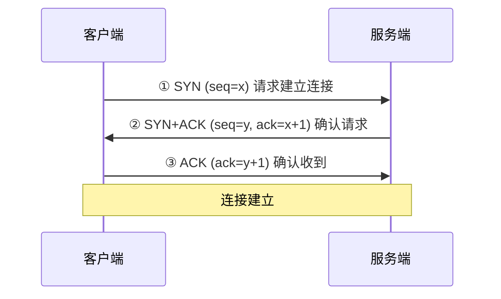
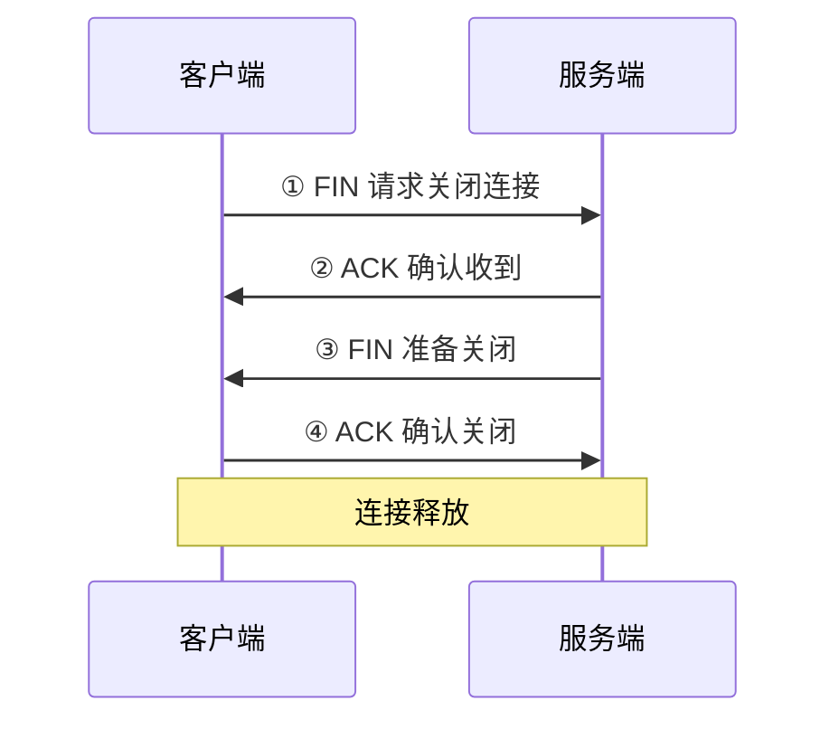

# Java后端开发视角下计算机网络（自顶向下）：运输层深度剖析（理论+实战）

## 📑 目录

- [一、前言：运输层在Java后端网络通信中的核心定位](#一前言运输层在java后端网络通信中的核心定位)
- [二、运输层核心理论（自顶向下视角，Java后端必懂）](#二运输层核心理论自顶向下视角java后端必懂)
- [三、Java后端实战：运输层协议的应用与优化](#三java后端实战运输层协议的应用与优化)
- [四、核心总结与Java后端开发启示](#四核心总结与java后端开发启示)
- [五、拓展思考（Java后端面试高频）](#五拓展思考java后端面试高频)

---

## 一、前言：运输层在Java后端网络通信中的核心定位

自顶向下的计算机网络体系中，运输层处于应用层与网络层之间，是"端到端通信"的核心枢纽——对上，为Java后端应用（如Spring Boot接口、RPC框架、消息队列）提供可靠/高效的通信服务；对下，依托网络层的IP地址完成"主机寻址"，进一步实现"进程寻址"，解决网络层无法区分同一主机上不同应用进程的问题。

> 对于Java后端开发而言，运输层的核心价值是"屏蔽底层网络的复杂性"：我们无需关注IP路由、数据链路传输等细节，只需通过Socket、Netty等工具，基于运输层协议（TCP/UDP）就能实现跨主机的通信。

---

## 二、运输层核心理论（自顶向下视角，Java后端必懂）

运输层的核心目标是"为应用层提供端到端的通信服务"，核心解决两个核心问题：
1. 如何区分同一主机上的不同应用进程（进程寻址）
2. 如何保障通信的可靠性、高效性（协议设计）

### 2.1 运输层的核心作用

从自顶向下的层级衔接来看，运输层的作用主要体现在3点：

| 作用 | 说明 |
|------|------|
| **进程寻址** | 通过"端口号"解决进程寻址问题，端口号与IP地址组合形成Socket地址（IP:端口） |
| **服务抽象** | 提供两种核心服务：面向连接的可靠服务（TCP）、无连接的高效服务（UDP） |
| **差错控制与流量控制** | 通过差错检测、重传机制、流量控制，为应用层提供可靠的通信保障 |

### 2.2 核心协议：TCP与UDP

#### UDP协议（用户数据报协议）

| 特性 | 说明 |
|------|------|
| 无连接 | 通信前无需建立连接，延迟极低 |
| 不可靠 | 不保证数据接收顺序、不保证数据一定能到达 |
| 面向数据报 | 数据以"数据报"为单位传输，最大65535字节 |
| 开销小 | UDP头部仅8字节 |

**Java后端适用场景**：日志采集、实时监控、视频/语音通话、广播通信

#### TCP协议（传输控制协议）

| 特性 | 说明 |
|------|------|
| 面向连接 | 通过"三次握手"建立连接，"四次挥手"释放连接 |
| 可靠传输 | 校验和、确认应答（ACK）、序号与确认号、超时重传四大机制 |
| 面向字节流 | 数据以"字节流"为单位传输，无固定大小限制 |
| 流量控制 | 通过"滑动窗口"机制控制发送速率 |
| 拥塞控制 | 慢启动、拥塞避免、快重传、快恢复四个阶段 |

**Java后端适用场景**：HTTP接口、RPC通信、数据库连接、文件传输

#### TCP与UDP核心区别

| 对比维度 | TCP协议 | UDP协议 | Java后端选型建议 |
|----------|---------|---------|------------------|
| 连接方式 | 面向连接（三次握手/四次挥手） | 无连接 | 需要稳定通信选TCP，追求速度选UDP |
| 可靠性 | 可靠（确认、重传、排序） | 不可靠（无确认、无重传） | 支付、核心业务接口选TCP |
| 传输单位 | 字节流 | 数据报 | 大文件选TCP，小数据包选UDP |
| 开销 | 大（头部20-60字节） | 小（头部8字节） | 高并发低延迟选UDP |
| 适用场景 | HTTP、RPC、数据库、文件传输 | 日志、监控、视频/语音 | 核心场景优先TCP |

### 2.3 运输层核心机制

#### 端口号机制

- 端口号范围：0-65535
- 0-1023：知名端口（如80/HTTP、443/HTTPS、3306/MySQL）
- 1024-49151：注册端口
- 49152-65535：临时端口（Java后端客户端通信时随机分配）

#### TCP三次握手



> **核心目的**：确保通信双方的发送和接收能力正常，避免"无效连接"

#### TCP四次挥手



#### TCP滑动窗口

- **流量控制**：接收方通过告知发送方"窗口大小"，控制发送速率
- **拥塞控制**：当网络出现拥塞时，TCP动态调整发送速率（慢启动→拥塞避免→快重传→快恢复）

---

## 三、Java后端实战：运输层协议的应用与优化

### 3.1 场景1：Java原生Socket编程

#### TCP Socket实战

```java
// 服务器端
public class TcpServer {
    public static void main(String[] args) throws IOException {
        ServerSocket serverSocket = new ServerSocket(8888);
        System.out.println("TCP服务器已启动，监听端口8888...");
        while (true) {
            Socket clientSocket = serverSocket.accept();
            System.out.println("客户端连接成功：" + clientSocket.getInetAddress());
            try (InputStream is = clientSocket.getInputStream();
                 OutputStream os = clientSocket.getOutputStream();
                 BufferedReader br = new BufferedReader(new InputStreamReader(is));
                 PrintWriter pw = new PrintWriter(os, true)) {
                String request = br.readLine();
                System.out.println("收到客户端请求：" + request);
                pw.println("服务器已收到请求，响应：" + request);
            } catch (IOException e) {
                e.printStackTrace();
            } finally {
                clientSocket.close();
            }
        }
    }
}
```

```java
// 客户端
public class TcpClient {
    public static void main(String[] args) throws IOException {
        Socket socket = new Socket("127.0.0.1", 8888);
        try (InputStream is = socket.getInputStream();
             OutputStream os = socket.getOutputStream();
             BufferedReader br = new BufferedReader(new InputStreamReader(is));
             PrintWriter pw = new PrintWriter(os, true)) {
            String request = "Hello TCP Server!";
            pw.println(request);
            System.out.println("客户端发送请求：" + request);
            String response = br.readLine();
            System.out.println("收到服务器响应：" + response);
        } catch (IOException e) {
            e.printStackTrace();
        } finally {
            socket.close();
        }
    }
}
```

**TCP优化建议**：
- 避免频繁创建/关闭连接（使用连接池）
- 调整缓冲区大小（`setSendBufferSize` / `setReceiveBufferSize`）
- 避免阻塞式IO（高并发场景使用Netty）

#### UDP Socket实战

```java
// UDP服务器
public class UdpServer {
    public static void main(String[] args) throws Exception {
        DatagramSocket datagramSocket = new DatagramSocket(9999);
        System.out.println("UDP服务器已启动，监听端口9999...");
        byte[] buffer = new byte[65535];
        DatagramPacket packet = new DatagramPacket(buffer, buffer.length);
        while (true) {
            datagramSocket.receive(packet);
            String data = new String(packet.getData(), 0, packet.getLength());
            System.out.println("收到UDP数据：" + data + "，来自：" + packet.getAddress());
        }
    }
}
```

```java
// UDP客户端
public class UdpClient {
    public static void main(String[] args) throws Exception {
        DatagramSocket datagramSocket = new DatagramSocket();
        String data = "Hello UDP Server!";
        byte[] buffer = data.getBytes();
        DatagramPacket packet = new DatagramPacket(
                buffer, buffer.length,
                InetAddress.getByName("127.0.0.1"), 9999
        );
        datagramSocket.send(packet);
        System.out.println("UDP客户端发送数据：" + data);
        datagramSocket.close();
    }
}
```

### 3.2 场景2：Netty框架应用

#### Netty核心优势

| 特性 | 说明 |
|------|------|
| 非阻塞IO | 基于Java NIO的Selector机制，一个线程管理多个连接 |
| 事件驱动 | 通过事件回调机制简化开发 |
| 运输层优化 | 内置TCP粘包/拆包处理、滑动窗口调整、拥塞控制优化 |
| 高可扩展性 | 支持自定义协议 |

#### Netty TCP服务器实战

```java
import io.netty.bootstrap.ServerBootstrap;
import io.netty.channel.*;
import io.netty.channel.nio.NioEventLoopGroup;
import io.netty.channel.socket.SocketChannel;
import io.netty.channel.socket.nio.NioServerSocketChannel;
import io.netty.handler.codec.string.StringDecoder;
import io.netty.handler.codec.string.StringEncoder;

public class NettyTcpServer {
    public static void main(String[] args) throws InterruptedException {
        NioEventLoopGroup bossGroup = new NioEventLoopGroup(1);
        NioEventLoopGroup workerGroup = new NioEventLoopGroup();
        try {
            ServerBootstrap bootstrap = new ServerBootstrap();
            bootstrap.group(bossGroup, workerGroup)
                    .channel(NioServerSocketChannel.class)
                    .childHandler(new ChannelInitializer<SocketChannel>() {
                        @Override
                        protected void initChannel(SocketChannel ch) {
                            ChannelPipeline pipeline = ch.pipeline();
                            pipeline.addLast(new StringDecoder());
                            pipeline.addLast(new StringEncoder());
                            pipeline.addLast(new TcpServerHandler());
                        }
                    });
            ChannelFuture future = bootstrap.bind(8888).sync();
            System.out.println("Netty TCP服务器已启动，监听端口8888...");
            future.channel().closeFuture().sync();
        } finally {
            bossGroup.shutdownGracefully();
            workerGroup.shutdownGracefully();
        }
    }
}

class TcpServerHandler extends ChannelInboundHandlerAdapter {
    @Override
    public void channelRead(ChannelHandlerContext ctx, Object msg) {
        String request = (String) msg;
        System.out.println("收到客户端请求：" + request);
        ctx.writeAndFlush("Netty服务器响应：" + request);
    }
    @Override
    public void exceptionCaught(ChannelHandlerContext ctx, Throwable cause) {
        cause.printStackTrace();
        ctx.close();
    }
}
```

**Netty实战优化**：
- 解决TCP粘包/拆包：使用`LineBasedFrameDecoder`、`LengthFieldBasedFrameDecoder`等处理器
- 调整TCP参数：`SO_KEEPALIVE`、`TCP_NODELAY`
- 线程池优化：`workerGroup`线程数=CPU核心数*2
- 空闲检测：通过`IdleStateHandler`

### 3.3 场景3：Java后端高频问题与运输层优化

| 问题 | 核心原因 | 优化方案 |
|------|----------|----------|
| **TCP连接超时** | 三次握手失败、网络延迟高 | 设置超时时间；优化TCP重传机制；检查网络和端口 |
| **TCP粘包/拆包** | 面向字节流特性 | 自定义协议（分隔符/长度字段）；使用Netty内置处理器 |
| **UDP数据丢失** | 无确认机制、缓冲区溢出 | 应用层重传；控制数据报大小；增大接收缓冲区 |
| **高并发下TCP连接过多** | 每个连接占用文件描述符 | 连接池复用；开启TCP复用（tcp_tw_reuse）；限制最大连接数 |

---

## 四、核心总结与Java后端开发启示

### 核心总结

> 运输层是Java后端网络通信的"核心枢纽"，核心通过TCP/UDP协议，为应用层提供端到端的通信服务：
> - **UDP**追求高效，适配实时场景，需在应用层弥补可靠性不足
> - **TCP**追求可靠，适配核心业务场景，其三次握手、四次挥手、滑动窗口、拥塞控制等机制，是Java后端稳定通信的基础

### 后端开发启示

1. **协议选型要贴合业务**：核心业务（支付、接口）优先选TCP，追求实时性（日志、监控）选UDP
2. **重视运输层细节优化**：TCP的超时重传、滑动窗口，UDP的缓冲区大小、数据报拆分，直接影响接口性能和稳定性
3. **高并发场景优先用Netty**：原生Socket的阻塞IO无法适配高并发，Netty的非阻塞IO、事件驱动能提升通信效率
4. **异常处理要覆盖运输层场景**：TCP连接超时、UDP数据丢失，需在应用层做兜底处理

---

## 五、拓展思考（Java后端面试高频）

| 问题 | 核心要点 |
|------|----------|
| 为什么TCP是三次握手，而不是两次？ | 避免"无效连接"，确保双方发送/接收能力正常 |
| Java中Socket和ServerSocket的底层实现？ | 封装了TCP协议，底层调用操作系统Socket API，触发三次握手/四次挥手 |
| Netty如何解决TCP粘包/拆包？ | 通过自定义协议（分隔符、长度字段）或Netty内置处理器，拆分/合并数据 |
| TCP的拥塞控制机制？ | 分为慢启动、拥塞避免、快重传、快恢复四个阶段，动态调整发送速率 |

---

## 📖 相关阅读

- [计算机网络-网络层·数据平面](./计算机网络-网络层·数据平面.md)
- [计算机网络-网络层·控制平面](./计算机网络-网络层·控制平面.md)
- [计算机网络-总览](./计算机网络-总览.md)
- [计算机网络-（理论+实战）](./计算机网络-（理论+实战）.md)
- [从Java后端开发角度深度剖析计算机网络（自顶向下：计算机网络与因特网，理论+实战）](./从Java后端开发角度深度剖析计算机网络（自顶向下：计算机网络与因特网，理论+实战）.md)
- [计算机网络系统学习指南](./计算机网络系统学习指南.md)
