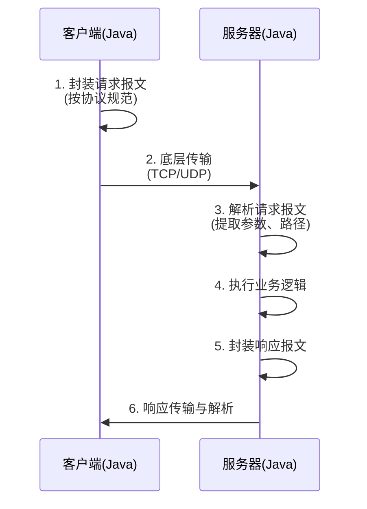
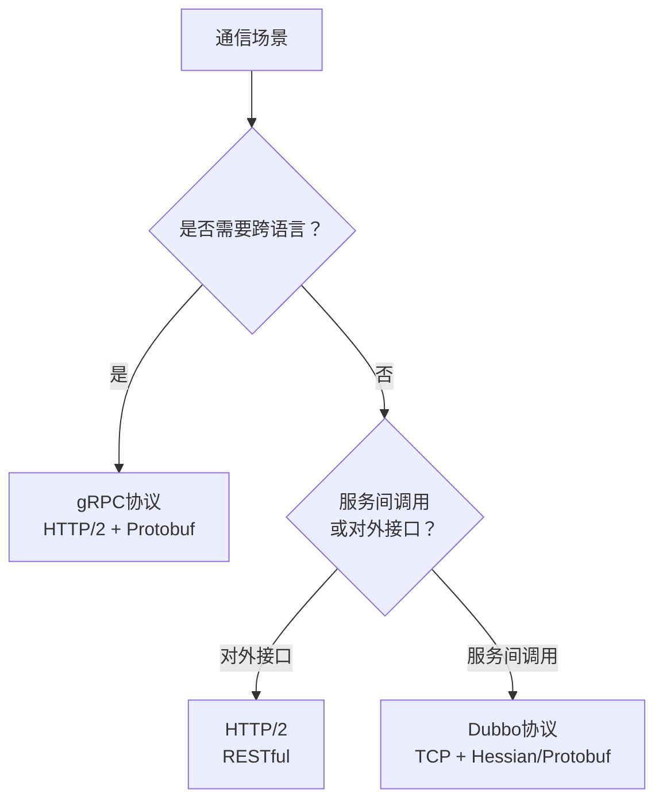

# 从Java后端开发角度深度剖析计算机网络（自顶向下·应用层）

## 📑 目录

- [引言](#引言)
- [一、应用层核心理论（Java后端必懂基础）](#一应用层核心理论java后端必懂基础)
- [二、Java后端实战：应用层协议的落地与优化](#二java后端实战应用层协议的落地与优化)
- [三、总结：Java后端开发与应用层的核心关联](#三总结java后端开发与应用层的核心关联)

---

## 引言

计算机网络自顶向下分层架构中，应用层是最贴近Java后端开发的一层——它定义了应用程序之间通信的规范与协议，是后端接口调用、数据传输、服务交互的核心载体。不同于底层网络（传输层、网络层）的硬件/系统级实现，应用层的协议与技术直接嵌入Java后端开发的日常：HTTP接口开发、RPC通信、消息队列交互、数据库连接等，本质上都是应用层协议的落地与实践。

---

## 一、应用层核心理论（Java后端必懂基础）

应用层的核心作用是"为应用程序提供网络通信服务"，屏蔽底层传输层（TCP/UDP）、网络层（IP）的复杂细节，让开发者无需关注数据如何封装、路由、传输，只需通过标准化协议实现应用间的数据交互。

### 应用层的核心特性

从Java后端开发视角，应用层的3个核心特性直接决定开发逻辑与技术选型：

| 特性 | 说明 | Java后端关联 |
|------|------|--------------|
| **面向应用** | 完全围绕后端应用的需求设计 | HTTP用于Web接口，MySQL协议用于数据库交互，Redis协议用于缓存通信 |
| **协议标准化** | 均为标准化规范，保证跨语言、跨系统互通 | Java后端能够与前端、Python/Go服务通信的基础 |
| **依赖底层传输** | 不直接负责数据传输，依赖TCP或UDP | 协议选型需结合传输层特性判断 |

### 应用层与Java后端的核心关联

| 场景 | 技术栈 | 底层应用层协议 |
|------|--------|----------------|
| 接口开发 | Spring Boot RESTful/GraphQL | HTTP |
| 服务间通信 | Feign、Dubbo | HTTP / Dubbo协议 / gRPC |
| 数据存储交互 | JDBC + MySQL/Redis | MySQL协议 / Redis协议 |
| 消息通信 | RabbitMQ、Kafka | AMQP / Kafka协议 |

### 应用层核心协议（后端开发高频用到）

#### HTTP协议（最核心，后端接口首选）

| 特性 | 说明 | 后端影响 |
|------|------|----------|
| 无状态 | 协议本身不记录请求上下文 | 需使用Session/Token实现用户会话管理 |
| 请求-响应模式 | 一次请求对应一次响应 | 天然适配RESTful接口设计 |
| 核心请求方法 | GET/POST/PUT/DELETE | 对应CRUD接口的核心逻辑 |
| HTTP/1.1 | 支持长连接(Keep-Alive) | 减少TCP连接建立/关闭开销 |
| HTTP/2 | 支持多路复用、头部压缩 | 解决队头阻塞问题，提升并发效率 |

#### RPC协议（微服务服务间通信首选）

| 协议 | 传输层 | 序列化 | 适用场景 |
|------|--------|--------|----------|
| **Dubbo协议** | TCP | Hessian/Protobuf | Java微服务（Spring Cloud Alibaba生态） |
| **gRPC协议** | HTTP/2 | Protobuf | 跨语言微服务通信（Java+Go） |
| **Hessian协议** | HTTP | Hessian | 小型微服务架构 |

#### 数据库相关协议

| 协议 | 传输层 | 对应数据库 | Java客户端 |
|------|--------|------------|------------|
| MySQL协议 | TCP | MySQL | MySQL Connector/J |
| PostgreSQL协议 | TCP | PostgreSQL | PostgreSQL JDBC Driver |

#### 缓存相关协议

| 协议 | 传输层 | 对应缓存 | Java客户端 |
|------|--------|----------|------------|
| Redis协议 | TCP | Redis | Jedis、Lettuce |
| Memcached协议 | TCP | Memcached | spymemcached |

### 应用层协议的核心工作流程（通用逻辑）



---

## 二、Java后端实战：应用层协议的落地与优化

### 实战场景1：HTTP接口开发（基于Spring Boot）

#### 核心实战：RESTful接口设计与实现

```java
@RestController
@RequestMapping("/api/v1/users")
public class UserController {

    @Autowired
    private UserService userService;

    // GET请求：查询单个用户（幂等）
    @GetMapping("/{id}")
    public ResponseEntity<UserDTO> getUserById(@PathVariable Long id) {
        UserDTO user = userService.getById(id);
        if (user == null) {
            return ResponseEntity.notFound().build();  // 404
        }
        return ResponseEntity.ok(user);  // 200
    }

    // POST请求：创建用户（非幂等）
    @PostMapping
    public ResponseEntity<UserDTO> createUser(@RequestBody @Valid UserCreateDTO createDTO) {
        UserDTO user = userService.create(createDTO);
        return ResponseEntity.status(HttpStatus.CREATED)  // 201
                .header("Location", "/api/v1/users/" + user.getId())
                .body(user);
    }

    // PUT请求：更新用户（幂等）
    @PutMapping("/{id}")
    public ResponseEntity<UserDTO> updateUser(@PathVariable Long id,
                                               @RequestBody @Valid UserUpdateDTO updateDTO) {
        UserDTO user = userService.update(id, updateDTO);
        return ResponseEntity.ok(user);
    }

    // DELETE请求：删除用户（幂等）
    @DeleteMapping("/{id}")
    public ResponseEntity<Void> deleteUser(@PathVariable Long id) {
        userService.delete(id);
        return ResponseEntity.noContent().build();  // 204
    }
}
```

#### 实战优化：HTTP接口性能与安全性优化

| 优化点 | 配置方式 | 效果 |
|--------|----------|------|
| **启用HTTP/2** | `server.http2.enabled=true` + SSL证书 | 多路复用、头部压缩，解决队头阻塞 |
| **启用长连接** | HTTP/1.1默认开启Keep-Alive | 减少TCP三次握手开销 |
| **接口缓存** | `@Cacheable` + HTTP缓存头(Cache-Control/ETag) | 减少后端请求压力 |
| **Gzip压缩** | `server.compression.enabled=true` | 减少数据传输大小 |
| **HTTPS** | 配置SSL证书 | 加密传输，防止窃取/篡改 |
| **安全头** | 添加XSS/CSRF防护头 | 防范XSS、CSRF攻击 |

```yaml
# application.yml 配置示例
server:
  http2:
    enabled: true
  compression:
    enabled: true
    mime-types: application/json,application/xml,text/html
  ssl:
    key-store: classpath:keystore.p12
    key-store-password: ${SSL_PASSWORD}
```

### 实战场景2：RPC服务调用（微服务架构核心）

#### 实战案例1：Dubbo协议应用（Spring Cloud Alibaba）

**步骤1：引入依赖**

```xml
<dependency>
    <groupId>com.alibaba.cloud</groupId>
    <artifactId>spring-cloud-starter-dubbo</artifactId>
</dependency>
<dependency>
    <groupId>com.alibaba.cloud</groupId>
    <artifactId>spring-cloud-starter-alibaba-nacos-discovery</artifactId>
</dependency>
```

**步骤2：定义公共接口**

```java
public interface UserRpcService {
    UserDTO getById(Long id);
}
```

**步骤3：服务提供者实现**

```java
@DubboService(interfaceClass = UserRpcService.class, version = "1.0.0")
@Service
public class UserRpcServiceImpl implements UserRpcService {

    @Autowired
    private UserMapper userMapper;

    @Override
    public UserDTO getById(Long id) {
        User user = userMapper.selectById(id);
        return BeanUtil.copyProperties(user, UserDTO.class);
    }
}
```

**步骤4：服务消费者调用**

```java
@RestController
@RequestMapping("/api/v1/order")
public class OrderController {

    @DubboReference(interfaceClass = UserRpcService.class, version = "1.0.0")
    private UserRpcService userRpcService;

    @GetMapping("/{orderId}/user")
    public ResponseEntity<UserDTO> getOrderUser(@PathVariable Long orderId) {
        OrderDTO order = orderService.getById(orderId);
        UserDTO user = userRpcService.getById(order.getUserId());
        return ResponseEntity.ok(user);
    }
}
```

#### 实战案例2：gRPC协议应用（跨语言通信）

**步骤1：定义Protobuf协议**

```protobuf
syntax = "proto3";
package com.example.rpc;

message UserRequest {
    int64 id = 1;
}

message UserResponse {
    int64 id = 1;
    string name = 2;
    string phone = 3;
}

service UserService {
    rpc GetById(UserRequest) returns (UserResponse);
}
```

**步骤2：服务端实现（Java）**

```java
public class UserGrpcServiceImpl extends UserServiceGrpc.UserServiceImplBase {

    @Autowired
    private UserService userService;

    @Override
    public void getById(UserRequest request,
                        StreamObserver<UserResponse> responseObserver) {
        Long id = request.getId();
        UserDTO user = userService.getById(id);

        UserResponse response = UserResponse.newBuilder()
                .setId(user.getId())
                .setName(user.getName())
                .setPhone(user.getPhone())
                .build();

        responseObserver.onNext(response);
        responseObserver.onCompleted();
    }
}
```

**步骤3：客户端调用（Java调用Go服务）**

```java
public class GrpcClient {

    public static UserResponse getUserById(Long id) {
        ManagedChannel channel = ManagedChannelBuilder
                .forAddress("go-service:8080")
                .usePlaintext()
                .build();

        UserServiceGrpc.UserServiceBlockingStub stub =
                UserServiceGrpc.newBlockingStub(channel);

        UserRequest request = UserRequest.newBuilder().setId(id).build();
        UserResponse response = stub.getById(request);

        channel.shutdown();
        return response;
    }
}
```

#### RPC调用优化

| 优化点 | 方案 | 效果 |
|--------|------|------|
| **高效序列化** | 替换为Protobuf/Kryo | 减少数据体积，提升传输效率 |
| **连接池配置** | `dubbo.client.connection-pool.size=20` | 避免连接不足导致的调用阻塞 |
| **负载均衡** | 随机/轮询/一致性哈希 | 避免单节点压力过大 |
| **容错机制** | 失败重试、降级、熔断 | 提升通信稳定性 |

```yaml
# Dubbo配置示例
dubbo:
  consumer:
    timeout: 3000
    retries: 2
  protocol:
    name: dubbo
    port: 20880
  registry:
    address: nacos://localhost:8848
```

### 实战场景3：应用层通信常见问题排查与解决

#### HTTP接口调用超时

| 现象 | 原因分析 | 解决方案 |
|------|----------|----------|
| 频繁超时(500ms+) | 未启用长连接，每次调用需三次握手 | 启用Keep-Alive |
| 504 Gateway Timeout | 请求体过大，传输耗时久 | 启用Gzip压缩；拆分大请求 |
| 后端处理慢 | SQL慢查询、业务逻辑复杂 | 优化SQL、添加缓存 |
| 线程池满 | Tomcat线程池配置不足 | 调整线程池大小 |

```yaml
# Feign超时配置
feign:
  client:
    config:
      default:
        connect-timeout: 2000
        read-timeout: 3000
```

#### RPC调用失败（No provider available）

| 现象 | 原因分析 | 解决方案 |
|------|----------|----------|
| No provider available | 协议版本不一致 | 确保`version`属性一致 |
| 服务未注册 | 提供者未注册到Nacos | 检查注册中心中是否存在服务实例 |
| 网络不通 | 防火墙拦截RPC端口 | 开放Dubbo默认端口20880 |

#### 数据传输不一致（乱码、数据丢失）

| 现象 | 原因分析 | 解决方案 |
|------|----------|----------|
| 中文乱码 | 未设置字符编码 | `spring.http.encoding.charset=utf-8` |
| 字段缺失 | 序列化方式不兼容 | 统一序列化方式(如统一使用Protobuf) |
| 反序列化失败 | DTO未实现Serializable | 实现`Serializable`接口 |

### 实战场景4：应用层协议的选型建议

| 业务场景 | 推荐协议 | 理由 |
|----------|----------|------|
| 前后端交互、对外接口 | HTTP/2 (RESTful) | 兼容性好、开发成本低 |
| 微服务内部调用(Java生态) | Dubbo协议 | 高性能、服务治理完善 |
| 跨语言微服务调用 | gRPC | HTTP/2 + Protobuf，跨语言兼容 |
| 异步通信/削峰填谷 | AMQP / Kafka协议 | 解耦、高吞吐 |
| 数据存储交互 | 数据库/缓存原生协议 | 客户端自动适配，无需手动选型 |

---

## 三、总结：Java后端开发与应用层的核心关联

### 核心要点

| 维度 | 核心内容 |
|------|----------|
| **理论层面** | 重点掌握HTTP、RPC核心协议的特性与工作流程，理解协议与后端开发的关联 |
| **实战层面** | 重点掌握HTTP接口开发、RPC服务调用两大场景，结合协议特性优化性能 |
| **选型核心** | 根据业务场景（前后端交互/服务间调用/跨语言）选择合适的协议 |

### 协议选型决策树



### 关键优化 checklist

- [ ] HTTP接口：启用HTTP/2、Gzip压缩、HTTPS、安全头
- [ ] RPC调用：选择高效序列化、配置连接池、负载均衡、容错机制
- [ ] 超时控制：设置合理的connect-timeout和read-timeout
- [ ] 编码统一：全程UTF-8，DTO实现Serializable
- [ ] 缓存策略：HTTP缓存头 + Spring Cache

---

## 📖 相关阅读

- [从Java后端开发角度深度剖析计算机网络（自顶向下：计算机网络与因特网，理论+实战）](./从Java后端开发角度深度剖析计算机网络（自顶向下：计算机网络与因特网，理论+实战）.md)
- [计算机网络-运输层](./计算机网络-运输层.md)
- [计算机网络-总览](./计算机网络-总览.md)
- [计算机网络自顶向下方法](./计算机网络自顶向下方法.md)
- [计算机网络系统学习指南](./计算机网络系统学习指南.md)
