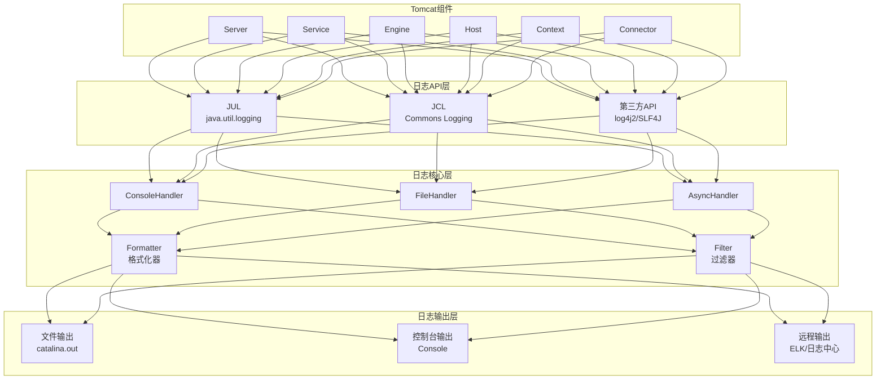
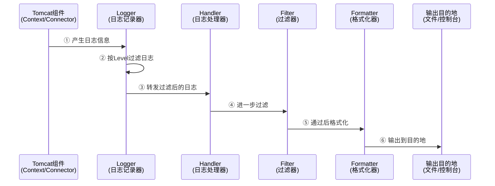
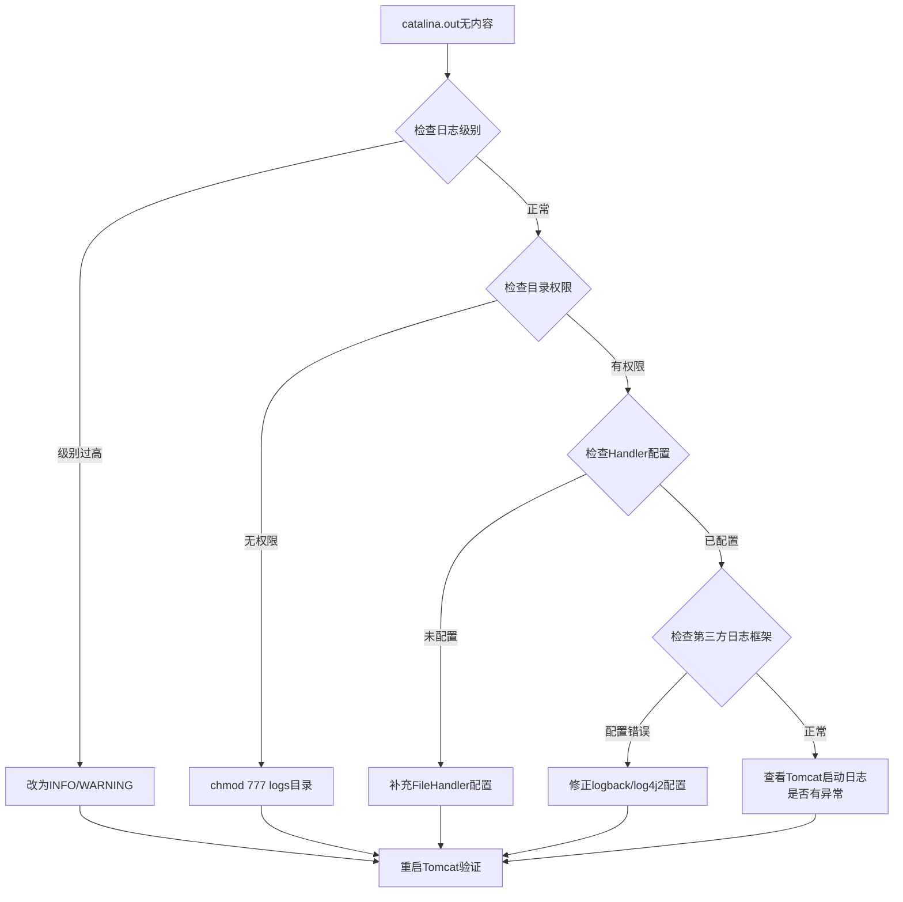

# Tomcat：日志记录器（理论+实战）

## 一、前言：Tomcat日志记录器的后端核心价值

对于Java后端开发者而言，Tomcat日志记录器并非"可有可无"的辅助组件，而是**问题排查、系统监控、性能优化**的核心支撑。在实际开发中，后端接口报错、请求阻塞、服务器异常等问题，几乎都需要通过Tomcat日志定位根因；同时，日志也是排查线上问题（如500错误、请求超时）的**唯一"线索"**。

> **关键认知**：不同于Java项目自身的业务日志（如Spring Boot的logback/log4j2日志），Tomcat日志记录器负责记录**Tomcat服务器自身的运行状态**（启动、停止、组件加载）、**HTTP请求链路**、**容器异常**等核心信息，与后端开发者的日常开发、测试、运维工作深度绑定。


## 二、核心理论：Tomcat日志记录器的架构与核心组件

Tomcat日志记录器的设计遵循**"分层架构 + 组件化思想"**，核心目标是"统一收集、分类输出、灵活配置"，其底层依赖Java的日志体系（JUL、JCL），同时支持集成第三方日志框架（如logback、log4j2）。

### 2.1 Tomcat日志记录器的整体架构



| 层级 | 核心职责 | 后端开发者关注点 |
|------|----------|------------------|
| **日志API层** | Tomcat内部使用的日志接口 | 了解兼容性，避免日志框架冲突 |
| **日志核心层** | 日志的收集、过滤、格式化 | Logger和Handler的配置与协同 |
| **日志输出层** | 将日志输出到指定目的地 | 熟悉logs目录下各日志文件的用途 |

### 2.2 核心组件详解

#### 2.2.1 Logger（日志记录器）：日志的"收集者"

Logger是Tomcat日志记录器的核心组件，每个Tomcat核心组件（Server、Service、Engine、Host、Context等）都对应一个Logger实例。

**Logger的3个核心属性：**

| 属性 | 说明 | 可选值（从低到高） |
|------|------|---------------------|
| **级别（Level）** | 日志级别，过滤低于配置级别的日志 | FINEST → FINER → FINE → INFO → WARNING → SEVERE → OFF |
| **名称（Name）** | Logger的唯一标识，与组件层级对应 | `org.apache.catalina.core.StandardEngine` |
| **父Logger** | 采用父子继承机制，子继承父的配置 | Context → Host → Engine → Server |

#### 2.2.2 Handler（日志处理器）：日志的"处理器与输出者"

Handler负责接收Logger收集的日志，进行过滤、格式化，然后输出到指定目的地。

**Tomcat默认提供的3种Handler：**

| Handler | 作用 | 适用场景 |
|---------|------|----------|
| **ConsoleHandler** | 输出到控制台 | 开发环境调试 |
| **FileHandler** | 输出到日志文件 | **生产环境核心** |
| **AsyncHandler** | 异步输出，不阻塞请求 | 高并发场景（需手动配置） |

**Handler的两个辅助组件：**

| 组件 | 作用 | 常用实现 |
|------|------|----------|
| **Formatter（格式化器）** | 格式化日志信息 | `SimpleFormatter`、`PatternFormatter` |
| **Filter（过滤器）** | 过滤日志，只保留符合条件的 | `LevelFilter`、自定义Filter |

### 2.3 Tomcat日志的分类（后端开发必懂）

Tomcat运行时产生的日志文件位于`${CATALINA_HOME}/logs`目录下：

```bash
logs/
├── catalina.out              # 核心日志：服务器运行日志 + System.out/err输出
├── catalina.2026-05-27.log   # 按天滚动的Catalina日志
├── localhost.log             # localhost虚拟主机日志
├── localhost.2026-05-27.log  # 按天滚动的Host日志
├── localhost_access_log.2026-05-27.txt  # HTTP访问日志
├── manager.log               # 管理控制台日志
└── host-manager.log          # 主机管理控制台日志
```

| 日志文件 | 记录内容 | 排查场景 |
|----------|----------|----------|
| **catalina.out** | Tomcat启动/停止、组件加载、异常信息、`System.out/err`输出 | **首选排查**：端口占用、启动失败、500错误 |
| **localhost_access_log** | HTTP请求信息（IP、方法、路径、状态码、耗时） | 请求量分析、超时排查、404/500溯源 |
| **localhost.log** | Host组件启动/停止、Context部署日志 | Web应用部署问题 |
| **manager.log** | 管理控制台操作日志 | 运维审计 |

### 2.4 Tomcat日志 vs 业务日志

| 对比维度 | Tomcat日志 | 业务日志 |
|----------|------------|----------|
| **记录主体** | Tomcat服务器自身 | Java后端业务代码 |
| **记录内容** | 服务器启动、异常、HTTP请求 | 接口调用、业务参数、自定义异常 |
| **配置方式** | `conf/logging.properties` | `logback.xml` / `log4j2.xml` |
| **关联关系** | 业务日志未独立配置时，默认输出到`catalina.out` | Tomcat异常对应业务日志中的堆栈 |

> **最佳实践**：将业务日志与Tomcat日志分离（配置独立输出），避免`catalina.out`过大，便于快速定位问题。


## 三、底层原理：日志记录的完整流程

### 3.1 日志记录完整流程



### 3.2 核心原理关键点

| 关键机制 | 说明 | 后端影响 |
|----------|------|----------|
| **日志级别继承** | 子Logger未配置级别时，继承父Logger的级别 | 合理配置可减少冗余日志 |
| **多Handler输出** | 一个Logger可配置多个Handler | 同时输出到控制台和文件 |
| **日志格式化** | 通过Formatter自定义输出格式 | 便于ELK等工具解析 |
| **异步日志** | 异步线程输出日志，不阻塞请求 | **高并发场景必开** |


## 四、实战落地：配置与问题排查

### 4.1 实战1：核心配置（开发/生产环境适配）

#### 4.1.1 `logging.properties`配置（核心日志）

**开发环境配置（调试优先）：**

```properties
# 顶层Logger级别设为INFO
.level = INFO

# 核心组件Logger设为FINE（输出详细日志）
org.apache.catalina.core.StandardEngine.level = FINE
org.apache.catalina.core.StandardContext.level = FINE

# 控制台Handler开启，便于实时查看
java.util.logging.ConsoleHandler.level = FINE
java.util.logging.ConsoleHandler.formatter = java.util.logging.SimpleFormatter

# 文件Handler配置
1catalina.org.apache.juli.FileHandler.level = FINE
1catalina.org.apache.juli.FileHandler.directory = ${catalina.base}/logs
1catalina.org.apache.juli.FileHandler.prefix = catalina.
1catalina.org.apache.juli.FileHandler.formatter = org.apache.juli.OneLineFormatter
```

**生产环境配置（性能优先）：**

```properties
# 顶层Logger级别设为WARNING，过滤INFO/FINE日志
.level = WARNING

# 核心组件Logger设为WARNING
org.apache.catalina.core.StandardEngine.level = WARNING
org.apache.catalina.core.StandardContext.level = WARNING
org.apache.coyote.http11.Http11Nio2Protocol.level = WARNING

# 关闭控制台日志（减少性能损耗）
java.util.logging.ConsoleHandler.level = OFF

# 文件Handler + 日志滚动配置
1catalina.org.apache.juli.FileHandler.level = WARNING
1catalina.org.apache.juli.FileHandler.directory = ${catalina.base}/logs
1catalina.org.apache.juli.FileHandler.prefix = catalina.
1catalina.org.apache.juli.FileHandler.maxDays = 7        # 保留7天
1catalina.org.apache.juli.FileHandler.maxFileSize = 100MB  # 单文件最大100MB
```

#### 4.1.2 `server.xml`配置（HTTP访问日志）

```xml
<Connector port="8080" protocol="org.apache.coyote.http11.Http11Nio2Protocol">
    
    <!-- 配置HTTP访问日志 -->
    <Valve className="org.apache.catalina.valves.AccessLogValve"
           directory="logs"
           prefix="localhost_access_log"
           suffix=".txt"
           pattern="%h %l %u %t &quot;%r&quot; %s %b %D"
           rotate="true"
           maxDays="7"/>
</Connector>
```

**常用pattern占位符：**

| 占位符 | 含义 | 示例 |
|--------|------|------|
| `%h` | 客户端IP地址 | `192.168.1.100` |
| `%t` | 请求时间 | `[27/May/2026:14:30:00 +0800]` |
| `%r` | 请求行 | `GET /api/user/1 HTTP/1.1` |
| `%s` | 响应状态码 | `200`、`404`、`500` |
| `%b` | 响应字节数 | `1024` |
| `%D` | 请求处理耗时（毫秒） | `123` |

### 4.2 实战2：自定义日志

#### 4.2.1 自定义JSON格式（适配ELK）

**步骤1：创建自定义Formatter**

```java
package com.example.tomcat.logger;

import org.apache.juli.OneLineFormatter;
import java.util.logging.LogRecord;

public class JsonFormatter extends OneLineFormatter {
    
    @Override
    public String format(LogRecord record) {
        return "{" +
            "\"timestamp\":\"" + formatMessage(record) + "\"," +
            "\"level\":\"" + record.getLevel() + "\"," +
            "\"logger\":\"" + record.getLoggerName() + "\"," +
            "\"message\":\"" + record.getMessage() + "\"" +
            "}\n";
    }
}
```

**步骤2：配置`logging.properties`**

```properties
1catalina.org.apache.juli.FileHandler.formatter = com.example.tomcat.logger.JsonFormatter
```

**步骤3**：将编译后的class放入`${CATALINA_HOME}/lib`目录，重启Tomcat。

#### 4.2.2 集成Logback（替代默认JUL）

**步骤1**：下载logback依赖包，放入`${CATALINA_HOME}/lib`
- `logback-core.jar`
- `logback-classic.jar`
- `logback-access.jar`

**步骤2**：创建`${CATALINA_HOME}/conf/logback.xml`

```xml
<configuration>
    
    <!-- 业务日志输出 -->
    <appender name="FILE" class="ch.qos.logback.core.rolling.RollingFileAppender">
        <file>${CATALINA_HOME}/logs/catalina.log</file>
        <rollingPolicy class="ch.qos.logback.core.rolling.TimeBasedRollingPolicy">
            <fileNamePattern>${CATALINA_HOME}/logs/catalina.%d{yyyy-MM-dd}.log</fileNamePattern>
            <maxHistory>7</maxHistory>
        </rollingPolicy>
        <encoder>
            <pattern>%d{yyyy-MM-dd HH:mm:ss.SSS} [%thread] %-5level %logger{50} - %msg%n</pattern>
        </encoder>
    </appender>
    
    <!-- HTTP访问日志 -->
    <appender name="ACCESS" class="ch.qos.logback.core.rolling.RollingFileAppender">
        <file>${CATALINA_HOME}/logs/access.log</file>
        <rollingPolicy class="ch.qos.logback.core.rolling.TimeBasedRollingPolicy">
            <fileNamePattern>${CATALINA_HOME}/logs/access.%d{yyyy-MM-dd}.log</fileNamePattern>
            <maxHistory>7</maxHistory>
        </rollingPolicy>
        <encoder>
            <pattern>%h %l %u %t "%r" %s %b %D%n</pattern>
        </encoder>
    </appender>
    
    <root level="WARN">
        <appender-ref ref="FILE"/>
    </root>
    
    <logger name="org.apache.catalina.access" level="INFO" additivity="false">
        <appender-ref ref="ACCESS"/>
    </logger>
</configuration>
```

**步骤3**：修改`catalina.sh`（Linux）添加JVM参数

```bash
CATALINA_OPTS="$CATALINA_OPTS -Dlogback.configurationFile=${CATALINA_HOME}/conf/logback.xml"
```

### 4.3 实战3：常见问题排查

#### 4.3.1 问题1：日志不输出（catalina.out无内容）



#### 4.3.2 问题2：日志文件过大（磁盘空间不足）

| 解决方案 | 具体操作 |
|----------|----------|
| **开启日志滚动** | 配置`maxDays=7`、`maxFileSize=100MB` |
| **分离业务日志** | 业务日志独立输出，避免写入`catalina.out` |
| **定时清理** | Linux crontab：`0 3 * * * find /logs -name "*.log" -mtime +7 -delete` |

#### 4.3.3 问题3：日志中出现异常

| 异常类型 | 典型错误 | 解决方案 |
|----------|----------|----------|
| `ClassNotFoundException` | 驱动类/Spring类找不到 | 检查`WEB-INF/lib`，补充缺失依赖 |
| `Connection refused` | 数据库/Redis连接失败 | 检查服务是否启动、地址/端口是否正确 |
| `Context启动失败` | web.xml配置错误 | 检查Servlet映射、Listener配置 |


## 五、总结：核心要点速查

### Tomcat日志分类速查

| 日志文件 | 用途 | 排查场景 |
|----------|------|----------|
| `catalina.out` | 核心运行日志 | **启动失败、500错误、异常堆栈** |
| `localhost_access_log.*.txt` | HTTP访问日志 | 请求超时、404/500溯源、请求量分析 |
| `localhost.log` | Host/Context日志 | Web应用部署问题 |

### 配置优化清单

| 环境 | 日志级别 | 控制台 | 日志滚动 | 异步日志 |
|------|----------|--------|----------|----------|
| **开发环境** | INFO/FINE | 开启 | 不需要 | 不需要 |
| **生产环境** | WARNING | 关闭 | 必须开启（7天/100MB） | 建议开启 |

### 常用排查命令

```bash
# 实时查看catalina.out
tail -f ${CATALINA_HOME}/logs/catalina.out

# 搜索错误日志
grep -i "error\|exception" ${CATALINA_HOME}/logs/catalina.out

# 查看HTTP访问日志（分析请求耗时）
awk '{if($NF>1000) print $0}' ${CATALINA_HOME}/logs/localhost_access_log.*.txt

# 查看日志文件大小
du -sh ${CATALINA_HOME}/logs/*
```

### 核心结论

> 深入理解Tomcat日志记录器，不仅能提升后端开发者的问题排查效率，还能帮助优化系统性能（异步日志、日志滚动），为线上系统的稳定性提供保障。在实际开发中，需结合业务场景合理配置日志，让日志成为**"助力开发、保障运维"**的核心工具。
