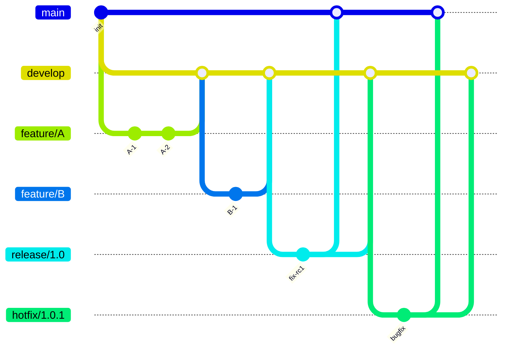
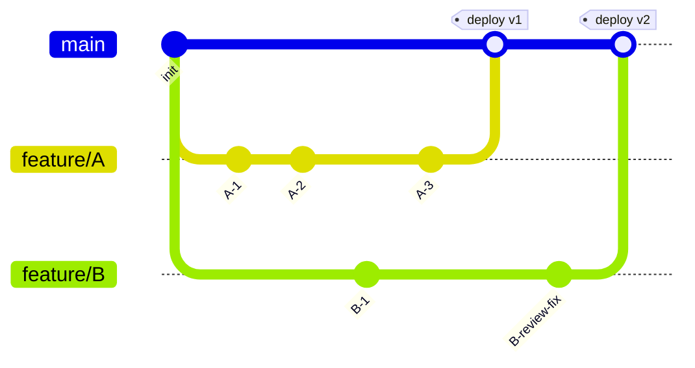
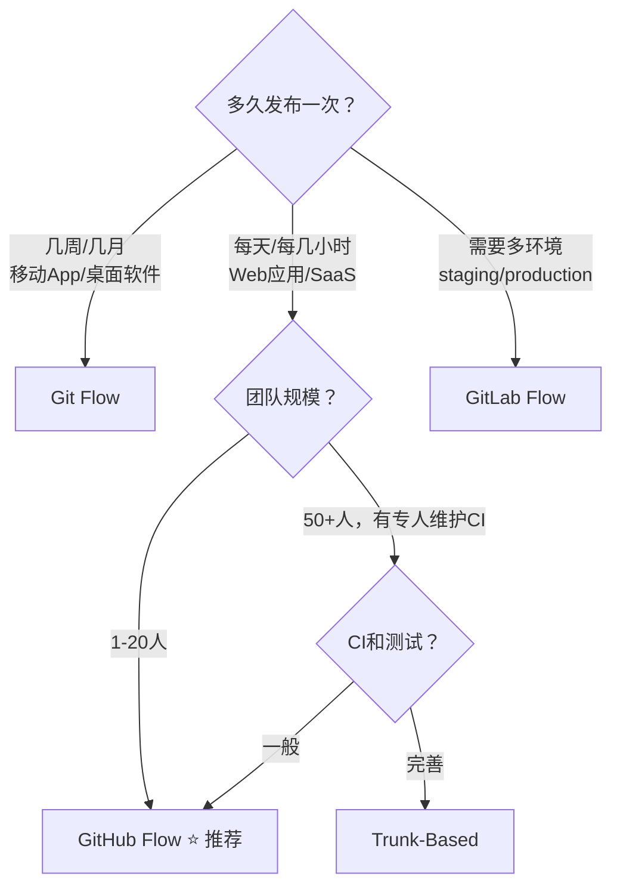

# Git 分支模型与团队工作流

## 为什么需要分支模型？

分支本质只是指针，几乎零成本。但**怎么用分支**决定了团队的开发效率和发布质量。

没有分支模型的团队：
- 所有人往 main 直接提交 → 频繁冲突
- 不知道哪些代码在生产环境 → 回滚困难
- 紧急修复没地方放 → 慌

---

## 1. 四种主流分支模型速览

| 模型 | 分支数量 | 适用团队 | 发布节奏 |
|------|---------|---------|---------|
| **Git Flow** | 多（main+develop+feature+release+hotfix） | 传统软件，有明确版本 | 几周~几月 |
| **GitHub Flow** | 少（main + feature） | Web 应用，SaaS | 按天/小时 |
| **GitLab Flow** | 中（main + feature + 环境分支） | 需要多环境 | 按需 |
| **Trunk-Based** | 极少（trunk + 短期feature） | 精英团队，大厂 | 按小时 |

---

## 2. Git Flow — 经典重型模型



### 分支角色

| 分支 | 来源 | 合并到 | 生命周期 | 命名 |
|------|------|--------|---------|------|
| **main** | — | — | 永久 | `main` |
| **develop** | main | — | 永久 | `develop` |
| **feature** | develop | develop | 开发完成后删除 | `feature/xxx` |
| **release** | develop | main + develop | 发布完成后删除 | `release/x.y.z` |
| **hotfix** | main | main + develop | 修复完成后删除 | `hotfix/x.y.z` |

### 操作流程

```bash
# 1. 初始化仓库（设置 main + develop）
git init
git checkout -b develop

# 2. 开发新功能
git checkout -b feature/user-login develop
# ... 开发 ...
git add . && git commit -m "feat: user login module"
git checkout develop
git merge --no-ff feature/user-login   # --no-ff 保留分支痕迹
git branch -d feature/user-login

# 3. 准备发布
git checkout -b release/1.0.0 develop
# 修复bug、更新版本号、文档
git commit -m "chore: bump version to 1.0.0"
git checkout main
git merge --no-ff release/1.0.0
git tag -a v1.0.0 -m "Release v1.0.0"
git checkout develop
git merge --no-ff release/1.0.0       # 把release的修复合并回develop
git branch -d release/1.0.0

# 4. 紧急修复
git checkout -b hotfix/1.0.1 main
# 修复bug
git commit -m "fix: critical login bug"
git checkout main
git merge --no-ff hotfix/1.0.1
git tag -a v1.0.1 -m "Hotfix v1.0.1"
git checkout develop
git merge --no-ff hotfix/1.0.1
git branch -d hotfix/1.0.1
```

### 优点 vs 缺点

| 优点 | 缺点 |
|------|------|
| 结构清晰，角色分明 | **太重**，日常维护成本高 |
| 适合有明确版本周期的软件 | merge 太多，历史复杂 |
| 发布内容可控 | 不适合频繁部署的 Web 应用 |

---

## 3. GitHub Flow — 轻量敏捷模型



### 核心原则

1. **main 分支永远可部署**（这是铁律）
2. 从 main 创建 feature 分支，用描述性命名
3. 随时推送 feature 分支（早开 PR）
4. 通过 **Pull Request** 讨论和审查
5. 合并到 main 后**立即部署**

### 操作流程

```bash
# 1. 从 main 拉出 feature 分支
git checkout main && git pull origin main
git checkout -b feature/oauth-integration

# 2. 频繁提交，随时push（备份+协作可见）
git commit -m "feat: add oauth redirect"
git push origin feature/oauth-integration

# 3. 在 GitHub 上创建 PR，讨论、Review、CI检查

# 4. 合并方式选择（GitHub 支持三种按钮）
#   - Create a merge commit  → 保留完整历史
#   - Squash and merge       → 压缩所有commit为一个
#   - Rebase and merge       → 线性历史

# 5. 部署 main（合并后自动/手动触发）
# 6. 删除 feature 分支
git branch -d feature/oauth-integration
git push origin --delete feature/oauth-integration
```

### 关键实践

```bash
# 保持 feature 分支与 main 同步
git checkout feature/xxx
git merge main          # 或者 git rebase main（看团队约定）

# feature 分支命名规范
# feature/add-xxx       → 新功能
# fix/xxx               → 修复
# refactor/xxx          → 重构
# docs/xxx              → 文档
```

---

## 4. GitLab Flow — 环境驱动模型

适合有 staging/production 等多环境的场景：

```text
main ──────────> pre-production ──────────> production
  │                  │                        │
  └── feature/A      └── 自动部署到staging     └── 手动部署到生产
```

```bash
# main → pre-production → production 的逐级合并
git checkout pre-production && git merge main
git checkout production && git merge pre-production
git tag -a v2.1.0 -m "Deploy to production"
```

---

## 5. Trunk-Based Development — 主干开发

大厂精英团队的最爱（Google、Facebook）：

```text
trunk (main)
  ├── 超短期 feature 分支（< 1天）
  ├── Feature Flag 控制未完成功能
  └── 分支切换评审（Branch by Abstraction）
```

### 核心规则

- 所有人直接往 trunk 提交（或超短分支，<24小时）
- 通过 **Feature Flag** 隐藏未完成的功能
- 极其频繁的集成（每天多次）
- **必须**有强测试覆盖 + CI

```bash
# 典型的一天
git checkout main && git pull
# 修改一点点代码（小步提交）
git add . && git commit -m "feat: step 1 of search rewrite"
git pull --rebase && git push
# ... 10分钟后 ...
git add . && git commit -m "feat: step 2 of search rewrite"
git pull --rebase && git push
```

### Feature Flag 示例

```python
# 用flag控制未完成的功能
if feature_flag_enabled("new-search"):
    return new_search_handler()
else:
    return old_search_handler()
```

---

## 6. 如何选择？



### 决策表

| 场景 | 推荐模型 | 原因 |
|------|---------|------|
| 个人项目 / 小团队 | **GitHub Flow** | 简单够用，PR 足够了 |
| 开源项目 | **GitHub Flow** + Fork | PR 是协作核心 |
| 移动 App 开发 | **Git Flow** | 版本发布有节奏，需要 hotfix |
| SaaS 产品 | **GitHub Flow** 或 **Trunk-Based** | 持续部署 |
| 企业级多环境 | **GitLab Flow** | 环境分支天然匹配发布流水线 |
| 大型基础设施 | **Trunk-Based** | 避免分支地狱 |

---

## 7. 通用规则（不管用什么模型）

### 7.1 Commit Message 规范（Conventional Commits）

```text
<type>(<scope>): <subject>

# 类型
feat     → 新功能
fix      → 修复bug
refactor → 重构（不改功能）
docs     → 文档
style    → 代码格式（空格、分号等）
test     → 测试相关
chore    → 构建/工具相关

# 示例
feat(auth): add OAuth2 login support
fix(api): handle null response from payment gateway
refactor(db): extract connection pool to shared module
```

### 7.2 分支命名规范

```bash
feature/user-login          # 新功能
fix/header-overflow         # 修复
hotfix/v1.2.1-payment       # 紧急修复
release/v2.0.0              # 发布准备
chore/update-deps           # 杂项
docs/api-reference          # 文档
```

### 7.3 PR/MR 最佳实践

- 一个 PR 只做一件事（单一职责）
- PR 描述写清楚"做了什么、为什么、怎么测试"
- 超过 400 行的 PR 考虑拆分
- Review 通过后由 PR 作者自己合并（默认）
- 合并后立即删除分支

---

## 8. 核心总结

| 模型 | 复杂度 | 分支数 | 发布频率 | CI/CD 要求 |
|------|--------|--------|---------|-----------|
| Git Flow | 高 | 5种 | 低（周~月） | 低 |
| GitHub Flow | 低 | 2种 | 高（天） | 中 |
| GitLab Flow | 中 | 3-4种 | 中（天~周） | 中 |
| Trunk-Based | 极低 | 1-2种 | 极高（小时） | 极高 |

**建议路径：** 先用 GitHub Flow 入门 → 团队大了考虑 GitLab Flow → 工程能力强了探索 Trunk-Based。

---

> 上一篇：[02-Git底层原理深度剖析](02-Git底层原理深度剖析.md)
> 下一篇：[04-Git合并与变基完全指南](04-Git合并与变基完全指南.md)
