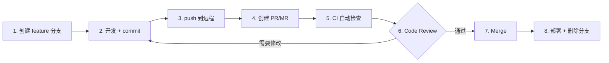

# Git 远程协作与平台实战

## 协作的本质

Git 是分布式版本控制系统——每个人电脑上都有**完整的仓库副本**。远程仓库只是一个"约定的同步点"。

```text
你的本地仓库 ←→ 远程仓库 (origin) ←→ 同事的本地仓库
     ↕                    ↕                   ↕
  git push           GitHub/GitLab        git fetch
  git fetch           PR / MR             git merge
```

---

## 1. 远程仓库管理

### 1.1 基础操作

```bash
# 查看所有远程仓库
git remote -v
# origin  https://github.com/user/repo.git (fetch)
# origin  https://github.com/user/repo.git (push)

# 查看某个远程的详细信息
git remote show origin

# 添加远程仓库
git remote add origin https://github.com/user/repo.git
git remote add upstream https://github.com/original/repo.git  # Fork场景

# 修改远程URL
git remote set-url origin git@github.com:user/repo.git

# 删除远程
git remote remove upstream

# 重命名远程
git remote rename origin old-origin
```

### 1.2 多远程仓库

```bash
# 典型Fork场景：同时追踪 origin(自己的fork) 和 upstream(原始仓库)
git remote add origin https://github.com/yourname/repo.git
git remote add upstream https://github.com/original/repo.git

# 从原始仓库同步
git fetch upstream
git checkout main
git merge upstream/main
git push origin main
```

---

## 2. Fetch vs Pull vs Push

### 2.1 git fetch — 只下载，不合并

```bash
git fetch origin
# 下载了远程最新数据，但不会动你的工作区
# 远程分支更新为 origin/main、origin/feature 等

# 查看远程有什么更新
git log origin/main ^main          # 远程有而本地没有的
git log main ^origin/main          # 本地有而远程没有的
```

### 2.2 git pull — 下载 + 合并

```bash
# git pull = git fetch + git merge
git pull origin main

# 用 rebase 代替 merge（推荐，保持线性历史）
git pull --rebase origin main

# 全局设置 pull 默认用 rebase
git config --global pull.rebase true
```

### 2.3 git push — 上传本地提交

```bash
# 推送当前分支到远程
git push origin main

# 推送并设置上游跟踪
git push -u origin feature/login
# 之后直接 git push 即可

# 删除远程分支
git push origin --delete feature/login

# 安全强制推送
git push --force-with-lease origin feature/login
```

### 三命令对比

| 命令 | 方向 | 合并？ | 安全？ |
|------|------|--------|--------|
| `git fetch` | 远程→本地（refs） | 否 | ✅ 最安全 |
| `git pull` | 远程→本地（工作区） | 是 | ⚠️ 可能冲突 |
| `git push` | 本地→远程 | — | ⚠️ 可能被拒绝 |

---

## 3. Pull Request / Merge Request 生命周期

PR (GitHub) / MR (GitLab) 是协作的核心机制，不只是"请求合并代码"。



### 3.1 创建高质量 PR

```markdown
## PR 标题
feat: add OAuth2 social login support

## 描述
### 做了什么
- 支持 Google / GitHub OAuth2 登录
- 新增统一的 OAuth 回调处理
- 添加相关单元测试

### 为什么这样做
- 减少用户注册摩擦，提升转化率
- 选择 OAuth2 标准协议，后续易扩展

### 如何测试
1. 配置 .env 中的 GOOGLE_CLIENT_ID 和 GITHUB_CLIENT_ID
2. 访问 /login，点击"Google 登录"
3. 验证跳转和回调流程
4. 运行 `npm test -- auth.test.ts`

### 截图
[截图1: 登录页面]
[截图2: 登录成功后的用户信息]
```

### 3.2 PR 合并策略对比

| 策略 | 效果 | 适用场景 |
|------|------|---------|
| **Create merge commit** | 创建 `Merge pull request #123...` | 保留完整历史 |
| **Squash and merge** | 所有 commit 压成 1 个 | feature 分支的 wip commit 太多 |
| **Rebase and merge** | 线性接入，不创建 merge commit | 重视线性历史 |

---

## 4. Fork 工作流（开源项目标准）

```text
原始仓库 (upstream)          你的 Fork (origin)          你的本地
─────────────────          ──────────────────        ──────────
main ←─────────────────── main ←──── git pull ──── main
  ↑         PR                 ↑       git push →     │
  └──────── feature ───────────┴──────────────── feature
```

### 完整操作流程

```bash
# 1. Fork 仓库（在 GitHub 网页操作）

# 2. Clone 自己的 Fork
git clone https://github.com/yourname/repo.git
cd repo

# 3. 添加上游仓库
git remote add upstream https://github.com/original/repo.git
git remote -v
# origin    https://github.com/yourname/repo.git (fetch/push)
# upstream  https://github.com/original/repo.git (fetch/push)

# 4. 创建功能分支
git checkout -b feature/awesome-feature

# 5. 开发 + 提交
# ... 写代码 ...
git add . && git commit -m "feat: awesome feature"

# 6. 同步上游（开发期间上游可能有更新）
git fetch upstream
git rebase upstream/main
# 解决冲突 → git rebase --continue

# 7. 推送到自己的 Fork
git push -u origin feature/awesome-feature

# 8. 在 GitHub 上创建 PR：yourname/repo → original/repo

# 9. 根据 Review 修改
# ... 修改代码 ...
git add . && git commit -m "fix: address review comments"
git push origin feature/awesome-feature  # PR 自动更新

# 10. PR 合并后，同步 main
git checkout main
git pull upstream main    # 从上游拉取
git push origin main      # 推送回自己的Fork

# 11. 清理本地分支
git branch -d feature/awesome-feature
```

---

## 5. 远程分支管理

```bash
# 查看所有分支（本地 + 远程）
git branch -a

# 查看远程分支
git branch -r

# 基于远程分支创建本地分支
git checkout -b feature/login origin/feature/login

# 查看本地分支和远程分支的跟踪关系
git branch -vv
# * main        a1b2c3d [origin/main] latest commit
#   feature/xxx e4f5g6h [origin/feature/xxx: ahead 2, behind 1] ...

# 设置/修改跟踪的上游分支
git branch -u origin/main        # 当前分支跟踪 origin/main
git branch -u origin/main mybranch  # 指定分支跟踪

# 清理本地的"已删除远程分支"引用
git remote prune origin
# 或者 fetch 时自动清理
git fetch --prune
```

---

## 6. 解决 Push 被拒绝

```bash
# 场景：你 push 时，远程有你本地不知道的新 commit
git push origin main
# ! [rejected] main -> main (non-fast-forward)
# error: failed to push some refs

# 正确做法：
git fetch origin
git rebase origin/main   # 或用 git merge origin/main
# 解决冲突（如果有）
git push origin main
```

---

## 7. SSH 配置（免密 push）

```bash
# 1. 生成 SSH key（如果没有）
ssh-keygen -t ed25519 -C "your_email@example.com"
# 推荐用 ed25519 算法，比 RSA 更快更安全

# 2. 复制公钥
cat ~/.ssh/id_ed25519.pub
# 粘贴到 GitHub → Settings → SSH and GPG keys

# 3. 测试连接
ssh -T git@github.com
# Hi username! You've successfully authenticated.

# 4. 用 SSH URL 克隆（而不是 HTTPS）
git clone git@github.com:user/repo.git

# 5. 如果已有 HTTPS 克隆，切换为 SSH
git remote set-url origin git@github.com:user/repo.git

# 6. 多账号配置 ~/.ssh/config
# Host github-personal
#     HostName github.com
#     User git
#     IdentityFile ~/.ssh/id_ed25519_personal
#
# Host github-work
#     HostName github.com
#     User git
#     IdentityFile ~/.ssh/id_ed25519_work
```

---

## 8. 协作常见场景速查

| 场景 | 命令 |
|------|------|
| 查看远程更新（不合并） | `git fetch origin` |
| 拉取 + 合并 | `git pull origin main` |
| 拉取 + rebase | `git pull --rebase origin main` |
| 推送新分支 | `git push -u origin feature/xxx` |
| 安全强制推送 | `git push --force-with-lease` |
| 删除远程分支 | `git push origin --delete feature/xxx` |
| 同步上游（Fork） | `git fetch upstream && git merge upstream/main` |
| 清理远程已删分支 | `git remote prune origin` |
| 查看跟踪关系 | `git branch -vv` |
| 查看谁改了这段代码 | `git log origin/main..HEAD --oneline` |

---

> 上一篇：[05-Git撤销操作完全手册](05-Git撤销操作完全手册.md)
> 下一篇：[07-Git钩子与自动化集成](07-Git钩子与自动化集成.md)
