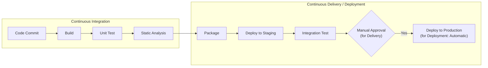

# 04-CICD流水线.md -- CI/CD Pipelines

> **从"SSH 上去手动部署"到"一键构建-测试-部署"**

---

## 目录

1. [CI/CD 概念与原理](#1-cicd-概念与原理)
2. [Jenkins 深度指南](#2-jenkins-深度指南)
3. [GitHub Actions 深度指南](#3-github-actions-深度指南)
4. [GitLab CI 深度指南](#4-gitlab-ci-深度指南)
5. [静态代码分析集成](#5-静态代码分析集成)
6. [制品管理](#6-制品管理)
7. [部署策略](#7-部署策略)
8. [Pipeline 最佳实践](#8-pipeline-最佳实践)
9. [面试高频题](#9-面试高频题)

---

## 1. CI/CD 概念与原理

### 1.1 什么是 CI/CD

| 概念 | 含义 | 核心价值 |
|------|------|---------|
| **CI** (Continuous Integration) | 频繁地将代码变更合并到主干，每次合并自动构建和测试 | 尽早发现集成问题 |
| **CD** (Continuous Delivery) | 代码每次变更都经过自动化流程验证，可随时部署到生产环境 | 降低发布风险 |
| **CD** (Continuous Deployment) | 通过自动化验证的代码变更自动部署到生产环境 | 加速价值交付 |

### 1.2 CI/CD vs CI/CD



**Continuous Delivery vs Continuous Deployment：**

| 特性 | Continuous Delivery | Continuous Deployment |
|------|-------------------|---------------------|
| 部署到生产 | 需要人工审批 | 完全自动化 |
| 适用场景 | 受监管行业、大客户部署 | SaaS 产品、快速迭代 |
| 发布频率 | 每周/每月 | 每天多次 |
| 风险控制 | 人工决策 | 自动化门禁 + 回滚 |

### 1.3 Pipeline 通用阶段

```
┌────────┐ ┌────────┐ ┌────────┐ ┌────────┐ ┌────────┐ ┌────────┐
│ Build  │→│ Unit   │→│ Static │→│ Inte-  │→│ Package│→│ Deploy │
│ (编译)  │ │ Test   │ │ Analysis│ │ gration│ │ (打包)  │ │ (部署)  │
│        │ │ (单元测试)│ │ (静态分析)│ │ (集成测试)│ │        │ │        │
└────────┘ └────────┘ └────────┘ └────────┘ └────────┘ └────────┘
     │          │          │          │          │          │
     ▼          ▼          ▼          ▼          ▼          ▼
 检查编译      运行测试    代码质量    数据库/API    制作镜像   部署到环境
   错误        覆盖率      SonarQube    测试       Docker      K8s/Server
```

---

## 2. Jenkins 深度指南

### 2.1 架构

```
┌──────────────────┐          ┌──────────────────┐
│  Jenkins Master  │          │  Jenkins Agent   │
│  (Controller)    │◄────────►│  (Worker)        │
│                  │  SSH/JNLP│                  │
│ - Web UI         │          │ - 执行 Pipeline  │
│ - Scheduling     │          │ - 运行构建任务    │
│ - Pipeline Mgmt  │          │ - 隔离环境        │
│ - Credentials    │          │                  │
└──────────────────┘          └──────────────────┘
```

### 2.2 Declarative Pipeline

```groovy
// Jenkinsfile (Declarative Pipeline)
pipeline {
    agent any

    // 工具定义
    tools {
        maven 'Maven-3.9'
        jdk 'JDK-17'
    }

    // 环境变量
    environment {
        // 从 Jenkins Credentials 获取
        DOCKER_REGISTRY = credentials('docker-registry-credentials')
        NEXUS_CREDS = credentials('nexus-credentials')
        SONAR_TOKEN = credentials('sonar-token')

        // 动态计算
        APP_NAME = 'user-service'
        IMAGE_TAG = "${env.BRANCH_NAME}-${env.BUILD_NUMBER}"
    }

    // 参数化构建
    parameters {
        choice(
            name: 'ENV',
            choices: ['dev', 'test', 'staging', 'prod'],
            description: 'Deploy environment'
        )
        booleanParam(
            name: 'SKIP_TESTS',
            defaultValue: false,
            description: 'Skip test execution'
        )
        string(
            name: 'VERSION',
            defaultValue: '',
            description: 'Override version (optional)'
        )
    }

    // 触发条件
    triggers {
        // Poll SCM 每分钟检查代码变更
        pollSCM('* * * * *')
        // GitHub webhook 触发
        githubPush()
        // 定时构建
        cron('0 2 * * *')  // 每天凌晨2点
    }

    stages {
        stage('Checkout') {
            steps {
                checkout scm
            }
        }

        stage('Build') {
            parallel {
                stage('Compile') {
                    steps {
                        sh 'mvn compile -DskipTests -q'
                    }
                }
                stage('Dependency Check') {
                    when {
                        expression { params.ENV == 'prod' }
                    }
                    steps {
                        sh 'mvn dependency-check:check'
                    }
                }
            }
        }

        stage('Test') {
            when {
                expression { !params.SKIP_TESTS }
            }
            steps {
                sh 'mvn test'
            }
            post {
                always {
                    // 收集测试报告
                    junit '**/target/surefire-reports/*.xml'
                    // 收集覆盖率报告
                    publishHTML(target: [
                        reportDir: 'target/site/jacoco',
                        reportFiles: 'index.html',
                        reportName: 'JaCoCo Coverage'
                    ])
                }
            }
        }

        stage('Quality Gate') {
            steps {
                withSonarQubeEnv('SonarQube') {
                    sh 'mvn sonar:sonar -Dsonar.token=$SONAR_TOKEN'
                }
            }
        }

        stage('Package') {
            steps {
                sh 'mvn package -DskipTests'
            }
            post {
                success {
                    archiveArtifacts '**/target/*.jar'
                }
            }
        }

        stage('Build Docker Image') {
            steps {
                script {
                    docker.build("${APP_NAME}:${IMAGE_TAG}")
                }
            }
        }

        stage('Deploy') {
            steps {
                script {
                    // 根据参数选择部署环境
                    switch(params.ENV) {
                        case 'dev':
                            sh "kubectl set image deployment/${APP_NAME} " +
                               "${APP_NAME}=${APP_NAME}:${IMAGE_TAG} -n dev"
                            break
                        case 'test':
                            sh "kubectl set image deployment/${APP_NAME} " +
                               "${APP_NAME}=${APP_NAME}:${IMAGE_TAG} -n test"
                            break
                        case 'prod':
                            input "Deploy to production?"
                            sh "kubectl set image deployment/${APP_NAME} " +
                               "${APP_NAME}=${APP_NAME}:${IMAGE_TAG} -n prod"
                            break
                    }
                }
            }
        }
    }

    post {
        always {
            cleanWs()  // 清理工作空间
        }
        success {
            emailext(
                subject: "[SUCCESS] ${env.JOB_NAME} - ${env.BUILD_NUMBER}",
                body: "Pipeline completed successfully.\n" +
                      "Check ${env.BUILD_URL} for details.",
                to: 'team@company.com'
            )
        }
        failure {
            emailext(
                subject: "[FAILED] ${env.JOB_NAME} - ${env.BUILD_NUMBER}",
                body: "Pipeline failed.\n" +
                      "Check ${env.BUILD_URL} for details.",
                to: 'team@company.com'
            )
        }
    }
}
```

### 2.3 Scripted Pipeline

```groovy
// Jenkinsfile (Scripted Pipeline)
node('java-agent') {
    stage('Prepare') {
        checkout scm
        sh 'mvn --version'
    }

    stage('Build') {
        try {
            sh 'mvn compile'
        } catch (Exception e) {
            currentBuild.result = 'FAILURE'
            error "Build failed: ${e.message}"
        }
    }

    stage('Test') {
        parallel(
            unit: {
                sh 'mvn test'
            },
            integration: {
                sh 'mvn integration-test'
            }
        )
    }

    stage('Deploy') {
        build job: 'deploy-to-k8s',
            parameters: [
                string(name: 'IMAGE_TAG', value: env.BUILD_TAG)
            ]
    }
}
```

**Declarative vs Scripted 对比：**

| 特性 | Declarative | Scripted |
|------|-------------|----------|
| 语法 | 结构化、声明式 | 脚本式、Groovy |
| 学习曲线 | 低 | 高 |
| Pipeline 可视化 | 支持 | 有限 |
| 条件逻辑 | when 块 | if/else Groovy |
| 循环 | 有限（matrix） | for/while |
| 错误处理 | post 块 | try/catch |
| 推荐 | ✅ 新项目使用 | 特定复杂场景 |

### 2.4 凭证管理

```groovy
// Jenkins Credentials 类型
// - Username with password
// - Secret text
// - Secret file
// - SSH key
// - Certificate

pipeline {
    agent any
    environment {
        // 方式 1: 基本凭证
        GIT_CREDS = credentials('git-credentials')

        // 方式 2: 仅使用密码
        DOCKER_PASSWORD = credentials('docker-registry-password')

        // 方式 3: SSH Key
        SSH_KEY = credentials('deploy-ssh-key')
    }
    stages {
        stage('Use Credentials') {
            steps {
                // 使用 withCredentials
                withCredentials([
                    usernamePassword(
                        credentialsId: 'nexus-credentials',
                        usernameVariable: 'NEXUS_USER',
                        passwordVariable: 'NEXUS_PASS'
                    )
                ]) {
                    sh "mvn deploy -Dnexus.user=${NEXUS_USER} -Dnexus.pass=${NEXUS_PASS}"
                }

                // 使用 SSH
                withCredentials([
                    sshUserPrivateKey(
                        credentialsId: 'deploy-key',
                        keyFileVariable: 'SSH_KEY_FILE',
                        usernameVariable: 'SSH_USER'
                    )
                ]) {
                    sh "ssh -i ${SSH_KEY_FILE} ${SSH_USER}@host 'deploy.sh'"
                }
            }
        }
    }
}
```

### 2.5 多分支 Pipeline

```groovy
// Jenkinsfile — 自动适配分支
pipeline {
    agent any

    stages {
        stage('Branch Specific') {
            steps {
                script {
                    // 不同分支执行不同逻辑
                    switch(env.BRANCH_NAME) {
                        case 'main':
                            // 完整流程
                            break
                        case 'develop':
                            // 跳过 deploy
                            break
                        case ~/feature\/.*/:
                            // 仅编译和测试
                            break
                        case ~/hotfix\/.*/:
                            // 快速构建和部署
                            break
                        default:
                            echo "Building branch: ${env.BRANCH_NAME}"
                    }
                }
            }
        }
    }
}
```

### 2.6 Shared Library

```groovy
// vars/buildJavaApp.groovy
// 在 Jenkins Shared Library 中定义
def call(Map config) {
    pipeline {
        agent any
        tools {
            maven config.get('mavenVersion', 'Maven-3.9')
            jdk config.get('jdkVersion', 'JDK-17')
        }
        environment {
            APP_NAME = config.appName
        }
        stages {
            stage('Build') {
                steps {
                    sh "mvn compile -DskipTests"
                }
            }
            stage('Test') {
                steps {
                    sh "mvn test"
                }
                post {
                    always {
                        junit '**/target/surefire-reports/*.xml'
                    }
                }
            }
            stage('Package') {
                steps {
                    sh "mvn package -DskipTests -P${config.env}"
                }
            }
        }
    }
}
```

```groovy
// 项目中的 Jenkinsfile
@Library('company-pipeline-library') _

buildJavaApp(
    appName: 'user-service',
    env: 'prod',
    mavenVersion: 'Maven-3.9',
    jdkVersion: 'JDK-21'
)
```

**Shared Library 结构：**

```
company-pipeline-library/
├── vars/
│   ├── buildJavaApp.groovy
│   ├── deployToK8s.groovy
│   └── notifySlack.groovy
├── src/
│   └── com/company/pipeline/
│       ├── DockerUtils.groovy
│       └── K8sUtils.groovy
└── resources/
    ├── templates/
    │   └── deploy.yaml
    └── com/company/
        └── pipeline.properties
```

---

## 3. GitHub Actions 深度指南

### 3.1 Workflow 语法

```yaml
# .github/workflows/ci.yml
name: Java CI Pipeline

# 触发条件
on:
  push:
    branches: [main, develop]
    paths-ignore:
      - 'docs/**'
      - '*.md'
  pull_request:
    branches: [main]
    types: [opened, synchronize, reopened]
  schedule:
    - cron: '0 2 * * 0'  # 每周日凌晨2点
  workflow_dispatch:       # 手动触发
    inputs:
      environment:
        description: 'Target environment'
        required: true
        default: 'staging'
        type: choice
        options:
          - staging
          - production

# 环境变量
env:
  APP_NAME: user-service
  JAVA_VERSION: '17'

jobs:
  # Job 1: Build & Test
  build:
    name: Build and Test
    runs-on: ubuntu-latest

    # 策略矩阵
    strategy:
      matrix:
        java-version: ['17', '21']
      fail-fast: false  # 一个平台失败不影响其他

    # 服务容器
    services:
      mysql:
        image: mysql:8.0
        env:
          MYSQL_ROOT_PASSWORD: test
          MYSQL_DATABASE: testdb
        ports:
          - 3306:3306
        options: >-
          --health-cmd "mysqladmin ping"
          --health-interval 10s
          --health-timeout 5s
          --health-retries 5

    steps:
      # 步骤 1: 检出代码
      - name: Checkout code
        uses: actions/checkout@v4
        with:
          fetch-depth: 0  # SonarQube 需要完整历史

      # 步骤 2: 设置 JDK
      - name: Setup JDK ${{ matrix.java-version }}
        uses: actions/setup-java@v4
        with:
          java-version: ${{ matrix.java-version }}
          distribution: 'temurin'
          cache: maven
          server-id: nexus-releases
          server-username: NEXUS_USERNAME
          server-password: NEXUS_PASSWORD

      # 步骤 3: 缓存 Maven 依赖
      - name: Cache Maven packages
        uses: actions/cache@v3
        with:
          path: ~/.m2/repository
          key: ${{ runner.os }}-maven-${{ hashFiles('**/pom.xml') }}
          restore-keys: |
            ${{ runner.os }}-maven-

      # 步骤 4: 编译
      - name: Compile
        run: mvn compile -DskipTests -q

      # 步骤 5: 运行测试
      - name: Run tests
        run: mvn test
        env:
          SPRING_DATASOURCE_URL: jdbc:mysql://localhost:3306/testdb
          SPRING_DATASOURCE_USERNAME: root
          SPRING_DATASOURCE_PASSWORD: test

      # 步骤 6: 生成覆盖率报告
      - name: Generate coverage report
        run: mvn jacoco:report

      # 步骤 7: 上传覆盖率报告
      - name: Upload coverage report
        uses: actions/upload-artifact@v4
        with:
          name: coverage-report-${{ matrix.java-version }}
          path: target/site/jacoco/

      # 步骤 8: SonarQube 分析
      - name: SonarQube Scan
        uses: sonarsource/sonarqube-scan-action@master
        env:
          SONAR_TOKEN: ${{ secrets.SONAR_TOKEN }}
          SONAR_HOST_URL: ${{ secrets.SONAR_HOST_URL }}

  # Job 2: Dependency Check (并行)
  security:
    name: Dependency Security Check
    runs-on: ubuntu-latest
    steps:
      - uses: actions/checkout@v4
      - uses: actions/setup-java@v4
        with:
          java-version: '17'
          distribution: 'temurin'
          cache: maven
      - name: OWASP Dependency Check
        run: mvn dependency-check:check -DfailBuildOnCVSS=7

  # Job 3: 构建 Docker 并部署
  deploy:
    name: Build and Deploy
    needs: [build, security]  # 依赖前面的 Job
    if: github.ref == 'refs/heads/main'
    runs-on: ubuntu-latest

    # 环境配置
    environment:
      name: production
      url: https://api.company.com

    steps:
      - uses: actions/checkout@v4

      - name: Set up Docker Buildx
        uses: docker/setup-buildx-action@v3

      - name: Login to Docker Registry
        uses: docker/login-action@v3
        with:
          registry: registry.company.com
          username: ${{ secrets.DOCKER_USERNAME }}
          password: ${{ secrets.DOCKER_PASSWORD }}

      - name: Build and Push Docker image
        uses: docker/build-push-action@v5
        with:
          context: .
          push: true
          tags: |
            registry.company.com/${{ env.APP_NAME }}:latest
            registry.company.com/${{ env.APP_NAME }}:${{ github.sha }}
          cache-from: type=gha
          cache-to: type=gha,mode=max

      - name: Deploy to Kubernetes
        run: |
          kubectl set image deployment/${{ env.APP_NAME }} \
            ${{ env.APP_NAME }}=registry.company.com/${{ env.APP_NAME }}:${{ github.sha }} \
            -n production
        env:
          KUBE_CONFIG: ${{ secrets.KUBE_CONFIG }}
```

### 3.2 动作市场常用 Action

```yaml
# Checkout
- uses: actions/checkout@v4

# Setup Java
- uses: actions/setup-java@v4
  with:
    distribution: 'temurin'
    java-version: '17'

# Cache
- uses: actions/cache@v3

# Upload/Download Artifacts
- uses: actions/upload-artifact@v4
- uses: actions/download-artifact@v4

# Docker
- uses: docker/setup-buildx-action@v3
- uses: docker/login-action@v3
- uses: docker/build-push-action@v5

# AWS
- uses: aws-actions/configure-aws-credentials@v4
- uses: aws-actions/amazon-ecr-login@v2

# Slack Notification
- uses: rtCamp/action-slack-notify@v2

# GitHub Release
- uses: softprops/action-gh-release@v2

# SonarQube
- uses: sonarsource/sonarqube-scan-action@master
```

### 3.3 Matrix Build 高级

```yaml
jobs:
  build:
    strategy:
      matrix:
        os: [ubuntu-latest, windows-latest, macos-latest]
        java: ['17', '21']
        # 排除组合
        exclude:
          - os: windows-latest
            java: '21'
        # 包含额外组合
        include:
          - os: ubuntu-latest
            java: '21'
            experimental: true

    runs-on: ${{ matrix.os }}
    continue-on-error: ${{ matrix.experimental || false }}

    steps:
      - uses: actions/checkout@v4
      - uses: actions/setup-java@v4
        with:
          java-version: ${{ matrix.java }}
          distribution: 'temurin'

      - name: Build and Test
        run: mvn clean verify
```

### 3.4 手动审批与部署

```yaml
name: Deploy to Production

on:
  workflow_dispatch:
    inputs:
      version:
        description: 'Version to deploy'
        required: true
      dry-run:
        description: 'Dry run only'
        type: boolean
        default: false

jobs:
  deploy:
    runs-on: ubuntu-latest

    # 环境设置 — 需要审批
    environment:
      name: production
      url: https://app.company.com

    steps:
      - name: Check deployment version
        run: |
          echo "Deploying version: ${{ github.event.inputs.version }}"
          echo "Dry run: ${{ github.event.inputs.dry-run }}"

      - name: Deploy
        if: ${{ !github.event.inputs.dry-run }}
        run: |
          echo "Deploying to production..."
          # 实际部署命令
```

---

## 4. GitLab CI 深度指南

### 4.1 .gitlab-ci.yml 结构

```yaml
# .gitlab-ci.yml
stages:
  - build
  - test
  - quality
  - package
  - deploy

# 全局变量
variables:
  MAVEN_OPTS: "-Dmaven.repo.local=$CI_PROJECT_DIR/.m2/repository"
  MAVEN_CLI_OPTS: "--batch-mode --no-transfer-progress"

# 缓存
cache:
  key: ${CI_COMMIT_REF_SLUG}
  paths:
    - .m2/repository/
    - target/

# 模板
.job-template: &job-template
  image: maven:3.9-eclipse-temurin-17
  before_script:
    - java -version
    - mvn --version

# Build 阶段
compile:
  <<: *job-template
  stage: build
  script:
    - mvn compile $MAVEN_CLI_OPTS -DskipTests
  only:
    - main
    - develop
    - /^feature\/.*$/

# Test 阶段
unit-test:
  <<: *job-template
  stage: test
  script:
    - mvn test $MAVEN_CLI_OPTS
  artifacts:
    reports:
      junit:
        - target/surefire-reports/TEST-*.xml
      coverage_report:
        coverage_format: cobertura
        path: target/site/jacoco/jacoco.xml

# SonarQube 分析
sonarqube:
  <<: *job-template
  stage: quality
  script:
    - mvn sonar:sonar $MAVEN_CLI_OPTS
      -Dsonar.token=$SONAR_TOKEN
      -Dsonar.host.url=$SONAR_HOST_URL
  only:
    - main
  dependencies:
    - unit-test

# Package 阶段
package:
  <<: *job-template
  stage: package
  script:
    - mvn package $MAVEN_CLI_OPTS -DskipTests -Pprod
  artifacts:
    paths:
      - target/*.jar
    expire_in: 1 week
  only:
    - main

# Deploy 阶段
deploy-dev:
  <<: *job-template
  stage: deploy
  script:
    - echo "Deploying to dev environment..."
    - apt-get update && apt-get install -y kubectl
    - kubectl set image deployment/$CI_PROJECT_NAME
      $CI_PROJECT_NAME=registry.company.com/$CI_PROJECT_NAME:$CI_COMMIT_SHA
      -n dev
  environment:
    name: dev
    url: https://dev-api.company.com
  only:
    - develop

deploy-prod:
  <<: *job-template
  stage: deploy
  script:
    - echo "Deploying to production..."
  environment:
    name: production
    url: https://api.company.com
  only:
    - main
  when: manual  # 需要手动触发
  allow_failure: false
```

### 4.2 GitLab CI 环境管理

```yaml
environment:
  name: production/$CI_COMMIT_BRANCH
  url: https://$CI_COMMIT_BRANCH.app.company.com
  on_stop: stop-review  # 关闭环境时执行的 job

# 多环境部署
deploy-staging:
  stage: deploy
  script:
    - deploy-to staging
  environment:
    name: staging
    url: https://staging.app.company.com

deploy-production:
  stage: deploy
  script:
    - deploy-to production
  environment:
    name: production
    url: https://app.company.com
  when: manual  # 手动审批
```

### 4.3 CI/CD 变量管理

```yaml
# 在 GitLab UI 中设置
# Settings → CI/CD → Variables

# 变量类型:
# - Variable: 普通变量
# - File: 文件类型变量
# - Protected: 只在 protected branch/tag 可用
# - Masked: 在日志中脱敏

# 在 .gitlab-ci.yml 中使用
script:
  - mvn deploy -Dnexus.user=$NEXUS_USERNAME
  - echo "$KUBE_CONFIG" | base64 -d > kubeconfig.yaml
```

---

## 5. 静态代码分析集成

### 5.1 Checkstyle

```xml
<plugin>
    <groupId>org.apache.maven.plugins</groupId>
    <artifactId>maven-checkstyle-plugin</artifactId>
    <version>3.3.1</version>
    <configuration>
        <configLocation>checkstyle.xml</configLocation>
        <failOnViolation>true</failOnViolation>
        <maxAllowedViolations>0</maxAllowedViolations>
        <violationSeverity>warning</violationSeverity>
    </configuration>
    <executions>
        <execution>
            <goals><goal>check</goal></goals>
            <phase>validate</phase>
        </execution>
    </executions>
</plugin>
```

### 5.2 PMD

```xml
<plugin>
    <groupId>org.apache.maven.plugins</groupId>
    <artifactId>maven-pmd-plugin</artifactId>
    <version>3.21.2</version>
    <configuration>
        <rulesets>
            <ruleset>pmd-rules.xml</ruleset>
        </rulesets>
        <failOnViolation>true</failOnViolation>
        <printFailingErrors>true</printFailingErrors>
    </configuration>
    <executions>
        <execution>
            <goals><goal>check</goal></goals>
            <phase>validate</phase>
        </execution>
    </executions>
</plugin>
```

### 5.3 SpotBugs (FindBugs 继任者)

```xml
<plugin>
    <groupId>com.github.spotbugs</groupId>
    <artifactId>spotbugs-maven-plugin</artifactId>
    <version>4.8.3.0</version>
    <configuration>
        <effort>Max</effort>
        <threshold>Medium</threshold>
        <failOnError>true</failOnError>
        <excludeFilterFile>spotbugs-exclude.xml</excludeFilterFile>
    </configuration>
    <executions>
        <execution>
            <goals><goal>check</goal></goals>
            <phase>verify</phase>
        </execution>
    </executions>
</plugin>
```

### 5.4 Spotless (代码格式化)

```xml
<plugin>
    <groupId>com.diffplug.spotless</groupId>
    <artifactId>spotless-maven-plugin</artifactId>
    <version>2.43.0</version>
    <configuration>
        <java>
            <googleJavaFormat>
                <version>1.18.1</version>
                <style>GOOGLE</style>
            </googleJavaFormat>
            <importOrder>
                <order>java,javax,org,com,com.company</order>
            </importOrder>
            <removeUnusedImports />
            <trimTrailingWhitespace />
            <endWithNewline />
        </java>
    </configuration>
    <executions>
        <execution>
            <goals><goal>check</goal></goals>
            <phase>validate</phase>
        </execution>
    </executions>
</plugin>
```

### 5.5 SonarQube 集成

```yaml
# sonar-project.properties
sonar.projectKey=com.company:user-service
sonar.projectName=User Service
sonar.projectVersion=1.0

sonar.sources=src/main/java
sonar.tests=src/test/java
sonar.java.binaries=target/classes
sonar.java.test.binaries=target/test-classes

sonar.coverage.jacoco.xmlReportPaths=target/site/jacoco/jacoco.xml

sonar.qualitygate.wait=true
sonar.qualitygate.timeout=300
```

**SonarQube Quality Gate：**

```
Quality Gate 示例:
- 覆盖率 >= 80%
- 代码异味 (Code Smells) 评级 A
- Bug 评级 A
- 漏洞 (Vulnerabilities) 评级 A
- 重复代码 <= 3%
- 圈复杂度 (单方法) <= 15
- 注释率 >= 30% (公共 API)
```

---

## 6. 制品管理

### 6.1 版本与标签

```yaml
# Build 阶段的制品版本约定
# 格式: {artifactId}-{version}.{packaging}

# Maven 版本
1.0.0-SNAPSHOT    # 开发版
1.0.0             # 正式版

# Docker 镜像标签
registry.company.com/user-service:latest
registry.company.com/user-service:1.0.0
registry.company.com/user-service:main-123  # 分支-commit
registry.company.com/user-service:a1b2c3d   # commit hash

# Travis CI 风格
# {branch}-{build_number}
# main-128, develop-45
```

### 6.2 发布到 Nexus

```yaml
# GitHub Actions: 发布到 Nexus
- name: Deploy to Nexus
  run: |
    mvn deploy \
      -DskipTests \
      -DaltDeploymentRepository=nexus-releases::default::https://nexus.company.com/repository/maven-releases/
  env:
    NEXUS_USERNAME: ${{ secrets.NEXUS_USERNAME }}
    NEXUS_PASSWORD: ${{ secrets.NEXUS_PASSWORD }}
```

---

## 7. 部署策略

### 7.1 Rolling Update

```
┌─────┐ ┌─────┐ ┌─────┐ ┌─────┐ ┌─────┐
│ v1  │ │ v1  │ │ v1  │ │ v1  │ │ v1  │  → 初始状态
└─────┘ └─────┘ └─────┘ └─────┘ └─────┘

┌─────┐ ┌─────┐ ┌─────┐ ┌─────┐ ┌─────┐
│ v2  │ │ v1  │ │ v1  │ │ v1  │ │ v1  │  → 逐步替换
└─────┘ └─────┘ └─────┘ └─────┘ └─────┘

┌─────┐ ┌─────┐ ┌─────┐ ┌─────┐ ┌─────┐
│ v2  │ │ v2  │ │ v2  │ │ v2  │ │ v2  │  → 全部替换
└─────┘ └─────┘ └─────┘ └─────┘ └─────┘
```

**Kubernetes Rolling Update：**

```yaml
apiVersion: apps/v1
kind: Deployment
spec:
  replicas: 5
  strategy:
    type: RollingUpdate
    rollingUpdate:
      maxSurge: 1        # 最多超出预期副本数
      maxUnavailable: 0  # 最少可用的副本数
```

### 7.2 Blue-Green Deployment

```
           ┌─────────────────┐
           │  Load Balancer   │
           └────────┬────────┘
                    │
          ┌─────────┴──────────┐
          ▼                    ▼
    ┌──────────┐         ┌──────────┐
    │ Blue (v1)│         │Green (v2)│
    │ Active   │         │Standby   │
    └──────────┘         └──────────┘

  --- 切换后 ---

           ┌─────────────────┐
           │  Load Balancer   │
           └────────┬────────┘
                    │
          ┌─────────┴──────────┐
          ▼                    ▼
    ┌──────────┐         ┌──────────┐
    │ Blue (v1)│         │Green (v2)│
    │Standby   │         │Active    │
    └──────────┘         └──────────┘
```

**Kubernetes 实现：**

```yaml
# blue deployment
apiVersion: apps/v1
kind: Deployment
metadata:
  name: app-blue
  labels:
    app: myapp
    version: blue
spec:
  replicas: 5
  selector:
    matchLabels:
      app: myapp
      version: blue
  template:
    metadata:
      labels:
        app: myapp
        version: blue
    spec:
      containers:
      - name: app
        image: myapp:v1

---
# green deployment (切换)
apiVersion: apps/v1
kind: Deployment
metadata:
  name: app-green
  labels:
    app: myapp
    version: green
spec:
  replicas: 5
  selector:
    matchLabels:
      app: myapp
      version: green
  template:
    metadata:
      labels:
        app: myapp
        version: green
    spec:
      containers:
      - name: app
        image: myapp:v2
```

### 7.3 Canary Deployment

```
           ┌─────────────────┐
           │  Load Balancer   │
           └────────┬────────┘
                    │
          ┌─────────┼──────────────────┐
          ▼         ▼          ...     ▼
    ┌──────────┐ ┌──────┐        ┌──────────┐
    │  v2 (5%) │ │ v1  │        │  v1      │
    │ Canary   │ │     │        │          │
    └──────────┘ └──────┘        └──────────┘

  --- 逐步增加流量 ---

    ┌──────────┐ ┌──────────┐     ┌──────────┐
    │ v2 (25%) │ │ v2 (50%)│ ... │ v2 (100%)│
    │          │ │         │     │          │
    └──────────┘ └──────────┘     └──────────┘
```

**Kubernetes Service Mesh (Istio) Canary：**

```yaml
apiVersion: networking.istio.io/v1beta1
kind: VirtualService
metadata:
  name: myapp
spec:
  hosts:
  - myapp
  http:
  - route:
    - destination:
        host: myapp
        subset: stable
      weight: 95
    - destination:
        host: myapp
        subset: canary
      weight: 5
```

### 7.4 Feature Flags

```java
// Feature Flag 解耦部署和发布
// 代码可以随时部署，但功能通过开关控制

@Component
public class PaymentFeatureFlag {
    @Value("${feature.new-payment-flow:false}")
    private boolean newPaymentFlowEnabled;

    public boolean isNewPaymentFlowEnabled() {
        return newPaymentFlowEnabled;
    }
}

// 使用
@Service
public class PaymentService {
    public PaymentResult processPayment(Order order) {
        if (featureFlag.isNewPaymentFlowEnabled()) {
            return newPaymentFlow.process(order);
        }
        return legacyPaymentFlow.process(order);
    }
}

// application.yml
feature:
  new-payment-flow: true    # 通过配置中心动态修改
```

---

## 8. Pipeline 最佳实践

### 8.1 快速反馈

| 实践 | 说明 |
|------|------|
| 并行执行 | Test 和安全检查并行 |
| 缓存依赖 | Maven/Gradle 缓存 |
| 增量构建 | 只构建变更模块 |
| 快速失败 | 早期阶段失败立即终止 |
| 测试分层 | 快速单元测试在前，慢速集成测试在后 |

### 8.2 Pipeline 优化

```yaml
# GitHub Actions 缓存优化
- uses: actions/cache@v3
  with:
    path: |
      ~/.m2/repository
      ~/.gradle/caches
    key: ${{ runner.os }}-build-${{ hashFiles('**/pom.xml') }}

# GitLab CI 缓存
cache:
  key: ${CI_COMMIT_REF_SLUG}
  paths:
    - .m2/repository/
  policy: pull-push  # 默认，pull-push 在完成时推送缓存
```

### 8.3 安全性

```yaml
# Secrets 管理
# - 永远不要在代码仓库中存储明文密码
# - 使用 CI/CD 平台的 Secret 管理功能
# - 敏感变量标记 masked，在日志中隐藏

# Pipeline 日志脱敏
script:
  - echo "Deploying to production..."
  # 密码通过环境变量传入，不在命令行中显示
  - mvn deploy -Dnexus.password=$NEXUS_PASSWORD  # LOG: -Dnexus.password=****
```

### 8.4 可重现性

```yaml
# 锁定所有版本
steps:
  - uses: actions/checkout@v4          # 锁定大版本
  - uses: actions/setup-java@v4
    with:
      java-version: '17'
      distribution: 'temurin'

# 使用确定性构建
# Maven: 锁定插件版本
# Docker: 使用具体版本标签而非 latest
# 系统包: 使用包管理器锁定版本
```

### 8.5 Pipeline as Documentation

Pipeline 不应该只是自动化脚本，还应该是**构建、测试和部署流程的文档**。

```text
好的 Pipeline 是文档：
- 谁都能看懂构建的各个阶段
- 失败时能快速定位到失败阶段
- 记录构建产物、版本号、变更历史

不好的 Pipeline：
- 黑盒：不知道里面做了什么
- 过度抽象：看不到具体步骤
- 失败信息模糊：不知道哪里错了
```

---

## 9. 面试高频题

### 基础概念类

**Q: CI 和 CD 的区别？CD 有哪两种模式？**
A: CI 持续集成关注代码合并后的自动构建和测试。CD 有两种模式：Continuous Delivery（持续交付，需要人工审批才能部署到生产）和 Continuous Deployment（持续部署，自动部署到生产）。Delivery 适合受监管行业，Deployment 适合 SaaS 快速迭代。

**Q: Jenkins Declarative 和 Scripted Pipeline 的区别？**
A: Declarative 是结构化声明式语法，更简单，支持 Pipeline 可视化；Scripted 是 Groovy 脚本，更灵活但更复杂。推荐新项目使用 Declarative。

**Q: GitHub Actions 的 Job 和 Step 的区别？**
A: Job 是独立运行的任务单元，可以并行执行，在不同 Runner 上运行；Step 是 Job 内的一个步骤，在同一个 Runner 上顺序执行。Job 之间可以通过 `needs` 定义依赖关系。

### 实战类

**Q: 如何加速 CI Pipeline？**
A:
1. 并行执行独立的任务（编译、安全检查）
2. 缓存 Maven/Gradle 依赖
3. 使用增量编译
4. 只在必要时运行集成测试
5. 使用更快的 Runner（如更大的机器）
6. 条件化执行（如只对 main 分支运行完整流程）
7. 构建缓存（远程缓存共享）

**Q: Blue-Green 部署和 Canary 部署的区别？**
A: Blue-Green 是完整切换（两套全量环境），切换瞬间完成，回滚也是瞬间切换回旧环境。Canary 是按比例逐步切换（如 5% → 25% → 50% → 100%），可以观察新版本对一小部分流量的影响后再扩大，风险更小但切换过程更长。

**Q: Pipeline 中敏感信息如何管理？**
A:
1. 使用 CI/CD 平台的 Secret 管理功能
2. 敏感变量标记为 masked
3. 不用明文写在 pipeline 脚本中
4. 定期轮换密钥
5. 使用临时 token（如 OIDC 认证）
6. 限制 Secret 的作用域（环境、分支）

### 场景类

**Q: Pipeline 中的测试不稳定（Flaky Test），怎么处理？**
A:
1. 对已知 flaky test 先标记并跳过，不阻塞 Pipeline
2. 建立 Flaky Test 追踪列表，设定修复期限
3. 自动重试（最多 2-3 次）
4. 根本原因排查：测试数据共享、时间依赖、外部服务不稳定
5. 使用 Testcontainers 稳定外部依赖

**Q: 如何在 Monorepo 中实现只构建变更的模块？**
A:
1. 检测变更的文件列表（`git diff --name-only`）
2. 根据变更路径确定需要构建的模块
3. 使用 Maven/Gradle 选择性构建（`mvn -pl` 或 `gradle :module:build`）
4. 缓存未变更模块的构建产物
5. GitHub Actions 的 `paths-filter` Action 可以简化此逻辑

**Q: 一次部署事故后，如何改进 Pipeline？**
A:
1. 复盘事故根因
2. 添加自动化检查门禁（如果是因为代码质量问题，加 SonarQube）
3. 增加测试覆盖（如果是因为测试遗漏）
4. 引入 Canary/Blue-Green 部署策略
5. 简化回滚流程（一键回滚）
6. 改进告警，让问题能在第一时间被发现

---

## 总结检查清单

- [ ] 是否选择了合适的 CI/CD 工具（Jenkins/GitHub Actions/GitLab CI）
- [ ] Pipeline 是否包含完整的阶段（Build → Test → Quality → Package → Deploy）
- [ ] 是否配置了并行执行以加速反馈
- [ ] 依赖缓存是否生效
- [ ] Secrets 管理是否安全
- [ ] 是否集成了静态代码分析（Checkstyle/PMD/SonarQube）
- [ ] 制品版本管理是否规范
- [ ] 部署策略是否合理（Rolling/Blue-Green/Canary）
- [ ] 是否有回滚方案
- [ ] Pipeline 是否可读、可维护
- [ ] 是否监控了 Pipeline 的成功率和执行时间
- [ ] Pipeline 失败时是否有通知机制
