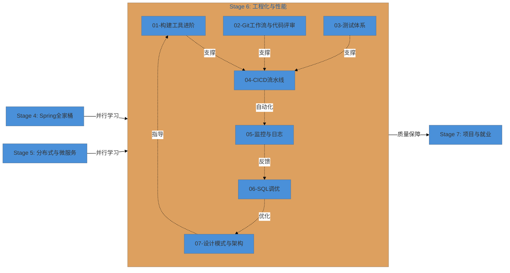

# Stage 6: 工程化与性能 -- Engineering & Performance

> **从"能写业务代码"到"可靠工程师"的关键蜕变**

| Stage | Focus | Duration |
|-------|-------|----------|
| Stage 6 | CI/CD, Build Tools, Testing, Monitoring, SQL Tuning, Architecture | 8-12 周（可与 Stage 4/5/7 并行） |

---

## 为什么工程化能力区分了初级与高级工程师

写业务代码人人都会，但**构建一个可维护、可测试、可监控、可快速迭代的系统**，需要工程化的思维和工具链。

| 初级工程师 | 高级/资深工程师 |
|-----------|---------------|
| 手动部署，SSH 上去改代码 | 自动化 CI/CD，一键发布 |
| 日志打到 System.out / 控制台 | 结构化日志 + 集中式日志平台 + 链路追踪 |
| 代码没有测试或只测"快乐路径" | 单元测试 + 集成测试 + 契约测试 + 覆盖率门禁 |
| Git 提交信息随意，分支混乱 | Conventional Commits + 规范分支策略 + Code Review |
| SQL 能跑就行 | EXPLAIN 分析 + 索引优化 + 慢查询治理 |
| 一个模块写到底 | 多模块工程 + BOM 依赖管理 + 构建优化 |
| 系统挂了才去排查 | 监控大盘 + 告警规则 + 健康检查 + 容量规划 |
| 代码耦合严重 | 设计模式 + 分层架构 + SOLID 原则 |

**工程化不是银弹，但没有工程化，团队规模越大越混乱。**

---

## 与其他 Stage 的关系

Stage 6 是一个 **横向贯穿的工程化阶段**，与前面的 Stage 并不是严格的顺序关系：



**为什么可以并行：**
- 你可以在写 Spring Boot 项目时**同步**引入测试体系、Git 规范和构建优化
- 监控与 SQL 调优可以在已有项目上逐步落地
- 设计模式是在编码过程中持续应用的能力

---

## 预备知识

### 硬性要求
- 熟练掌握 Java 语言基础 (Stage 1)
- 理解 JVM 基本概念 (Stage 2)
- 有 Spring Boot 项目开发经验 (Stage 4)
- 熟悉 Git 基本操作 (add, commit, push, pull, branch)

### 推荐了解
- 有 MySQL 使用经验 (Stage 3)
- 有基本的 Linux 操作能力
- 了解 Docker 基本概念

### 环境要求
| 工具 | 版本 | 用途 |
|------|------|------|
| JDK | 17+ (推荐 21 LTS) | 编译运行 |
| IntelliJ IDEA | 2023+ | 主力 IDE |
| Maven | 3.9+ | 构建工具 |
| Gradle | 8.x | 可选构建工具 |
| Git | 2.40+ | 版本控制 |
| Docker | 24+ | 容器化测试 |
| MySQL | 8.0+ | 数据库调优实践 |
| Node.js | 18+ | 部分 CI/CD 工具依赖 |

---

## 学习路径

### 推荐学习顺序

```text
第1-2周: 构建工具进阶 (01) + Git工作流 (02)
  → 重构现有项目为多模块工程，规范 Git 提交

第3-4周: 测试体系 (03)
  → 为已有项目补充测试用例，达到 70%+ 覆盖率

第5-6周: CI/CD 流水线 (04)
  → 搭建 Jenkins/GitHub Actions 流水线，自动化构建测试部署

第7-8周: 监控与日志 (05) + SQL 调优 (06)
  → 接入 Prometheus + Grafana，优化慢查询

第9-10周: 设计模式与架构 (07)
  → 重构项目，应用架构模式和设计原则

第11-12周: 综合实战项目
  → 产出性能审计报告 + 重构后的项目 + 设计决策文档
```

### 关键产出物

| 产出 | 描述 | 对应章节 |
|------|------|---------|
| **多模块工程** | 规范的 Maven/Gradle 多模块项目 | 01 |
| **BOM 依赖管理** | 统一版本管理 POM | 01 |
| **Git 提交规范** | Conventional Commits 合规 | 02 |
| **Code Review 流程** | PR 模板 + Review Checklist | 02 |
| **测试套件** | 单元测试 + 集成测试 + 覆盖率报告 | 03 |
| **CI/CD 流水线** | 自动化构建-测试-部署 | 04 |
| **监控大盘** | 服务指标 + 日志聚合 + 告警 | 05 |
| **SQL 优化报告** | 慢查询分析 + 索引优化建议 | 06 |
| **架构决策记录** | ADR 文档 + 设计模式应用 | 07 |
| **性能审计报告** | 综合性能评估与改进方案 | 所有章节 |

---

## 目录结构

```
06-工程化与性能/
├── README.md                              # 本文件 — Stage 6 总览
├── 01-构建工具进阶.md                     # Maven/Gradle 高级、多模块、BOM
├── 02-Git工作流与代码评审.md              # 分支策略、Conventional Commits、Review
├── 03-测试体系-JUnit与Mockito.md           # JUnit 5、Mockito、集成测试、TDD
├── 04-CICD流水线.md                       # Jenkins/GitHub Actions/GitLab CI
├── 05-监控与日志.md                       # 可观测性三大支柱
├── 06-SQL调优.md                          # 索引、查询优化、慢查询治理
└── 07-设计模式与架构.md                   # GoF 23 种模式 + 架构风格 + DDD
```

---

## 各章节速览

### 01-构建工具进阶
> 从"会配 pom.xml"到"能设计企业级构建体系"

- 多模块工程架构：common/api/service/dao/web/starter 模板
- Maven 高级：Profile、Plugin、Assembly、Enforcer
- Gradle 高级：自定义 Task、BuildSrc、Composite Build
- 依赖管理：BOM、Dependency Convergence、冲突解决
- 版本管理：SemVer、Release Strategy、SNAPSHOT 治理
- Nexus/Artifactory：代理仓库、私有仓库、Release/Snapshot
- 构建优化：并行编译、构建缓存、Profiling
- 供应链安全：OWASP Dependency-Check、CVE 扫描

### 02-Git工作流与代码评审
> 从"git push 完事"到"规范的分支与评审流程"

- Git 对象模型深入：blob/tree/commit/tag
- 分支策略对比：GitFlow vs GitHub Flow vs Trunk-Based
- 高级操作：Interactive Rebase、Bisect、Reflog、Cherry-pick
- Conventional Commits：type(scope): description
- Code Review 最佳实践：Checklist、Size Guidelines、Comment 分级
- PR 工作流：Draft → Review → Iteration → Approval → Merge
- Monorepo vs Polyrepo 的工程取舍
- .gitignore 最佳实践

### 03-测试体系-JUnit与Mockito
> 从"不写测试"到"TDD 驱动开发"

- 测试金字塔：Unit → Integration → E2E
- JUnit 5 深度：参数化测试、动态测试、Extension 模型、Test Suite
- Mockito 深度：Stubbing、Argument Matcher、Verification、Spy、Mock Static
- Spring Boot 测试：@SpringBootTest、Testcontainers、MockMvc
- 测试数据管理：Builder、Object Mother、Fixture
- 覆盖率：JaCoCo 配置与门禁
- 变异测试：PITest 入门
- TDD 循环：Red → Green → Refactor

### 04-CICD流水线
> 从"手动部署"到"一键发布"

- CI/CD 概念：Continuous Integration / Delivery / Deployment
- Jenkins：Declarative Pipeline、Shared Library、Multi-branch
- GitHub Actions：Workflow、Matrix Build、Cache、Self-hosted
- GitLab CI：.gitlab-ci.yml、Cache vs Artifacts、Auto DevOps
- 静态分析集成：SonarQube、Checkstyle、SpotBugs
- 部署策略：Rolling、Blue-Green、Canary、Feature Flags
- Pipeline 优化：并行、缓存、条件执行
- 安全：Secret 管理、日志脱敏

### 05-监控与日志
> 从"服务器挂了才知道"到"实时可观测性"

- 可观测性三大支柱：Logs + Metrics + Traces
- 日志体系：SLF4J + Logback + 结构化日志 + ELK/Loki
- 指标监控：Micrometer + Prometheus + Grafana
- 分布式追踪：OpenTelemetry + Zipkin/Jaeger
- 告警体系：Alertmanager + 告警规则 + Runbook
- Spring Boot Actuator 深度配置
- 四大黄金信号：Latency, Traffic, Errors, Saturation
- APM 工具对比：SkyWalking, Pinpoint, Datadog

### 06-SQL调优
> 从"SQL 能跑就行"到"查询毫秒级响应"

- SQL 执行顺序与优化器过程
- 索引优化：复合索引、覆盖索引、不可见索引
- 查询优化：分页优化、JOIN 优化、子查询优化
- Schema 优化：数据类型、范式与反范式、分区表
- 慢查询治理：慢查询日志、pt-query-digest
- 事务优化：短事务、批量操作、锁竞争
- 连接池优化：HikariCP 配置
- 读写分离：MySQL 主从 + ShardingSphere
- 真实案例：优化前后性能对比数据

### 07-设计模式与架构
> 从"代码能跑"到"代码优雅可维护"

- 创建型模式：Singleton、Factory、Builder、Prototype 的 Java 实现
- 结构型模式：Adapter、Decorator、Proxy、Facade 的 Spring 应用
- 行为型模式：Observer、Strategy、Template Method、Chain of Responsibility
- 架构模式：分层架构、六边形架构、事件驱动、管道架构
- SOLID 原则：每个原则的 Java/Spring 示例
- DDD 战术模式：Entity、Value Object、Aggregate、Domain Event
- 架构决策记录 (ADR)：模板与示例
- 反模式：上帝类、意大利面条代码、过早优化

---

## 学习建议

### 如何最大化学习效果

1. **在工作中实践**：将学到的工程化实践逐步应用到日常工作项目中
2. **从最痛点入手**：如果你的项目缺测试，就先学测试；如果构建慢，就学构建优化
3. **建立工程化清单**：创建一个"工程化 Checklist"，每次提交前检查
4. **代码评审是最好的学习**：多参与团队代码评审，学习别人的工程化实践
5. **自动化一切**：能用工具自动化的，绝不手动

### 常见陷阱

| 陷阱 | 正确做法 |
|------|---------|
| 追求 100% 测试覆盖率 | 关注关键路径的测试质量，而不是数字 |
| 过度设计架构 | 用 ADR 记录决策，保持演化式架构 |
| 搭建了监控但不看 | 设置有效的告警，建立 On-Call 机制 |
| CI/CD 配置过于复杂 | 保持 Pipeline 简洁，Pipeline as Documentation |
| 追求最新工具 | 选择团队能驾驭的成熟工具 |

### 推荐资源

| 资源 | 类型 | 相关章节 |
|------|------|---------|
| 《持续交付》Jez Humble | 书籍 | 04-CICD |
| 《Java Performance: In-Depth Advice》Scott Oaks | 书籍 | 05-监控 |
| 《高性能MySQL》 | 书籍 | 06-SQL |
| 《设计模式》GoF | 书籍 | 07-架构 |
| 《实现领域驱动设计》Vaughn Vernon | 书籍 | 07-架构 |
| 《重构：改善既有代码的设计》Martin Fowler | 书籍 | 07-架构 |
| SonarQube 官方文档 | 在线 | 04-CICD |
| Prometheus 官方文档 | 在线 | 05-监控 |
| JUnit 5 用户指南 | 在线 | 03-测试 |
| 阿里云云原生团队博客 | 在线 | 全部 |

---

## 面试高频考点

Stage 6 的知识点是 Java 高级工程师面试的重点，以下是常见面试题概览：

| 面试题 | 涉及章节 |
|--------|---------|
| Maven 依赖冲突如何解决？dependency convergence 是什么？ | 01 |
| Gradle 的 Configuration 和 Execution 阶段有什么区别？ | 01 |
| GitFlow 和 Trunk-Based 各自的适用场景？ | 02 |
| 如何用 Git Bisect 定位 bug？ | 02 |
| JUnit 5 的 Extension 模型如何工作？ | 03 |
| Mockito 如何 mock 静态方法和构造器？ | 03 |
| CI/CD Pipeline 如何确保只构建变更的模块？ | 04 |
| Blue-Green 部署和 Canary 部署有什么区别？ | 04 |
| 分布式追踪中 traceId 如何跨服务传递？ | 05 |
| SELECT * 为什么不好？深分页如何优化？ | 06 |
| 代理模式在 Spring 中的实现方式（JDK Proxy vs CGLIB）？ | 07 |
| DDD 中 Entity 和 Value Object 的区分标准？ | 07 |

---

## 学习进度追踪

- [ ] 01-构建工具进阶：多模块工程搭建
- [ ] 01-构建工具进阶：BOM 依赖管理
- [ ] 01-构建工具进阶：Maven Plugin 开发
- [ ] 01-构建工具进阶：构建优化与缓存
- [ ] 02-Git工作流：分支策略选型与配置
- [ ] 02-Git工作流：Conventional Commits 落地
- [ ] 02-Git工作流：Code Review 流程建立
- [ ] 03-测试体系：JUnit 5 全部特性
- [ ] 03-测试体系：Mockito 全部特性
- [ ] 03-测试体系：Spring Boot 集成测试
- [ ] 03-测试体系：Testcontainers 实践
- [ ] 03-测试体系：TDD 循环练习
- [ ] 04-CICD：Jenkins Pipeline 编写
- [ ] 04-CICD：GitHub Actions 工作流
- [ ] 04-CICD：SonarQube 集成
- [ ] 04-CICD：部署策略实践
- [ ] 05-监控与日志：结构化日志配置
- [ ] 05-监控与日志：Prometheus + Grafana 搭建
- [ ] 05-监控与日志：分布式追踪接入
- [ ] 05-监控与日志：告警规则设计
- [ ] 06-SQL调优：EXPLAIN 分析
- [ ] 06-SQL调优：慢查询治理实战
- [ ] 06-SQL调优：读写分离配置
- [ ] 07-设计模式：23 种模式 Java 实现
- [ ] 07-设计模式：SOLID 原则应用
- [ ] 07-设计模式：DDD 战术模式落地
- [ ] 07-设计模式：ADR 撰写

---

## 最终产出：工程化能力评估

完成 Stage 6 后，你应该能够：

- 设计并实现企业级多模块 Maven/Gradle 项目
- 建立规范的 Git 分支策略和 Code Review 流程
- 使用 JUnit 5 + Mockito 编写高质量测试
- 搭建完整的 CI/CD Pipeline
- 构建可观测性体系（日志 + 指标 + 追踪）
- 分析和优化 SQL 性能问题
- 应用设计模式和架构原则改进代码质量
- **产出完整的性能审计报告和重构方案**

> **工程化能力是区分"码农"和"工程师"的核心分水岭。**
> 它不是学完就结束的课程，而是贯穿整个职业生涯的持续修炼。
