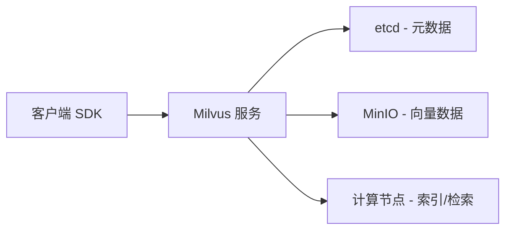

# 🗄️ 快速上手 Milvus

> **核心摘要**：Milvus 是目前国内最主流的开源向量数据库，专为 Embedding 向量检索与 AI 应用设计，支持毫秒级相似度检索与十亿级海量数据管理。本文涵盖核心概念、架构概览、Windows 本地部署（Docker）及完整的 Python 向量检索实战代码。

---

## 一、什么是 Milvus？

**Milvus** 是一个专门为高维向量数据设计的开源向量数据库，支持毫秒级相似度检索、海量数据存储和多模态向量管理。

### 核心能力

- **高效向量检索**：支持余弦相似度、L2 距离、内积等多种距离计算，百万级向量毫秒级响应
- **大规模存储**：支持十亿级向量数据，可横向扩展
- **多模态支持**：文本、图片、音频、视频等向量数据统一存储
- **灵活索引**：支持多种索引类型（FLAT、IVF_FLAT、HNSW 等），平衡检索速度与精度
- **完整生态**：兼容主流 AI 框架，支持 Python、Java、Go、REST API 等多种接入方式

> **重点**：Milvus 是构建 RAG 系统和语义搜索的标配工具，与 [[快速学会 主流向量数据库「全覆盖」]] 中其他向量数据库相比，Milvus 在分布式能力和大规模数据处理方面表现最优。

---

## 二、典型应用场景

| 场景 | 说明 |
|---|---|
| **RAG 知识库问答** | 文档分块 → 生成 Embedding → 存入 Milvus → 用户问题向量检索 → 召回相似文档 → 大模型生成回答 |
| **语义搜索** | 替代传统关键词匹配，实现"以意搜文"，如电商商品推荐、新闻内容推荐 |
| **推荐系统** | 用户/物品向量存入 Milvus，通过相似度召回相似内容 |
| **多模态检索** | 图片/文本向量统一存储，实现以文搜图、以图搜图 |

---

## 三、架构概览



- **元数据**：存放在 etcd 中，管理集合、索引、用户信息
- **向量数据**：存放在 MinIO 或本地磁盘，支持持久化
- **计算节点**：负责向量索引构建与检索计算

---

## 四、Windows 本地部署

### 4.1 安装 Docker Desktop

前往 Docker 官网安装 Docker Desktop（Windows 版），确保 WSL 2 后端已启用。

### 4.2 一键启动 Milvus

```powershell
# 拉取 Milvus 镜像
docker pull milvusdb/milvus:v2.4.3

# 启动 Milvus 服务
docker run -d --name milvus-standalone -p 19530:19530 -p 9091:9091 milvusdb/milvus:v2.4.3
```

启动后，Milvus 会在 `localhost:19530` 提供服务。

### 4.3 安装 Python SDK

```bash
pip install pymilvus
```

> **注意**：Java 后端可通过 `io.milvus:milvus-sdk-java` 接入，Maven 坐标：`milvus-sdk-java`。

---

## 五、Python 快速上手代码

以下完整示例涵盖**创建集合 → 插入向量 → 构建索引 → 相似度检索**全流程，可与 Embedding 代码无缝衔接：

```python
from pymilvus import MilvusClient, DataType
from sentence_transformers import SentenceTransformer
import numpy as np

# 1. 初始化 Milvus 客户端
client = MilvusClient(uri="http://localhost:19530")

# 2. 定义集合参数
collection_name = "embedding_demo"
dim = 384  # all-MiniLM-L6-v2 模型的向量维度

# 如果集合已存在，先删除（方便测试）
if client.has_collection(collection_name):
    client.drop_collection(collection_name)

# 创建集合
client.create_collection(
    collection_name=collection_name,
    dimension=dim,
    primary_field_name="id",
    vector_field_name="embedding",
    metric_type="COSINE",  # 余弦相似度
    auto_id=True
)

# 3. 加载 Embedding 模型
model = SentenceTransformer('all-MiniLM-L6-v2')

# 4. 准备数据
sentences = [
    "西红柿炒蛋怎么做",
    "番茄炒蛋的做法",
    "Java后端开发学习路线",
    "Python 入门教程"
]

# 生成向量
embeddings = model.encode(sentences)

# 插入数据到 Milvus
data = [{"embedding": emb} for emb in embeddings]
client.insert(collection_name=collection_name, data=data)

# 5. 构建索引
client.create_index(
    collection_name=collection_name,
    index_type="HNSW",
    metric_type="COSINE",
    params={"M": 8, "efConstruction": 64}
)

# 6. 向量检索
query_text = "番茄炒蛋的做法"
query_embedding = model.encode([query_text])

# 执行相似度搜索
results = client.search(
    collection_name=collection_name,
    data=query_embedding,
    limit=2,
    output_fields=["id"]
)

# 打印结果
print("查询文本:", query_text)
print("最相似的结果:")
for res in results[0]:
    print(f"ID: {res['id']}, 相似度: {res['distance']:.4f}, 对应句子: {sentences[res['id']]}")
```

---

## 六、关键概念

| 术语 | 说明 |
|---|---|
| **Collection** | 向量数据的容器，类似关系数据库中的表 |
| **Entity** | 一条数据记录，包含向量字段和其他标量字段 |
| **Index** | 向量索引，用于加速检索速度，常见类型有 HNSW、IVF_FLAT 等 |
| **Metric Type** | 相似度计算方式：`COSINE`（余弦相似度）、`L2`（欧氏距离）、`IP`（内积） |

---

## 七、常见问题

### 7.1 连接不上 Milvus？
- 检查 Docker 容器是否正常运行：`docker ps`
- 确认端口 19530 未被占用

### 7.2 检索结果不准？
- 检查向量维度是否与集合定义一致
- 确认 Metric Type 与模型输出的向量归一化方式匹配

### 7.3 数据量很大怎么办？
- 使用 Milvus 集群版，支持分布式存储与横向扩展
- 选择合适的索引类型：HNSW 适合高精度场景，IVF 适合大规模数据

---

## 八、与 RAG 项目结合

> **重点**：Milvus 最核心的用途是作为 RAG 系统的向量数据库。

1. 将知识库文档分块，每块生成 Embedding 存入 Milvus
2. 用户提问时，将问题生成 Embedding，在 Milvus 中召回最相似的文档块
3. 将召回的文档块作为上下文，喂给大模型生成回答

---

## 核心要点回顾

- Milvus 是高性能开源向量数据库，支持毫秒级相似度检索与十亿级数据管理
- 通过 Docker 可快速在 Windows 本地部署，`pymilvus` 提供简洁的 Python SDK
- Collection 类似数据库表，支持多种索引类型（HNSW、IVF_FLAT 等）和相似度计算方式
- 核心应用场景为 RAG 知识库问答、语义搜索、推荐系统和多模态检索
- Java 后端可通过 `milvus-sdk-java` 接入，实现与 Spring Boot 项目的整合

## 参考资料

1. Milvus 官方文档：https://milvus.io/docs
2. pymilvus SDK 参考：https://pypi.org/project/pymilvus/
3. milvus-sdk-java：https://github.com/milvus-io/milvus-sdk-java
4. Milvus 架构概述：https://milvus.io/docs/architecture_overview.md
