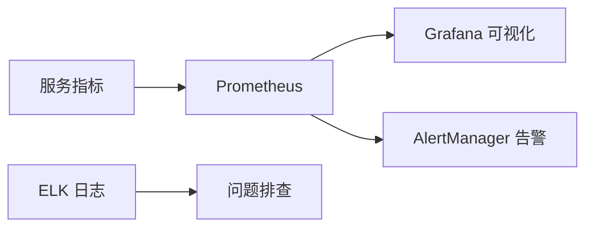

# 🚀 AI 模型服务化部署全解析

> **核心摘要**：AI 模型服务化部署是连接模型训练与业务应用的"最后一公里"，涵盖模型准备、优化、服务封装、部署发布到监控运维的全链路流程。本文深入解析云端/边缘/混合三种部署模式、核心支撑技术（Docker/K8s/TensorRT）及实践挑战与应对策略。

> **前置阅读**：[[Ollama本地部署与量化模型实战]]、[[Ollama实战：本地私有化部署开源大模型]]

---

## 目录

1. [核心概念与价值](#一核心概念与价值)
2. [完整部署流程](#二完整部署流程)
3. [核心技术支撑](#三核心技术支撑)
4. [实践挑战与应对策略](#四实践挑战与应对策略)
5. [典型应用场景](#五典型应用场景)
6. [未来趋势](#六未来趋势)

---

## 一、核心概念与价值

### 核心概念

**AI 模型服务化部署**是将训练好的模型通过标准化、工程化的方式封装为可复用、可扩展、高可用的服务，供业务系统通过 API 调用。其本质是"模型工程化"——将科研场景中"可运行"的模型转化为生产场景中"可服务"的系统组件。

### 核心价值

| 价值 | 说明 |
|---|---|
| **解耦高效** | 模型与业务逻辑分离，模型迭代无需改动业务代码 |
| **弹性可扩展** | 根据流量动态调整资源分配，高峰扩容、低峰缩容 |
| **标准化复用** | 统一 API 封装，模型可被多业务场景复用 |
| **稳定可观测** | 完善的监控、告警与故障自愈能力 |
| **跨平台适配** | 支持云端、边缘端、混合端多场景部署 |

---

## 二、完整部署流程

### 步骤一：模型准备

- **模型验证**：确认精度、召回率、推理速度满足业务需求
- **格式统一**：转换为通用部署格式（ONNX），解决框架兼容性
- **依赖梳理**：梳理 Python 版本、CUDA、框架版本等环境依赖

### 步骤二：模型优化

| 优化手段 | 说明 |
|---|---|
| **模型轻量化** | 剪枝（移除冗余参数）、量化（FP32 → FP16/INT8）、知识蒸馏 |
| **推理优化** | 计算图优化（算子融合）、批处理（静态/动态） |
| **硬件适配** | TensorRT（GPU）、OpenVINO（CPU），充分发挥硬件性能 |

### 步骤三：服务封装

- **接口设计**：REST/gRPC 协议，JSON/Tensor 格式，同步/异步调用
- **服务集成**：请求校验、结果格式化、异常处理
- **容器化封装**：Docker 打包模型、依赖环境、服务代码

### 步骤四：部署发布

| 部署模式 | 适用场景 | 核心工具 |
|---|---|---|
| **云端部署** | 高并发、大流量（智能客服、风控） | Kubernetes、PAI-EAS |
| **边缘部署** | 低延迟、离线（工业预测、移动端） | TensorFlow Lite、ONNX Runtime |
| **混合部署** | 边缘实时推理 + 云端参数更新 | 端云协同架构 |

### 步骤五：监控运维

- **实时监控**：CPU/GPU 利用率、请求延迟、成功率、推理耗时
- **告警机制**：多级阈值告警（短信、邮件、钉钉）
- **迭代更新**：灰度发布、蓝绿部署、版本管理
- **故障处理**：自愈机制（服务重启、实例扩容）

---

## 三、核心技术支撑

| 技术领域 | 核心工具 | 作用 |
|---|---|---|
| 容器化 | Docker + Kubernetes | 环境封装、弹性伸缩、负载均衡 |
| 推理优化 | TensorRT、OpenVINO、ONNX Runtime | 模型量化、计算图优化 |
| 服务化框架 | TorchServe、Triton Inference Server | 封装模型为 API 服务 |
| 监控运维 | Prometheus + Grafana + ELK | 指标采集、可视化、日志分析 |
| 分布式 | 参数服务器、Kafka/RabbitMQ | 大模型分片、异步队列 |

> **重点**：对于 Java 后端团队，推荐使用 Triton Inference Server 作为推理服务框架，其支持多框架模型（PyTorch、TensorFlow、ONNX），并提供 gRPC 接口便于 Java 客户端调用。

---

## 四、实践挑战与应对策略

| 挑战 | 应对策略 |
|---|---|
| **GPU 资源压力大** | 模型分片、量化剪枝、动态扩缩容 |
| **微服务通信开销** | gRPC 协议、批量处理、异步通信 |
| **模型迭代频繁** | 版本管理、灰度发布、容器镜像固化 |
| **运维复杂度高** | Kubernetes 自动化运维、可视化监控仪表盘 |
| **精度与性能难平衡** | 量化感知训练（QAT）、关键层高精度计算 |

---

## 五、典型应用场景

| 场景 | 架构特点 |
|---|---|
| **智能客服** | 文本理解/意图识别/回答生成拆分为独立微服务，异步队列处理 |
| **金融风险分析** | 大模型微服务化部署，参数服务器实现跨节点参数同步 |
| **工业预测维护** | 边缘设备实时分析 + 云端模型更新 |
| **计算机视觉** | 目标检测/图像分割服务化，支持实时视频流处理 |
| **推荐系统** | 用户画像/召回/排序模型服务化，支持快速迭代 |

---

## 六、未来趋势

1. **端云协同推理**：边缘端实时推理 + 云端训练更新
2. **自适应调度**：AI 预测流量，动态调整资源
3. **多模型融合服务**：统一接口支撑文本/语义/情感等复合场景
4. **自动化 MLOps**：训练-部署-监控-优化全链路自动化
5. **轻量化部署普及**：边缘设备算力提升，更多模型部署到端侧

---

## 核心要点回顾

- AI 模型服务化部署是模型工程化的核心环节，核心五步：准备 → 优化 → 封装 → 发布 → 运维
- 三种部署模式：云端（高并发）、边缘（低延迟）、混合（兼顾）
- 核心技术栈：Docker/K8s（容器化）、TensorRT/ONNX（优化）、Prometheus/Grafana（监控）
- 五大挑战对应五大策略，核心在于资源管理和自动化运维

## 参考资料

1. Docker 官方文档：https://docs.docker.com
2. Kubernetes 文档：https://kubernetes.io/docs
3. TensorRT 文档：https://developer.nvidia.com/tensorrt
4. ONNX Runtime：https://onnxruntime.ai
5. Prometheus 文档：https://prometheus.io/docs
6. Triton Inference Server：https://github.com/triton-inference-server/server
