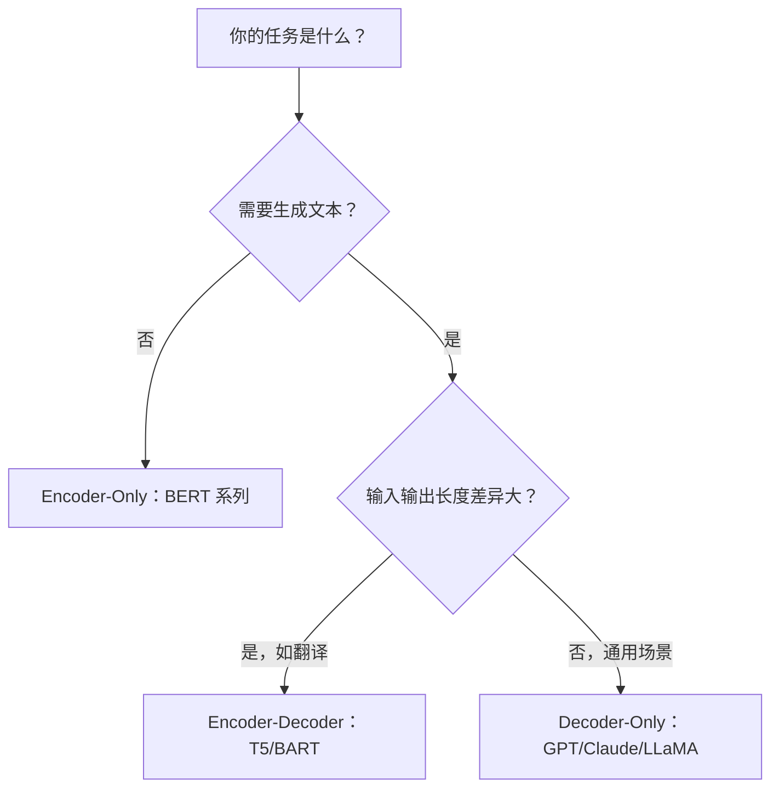
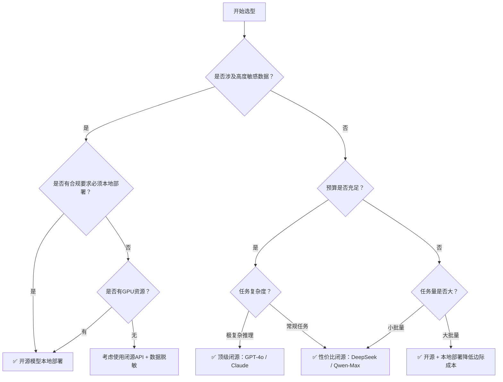

# 🎯 大模型分类与选型指南

> 面对 GPT、Claude、LLaMA、Qwen、DeepSeek、GLM 等众多大模型，开发者最常遇到的困惑是"该选哪个模型"。本文从架构分类、能力对比、部署方式和业务场景四个维度，建立系统化的模型选型方法论，帮助你在性能和成本之间找到最优解。

## 前置阅读

- [[01-Transformer架构详解：自注意力与多头注意力]]
- [[AI 大模型核心知识点]]
- [[大语言模型（LLM）详细知识点]]

## 目录

1. [三大架构分类](#1-三大架构分类)
2. [主流模型能力矩阵](#2-主流模型能力矩阵)
3. [开源 vs 闭源：选型决策树](#3-开源-vs-闭源选型决策树)
4. [按业务场景选型](#4-按业务场景选型)
5. [参数规模的权衡法则](#5-参数规模的权衡法则)
6. [部署方式的考量](#6-部署方式的考量)

---

## 1. 三大架构分类

所有大语言模型都可以归入以下三类架构之一：

### 1.1 Encoder-Only（编码器架构）

| 特性 | 说明 |
|------|------|
| **核心能力** | 理解输入文本的语义 |
| **Attention** | 双向（能看到上下文全部内容） |
| **输出** | 向量表示或分类标签，不生成文本 |
| **代表模型** | BERT、RoBERTa、DeBERTa |

```
适用场景：
✅ 文本分类（情感分析、垃圾检测）
✅ 命名实体识别（NER）
✅ 语义相似度计算
✅ 文本嵌入（Embedding）生成
❌ 对话生成
❌ 代码补全
❌ 创意写作
```

### 1.2 Decoder-Only（解码器架构）

| 特性 | 说明 |
|------|------|
| **核心能力** | 逐词生成文本 |
| **Attention** | 单向因果（只能看到已生成的内容） |
| **输出** | 自然语言文本、代码等 |
| **代表模型** | GPT-4、Claude、LLaMA、Qwen、DeepSeek |

```
适用场景：
✅ 对话与聊天
✅ 文本生成与创作
✅ 代码生成与补全
✅ 推理与复杂问题解决
✅ 翻译（实际上效果也很好）
❌ 单纯需要文本嵌入向量（不够高效）
```

> **重点**：当前 AI 应用开发 90% 以上的场景都使用 Decoder-Only 模型。这是大模型应用开发的主战场。

### 1.3 Encoder-Decoder（序列到序列架构）

| 特性 | 说明 |
|------|------|
| **核心能力** | 输入序列 → 理解 → 生成输出序列 |
| **Attention** | Encoder 双向 + Decoder 单向因果 + 交叉注意力 |
| **输出** | 翻译结果、摘要等 |
| **代表模型** | T5、BART、mT5 |

```
适用场景：
✅ 机器翻译（传统优势领域）
✅ 文本摘要
✅ 语音转文字
❌ 通用对话（已被 Decoder-Only 超越）
```

### 1.4 架构选择速查



---

## 2. 主流模型能力矩阵

### 2.1 闭源模型（API 调用）

| 模型 | 开发商 | 核心优势 | 适用场景 | Token 成本（参考） |
|------|--------|----------|----------|-------------------|
| **GPT-4o** | OpenAI | 综合能力最强，多模态原生 | 复杂推理、多模态、通用对话 | 较高 |
| **Claude 4 Sonnet** | Anthropic | 长上下文（200K），安全性高 | 长文档分析、代码审查、安全敏感任务 | 中等 |
| **Gemini 2.5 Pro** | Google | 原生多模态，与 Google 生态集成 | 搜索增强、多模态分析 | 中等 |
| **DeepSeek-V3** | 深度求索 | 极高性价比，开源友好 | 成本敏感型场景、大批量任务 | 极低 |
| **Qwen-Max** | 阿里云 | 中文能力顶级，阿里生态 | 中文场景、百炼平台集成 | 中等 |
| **豆包/Seed** | 字节跳动 | 中文场景优化 | 中文应用、抖音生态集成 | 低 |

### 2.2 开源模型（本地部署）

| 模型 | 参数规模 | 核心亮点 | 硬件要求（最低） | 适用场景 |
|------|----------|----------|----------------|----------|
| **LLaMA 3/4** | 8B–405B | Meta 出品，生态最完善 | 8B: 6GB显存 / 70B: 40GB | 通用场景、二次开发 |
| **Qwen 2.5** | 0.5B–72B | 中文能力最强的开源模型 | 7B: 6GB显存 / 72B: 40GB | 中文场景、企业内部应用 |
| **DeepSeek-V3** | 671B(MoE) | 开源 + MoE 架构极致性价比 | 需要多卡部署 | 复杂推理、知识密集型任务 |
| **GLM-4** | 9B | 中文长上下文优秀 | 9B: 8GB显存 | 中文对话、文档分析 |
| **Mistral** | 7B–Large | 欧洲产，多语言能力均衡 | 7B: 6GB显存 | 多语言场景 |
| **Phi-4** | 14B | 微软出品，小模型高能力 | 14B: 10GB显存 | 边缘设备、资源受限场景 |

---

## 3. 开源 vs 闭源：选型决策树



### 关键决策因素

| 因素 | 倾向闭源 | 倾向开源 |
|------|---------|---------|
| 数据安全 | 低要求 | 高要求（金融、医疗、政务） |
| 定制化需求 | 通用场景足够 | 需要深度定制/微调 |
| 延迟敏感 | API 延迟不可控 | 本地部署可优化 |
| 成本结构 | 小批量便宜 | 大批量边际成本低 |
| 技术团队 | 无需运维 | 需要 ML 工程能力 |

---

## 4. 按业务场景选型

### 4.1 智能客服 / 企业问答

```
推荐方案：RAG + 性价比模型
首选：DeepSeek-V3（API）或 Qwen 2.5 72B（本地）
备选：GPT-4o-mini（API，低延迟）
关键考量：响应速度 > 创意性，需要精准的事实检索
```

### 4.2 代码生成与审查

```
推荐方案：代码专用模型
首选：Claude 4 Sonnet（代码审查）、DeepSeek-Coder
备选：GPT-4o（代码生成）
关键考量：代码正确性 > 解释详细度，对上下文长度要求高
```

### 4.3 内容创作与写作

```
推荐方案：创意型模型
首选：Claude 4 Opus（长文写作）、GPT-4o（多模态创意）
备选：本地 Qwen 2.5 + 微调（品牌风格定制）
关键考量：文风质量、创意性、长文本连贯性
```

### 4.4 数据分析与报告

```
推荐方案：推理型 + 长上下文
首选：Claude 4 Sonnet（200K 上下文窗口）
备选：Gemini 2.5 Pro（原生表格理解）
关键考量：结构化推理能力、大上下文处理数据表格
```

---

## 5. 参数规模的权衡法则

### 5.1 规模-能力曲线

| 参数规模 | 典型能力 | 成本 | 推荐用途 |
|----------|---------|------|---------|
| 0.5B–3B | 简单文本处理 | 极低（CPU 可跑） | 文本分类、关键词提取、边缘设备 |
| 7B–14B | 常规对话理解 | 低（消费级 GPU） | 智能客服、RAG 生成层、个人助手 |
| 30B–72B | 复杂推理与创作 | 中（A100 单卡） | 企业核心应用、代码审查、复杂分析 |
| 100B+ | 接近人类专家水平 | 高（多卡集群） | 顶级推理、科研分析、关键任务 |

> **重点**：并非参数越大越好。7B 模型经过微调，在垂直领域的表现往往超过通用 70B 模型。**微调质量 >> 参数规模**。

### 5.2 MoE 架构的降维打击

**混合专家（Mixture of Experts, MoE）** 架构打破了大参数 = 高成本的魔咒：

- DeepSeek-V3 总参数 671B，但每次推理只激活约 37B 参数
- 实现了**大参数的能力 + 小参数的成本**
- 这代表了未来大模型架构演进的主流方向

---

## 6. 部署方式的考量

### 6.1 三种部署模式对比

| 模式 | 延迟 | 成本 | 灵活性 | 数据安全 | 运维负担 |
|------|------|------|--------|---------|---------|
| **API 调用** | 中（网络延迟） | 按量付费 | 低 | 低 | 无 |
| **云 GPU 托管** | 低 | 按实例付费 | 中 | 中 | 低 |
| **本地部署** | 极低 | 固定硬件成本 | 高 | 高 | 高 |

### 6.2 推荐路径

```
初创/验证阶段  → API 调用（快速验证想法）
                ↓
业务增长阶段  → 云 GPU + 开源模型（降本 + 可控）
                ↓
成熟稳定阶段  → 本地集群 + 微调（极致优化）
```

---

## 核心要点回顾

- 三大架构各有分工：Encoder 理解、Decoder 生成、Encoder-Decoder 翻译
- **90%+ 的应用开发使用 Decoder-Only 模型**（GPT/Claude/LLaMA 等）
- 选型决策核心四步：数据安全 → 任务复杂度 → 预算 → 部署能力
- 开源 vs 闭源不是非此即彼：可以 API 做核心推理 + 开源做辅助任务
- **参数规模不是唯一标准**：微调后的 7B 模型 > 通用 70B 模型
- MoE 架构是未来的主流方向

## 参考资料

1. [[01-Transformer架构详解：自注意力与多头注意力]]
2. [[AI 大模型核心知识点]]
3. [[大语言模型（LLM）详细知识点]]
4. [[快速吃透：大模型特性 + 部署方案 + 大模型Agent 区别&联系]]
5. [[快速学会「预训练模型」]]
6. [[大模型API调用实战：多平台统一调用与流式输出]]
