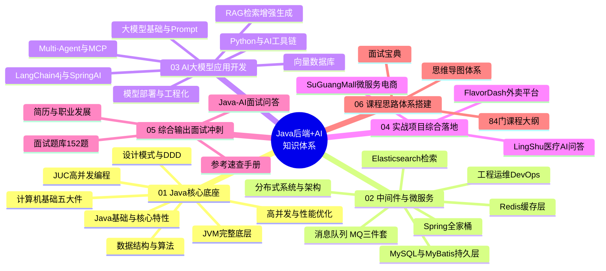
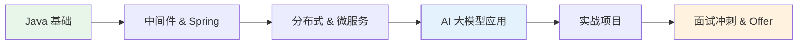

# 00 - Java 后端 + AI 大模型 知识体系思维导图总览

> 🎯 一张图看懂「Java 后端工程师 → AI 大模型应用开发工程师」的完整成长版图 —— 6 层金字塔、1500+ 篇文档、从地基到面试冲刺的全链路知识地图

---

## 📚 目录

1. [知识体系总图](#1-知识体系总图)
2. [思维导图文件导航](#2-思维导图文件导航)
3. [六层金字塔速览](#3-六层金字塔速览)
4. [学习路线推荐](#4-学习路线推荐)
5. [核心能力速查](#5-核心能力速查)
6. [如何使用本思维导图](#6-如何使用本思维导图)

---

## 1. 知识体系总图

> 💡 下方 Mermaid 思维导图在 GitHub / VS Code / Typora / Obsidian 中均可直接渲染为可视化脑图；纯文本环境可看第 3 节 ASCII 树。



---

## 2. 思维导图文件导航

> 本思维导图体系拆分为 1 张总图 + 6 张分层专题图，每张图聚焦一层金字塔，可独立学习也可串联成长。

| # | 思维导图文件 | 覆盖范围 | 适合人群 |
|---|-------------|---------|:--------:|
| 00 | 思维导图总览（本文件） | 全局版图 + 路线 + 速查 | 所有人 |
| 01 | [Java核心底座思维导图](./01-Java核心底座思维导图.md) | Java + JUC + JVM + 设计模式 + 计算机基础 + DSA | 初学 → 中级 |
| 02 | [中间件与微服务思维导图](./02-中间件与微服务工程思维导图.md) | MySQL + Redis + MQ + ES + Spring + DevOps + 分布式 | 中级 → 高级 |
| 03 | [AI大模型应用开发思维导图](./03-AI大模型应用开发思维导图.md) | Prompt + RAG + Agent + 向量库 + 部署 + 框架 | 转型 AI |
| 04 | [实战项目思维导图](./04-实战项目综合落地思维导图.md) | 三大核心项目 + 40+ 技术专项练习 | 项目落地 |
| 05 | [面试冲刺思维导图](./05-面试冲刺思维导图.md) | 题库 + 手写代码 + 简历 + 职业发展 | 求职冲刺 |
| 06 | [学习路线思维导图](./06-学习路线全景思维导图.md) | 三条成长路径 + 阶段里程碑 + 时间规划 | 规划学习 |

---

## 3. 六层金字塔速览

```text
                          ┌─────────────────────────────┐
                          │   06 课程思路体系（索引层）    │  84+ 门课程大纲 + 面试宝典 + 思维导图
                          └─────────────────────────────┘
                       ┌────────────────────────────────────┐
                       │     05 综合输出 面试冲刺（输出层）      │  152 题库 + 手写代码 + 简历 + 速查
                       └────────────────────────────────────┘
                    ┌──────────────────────────────────────────┐
                    │      04 实战项目综合落地（证明层）           │  FlavorDash + SuGuangMall + LingShu
                    └──────────────────────────────────────────┘
                 ┌────────────────────────────────────────────────┐
                 │       03 AI 大模型应用开发（差异层）               │  RAG + Agent + MCP + LangChain4j + SpringAI
                 └────────────────────────────────────────────────┘
              ┌──────────────────────────────────────────────────────┐
              │     02 后端中间件 & 微服务工程（骨架层）                 │  MySQL + Redis + MQ + ES + Spring + DevOps
              └──────────────────────────────────────────────────────┘
           ┌────────────────────────────────────────────────────────────┐
           │       01 底层根基 Java 核心底座（地基层）                       │  Java + JUC + JVM + 设计模式 + 计算机基础 + DSA
           └────────────────────────────────────────────────────────────┘
```

| 层级 | 定位 | 一句话价值 |
|:---:|------|-----------|
| 01 地基 | 底层根基 | 决定技术上限的内功 —— 语言、并发、虚拟机、算法 |
| 02 骨架 | 中间件微服务 | 后端工程师的核心生产力 —— 存储、缓存、消息、框架 |
| 03 差异 | AI 大模型 | 拉开差距的第二曲线 —— 让后端具备 AI 应用落地能力 |
| 04 证明 | 实战项目 | 把知识变成简历亮点 —— 可讲、可深挖的完整项目 |
| 05 输出 | 面试冲刺 | 把能力变成 offer —— 题库、手写、简历、话术 |
| 06 索引 | 课程体系 | 学习方法论与资源地图 —— 知道该学什么、按什么顺序 |

---

## 4. 学习路线推荐

> 🎯 详细阶段拆解见 [06-学习路线全景思维导图](./06-学习路线全景思维导图.md)，此处为总纲。



- **路线 A｜零基础后端**：01 地基 → 02 骨架 → 04 项目 → 05 面试（6-9 个月）
- **路线 B｜后端转 AI**：夯实 01/02 → 03 AI 大模型 → 04 AI 项目 → 05 AI 面试（3-4 个月）
- **路线 C｜求职冲刺**：05 题库驱动 → 反查 01/02/03 补漏 → 04 项目深挖（1-2 个月）

---

## 5. 核心能力速查

| 能力维度 | 关键技术栈 | 对应思维导图 |
|---------|-----------|-------------|
| 语言内功 | Java 语法、泛型、集合源码、IO/NIO | [01](./01-Java核心底座思维导图.md) |
| 并发与性能 | JUC、AQS、线程池、JVM 调优、GC | [01](./01-Java核心底座思维导图.md) |
| 数据存储 | MySQL InnoDB/索引/事务、Redis、MongoDB | [02](./02-中间件与微服务工程思维导图.md) |
| 消息与检索 | RabbitMQ/RocketMQ/Kafka、Elasticsearch | [02](./02-中间件与微服务工程思维导图.md) |
| 后端框架 | Spring/SpringBoot/SpringCloud Alibaba | [02](./02-中间件与微服务工程思维导图.md) |
| 工程运维 | Docker、K8s、Nginx、Linux、CI/CD、监控 | [02](./02-中间件与微服务工程思维导图.md) |
| AI 应用 | Prompt、RAG、Agent、MCP、向量库 | [03](./03-AI大模型应用开发思维导图.md) |
| AI 框架 | LangChain4j、Spring AI、Ollama | [03](./03-AI大模型应用开发思维导图.md) |
| 项目落地 | 单体 / 微服务 / 垂直 AI 三种架构 | [04](./04-实战项目综合落地思维导图.md) |
| 求职输出 | 152 题库、手写代码、简历、职业规划 | [05](./05-面试冲刺思维导图.md) |

---

## 6. 如何使用本思维导图

1. **先看总图**：本文件第 1 节 Mermaid 脑图 → 建立全局坐标系。
2. **按层深入**：根据当前阶段选择 01-06 中对应的分层思维导图。
3. **图文互查**：思维导图给结构，正文文档给细节 —— 每个节点都可下钻到 `01`-`05` 层的具体 `.md` 文档。
4. **路线驱动**：用第 4 节路线图规划顺序，用 [06](./06-学习路线全景思维导图.md) 做时间管理。
5. **面试反查**：临近面试时以 [05](./05-面试冲刺思维导图.md) 为纲，缺什么反查对应层。

> 💡 **渲染建议**：Mermaid `mindmap` 语法需 Mermaid 9.3+；在 GitHub、Typora、Obsidian、VS Code（Markdown Preview Mermaid Support 插件）中均可可视化。纯文本查看请参考各文件的 ASCII 树。

---

**下一模块**：[01-Java核心底座思维导图](./01-Java核心底座思维导图.md) / **返回仓库**：[README](../../README.md)

