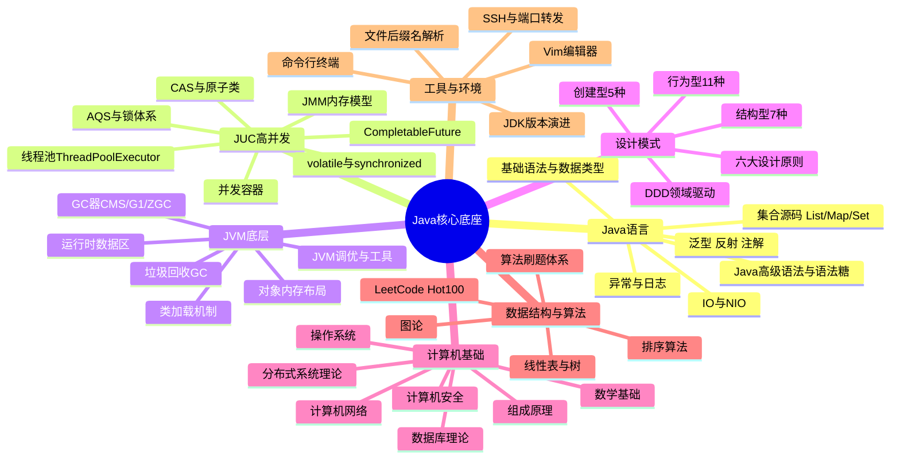
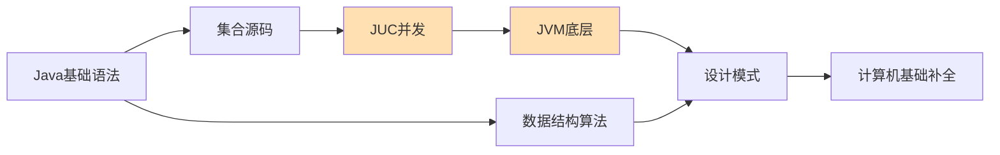

# 01 - Java 核心底座思维导图

> 🎯 决定技术上限的内功层 —— Java 语言、JUC 高并发、JVM 底层、设计模式、计算机基础、数据结构与算法

---

## 📚 目录

1. [核心脑图](#1-核心脑图)
2. [知识体系导图（ASCII）](#2-知识体系导图ascii)
3. [模块深度拆解](#3-模块深度拆解)
4. [高频考点速查](#4-高频考点速查)
5. [学习顺序建议](#5-学习顺序建议)

---

## 1. 核心脑图



---

## 2. 知识体系导图（ASCII）

```text
01 底层根基 · Java 核心底座
│
├── 🔤 Java 语言
│   ├── 基础语法与核心特性 ── 数据类型 / 面向对象 / String / 枚举
│   ├── 泛型 · 反射 · 注解 ── 类型擦除 / 通配符 / 动态代理
│   ├── 集合框架 ── ArrayList / HashMap / ConcurrentHashMap 源码
│   ├── IO 与 NIO ── 流模型 / Channel / Buffer / Selector / 零拷贝
│   ├── Java 高级语法 & 语法糖 ── Lambda / Stream / Optional / 自动装箱
│   └── Java API & JavaWeb ── 常用 API / Servlet / JSP / Filter
│
├── ⚡ JUC 高并发编程
│   ├── JMM ── 可见性 / 有序性 / 原子性 / happens-before
│   ├── 关键字 ── volatile / synchronized（锁升级）
│   ├── CAS 与原子类 ── Unsafe / AtomicXxx / ABA 问题
│   ├── AQS 锁体系 ── ReentrantLock / 读写锁 / Condition
│   ├── 线程池 ── 7 参数 / 4 拒绝策略 / 工作窃取
│   ├── 并发工具 ── CountDownLatch / CyclicBarrier / Semaphore
│   └── 异步编排 ── Future / CompletableFuture
│
├── 🧬 JVM 完整底层
│   ├── 类加载 ── 双亲委派 / 加载-链接-初始化 / 自定义类加载器
│   ├── 运行时数据区 ── 堆 / 栈 / 方法区 / 程序计数器
│   ├── 对象内存 ── 对象头 / 指针压缩 / 逃逸分析
│   ├── 垃圾回收 ── 可达性分析 / 分代 / 三色标记
│   ├── GC 收集器 ── Serial / Parallel / CMS / G1 / ZGC
│   └── 调优实战 ── jstat / jmap / jstack / Arthas / MAT
│
├── 🎨 设计模式
│   ├── 六大原则 ── SRP / OCP / LSP / ISP / DIP / 迪米特
│   ├── 创建型（5）── 单例 / 工厂 / 抽象工厂 / 建造者 / 原型
│   ├── 结构型（7）── 代理 / 适配器 / 装饰 / 门面 / 桥接 / 组合 / 享元
│   ├── 行为型（11）── 策略 / 模板 / 观察者 / 责任链 / 状态 ...
│   └── DDD ── 领域模型 / 聚合根 / 限界上下文
│
├── 💻 计算机基础
│   ├── 操作系统 ── 进程线程 / 调度 / 内存管理 / IO 多路复用
│   ├── 计算机网络 ── TCP/UDP / HTTP / TLS / 三次握手四次挥手
│   ├── 组成原理 ── CPU / 存储层次 / 缓存一致性
│   ├── 分布式理论 ── CAP / BASE / Paxos / Raft
│   ├── 数据库理论 ── 范式 / 事务 / 隔离级别
│   ├── 计算机安全 ── 加密 / 认证 / 常见攻防
│   └── 数学基础 ── 离散数学 / 概率 / 线性代数
│
├── 🧮 数据结构与算法
│   ├── 线性结构 ── 数组 / 链表 / 栈 / 队列 / 哈希
│   ├── 树与图 ── 二叉树 / BST / 堆 / 并查集 / 图遍历
│   ├── 经典算法 ── 排序 / 双指针 / 滑动窗口 / DP / 回溯
│   └── 刷题体系 ── LeetCode Hot100 / 30 天冲刺计划
│
└── 🛠️ 工具与环境
    ├── Vim ── 基础编辑 → 文本对象/宏/寄存器 → 插件 IDE 化
    ├── JDK ── 版本演进 / 特性对比 / 环境配置
    ├── 命令行终端 ── 常见终端及命令
    ├── 文件后缀名 ── 100+ 格式：文本/源码/配置/归档/多媒体
    └── SSH & 端口转发 ── 远程连接 / 隧道
```

---

## 3. 模块深度拆解

| 子模块 | 核心内容 | 难度 | 面试权重 |
|--------|---------|:---:|:---:|
| Java 基础语法与核心特性 | 数据类型、OOP、String、集合源码、IO/NIO、异常 | ⭐⭐ | 🔥🔥🔥 |
| 泛型 · 反射 · 注解 | 类型擦除、通配符、动态代理、注解处理器 | ⭐⭐⭐ | 🔥🔥 |
| JUC 高并发编程 | volatile、synchronized、AQS、线程池、CompletableFuture | ⭐⭐⭐⭐ | 🔥🔥🔥 |
| JVM 完整底层 | 类加载、内存区、GC（CMS/G1/ZGC）、调优工具 | ⭐⭐⭐⭐ | 🔥🔥🔥 |
| 设计模式 | GoF 23 种 + 六大原则 + DDD | ⭐⭐⭐ | 🔥🔥 |
| 计算机基础 | OS、网络、组成原理、分布式理论、安全 | ⭐⭐⭐ | 🔥🔥🔥 |
| 数据结构与算法 | LeetCode Hot100、排序、图论、DP | ⭐⭐⭐⭐ | 🔥🔥🔥 |
| 高并发与性能优化 | 高并发设计、池化技术、异步编程、压测 | ⭐⭐⭐⭐ | 🔥🔥 |

> 🎯 **核心要点**：JUC + JVM + 集合源码 + 算法 是 Java 后端面试的「四大杀器」，必须能手写、能画图、能讲原理。

---

## 4. 高频考点速查

| 主题 | 必答问题 |
|------|---------|
| HashMap | 底层结构、扩容机制、为什么线程不安全、1.7 vs 1.8 |
| ConcurrentHashMap | 分段锁 → CAS+synchronized 演进、size 计算 |
| synchronized | 锁升级过程、对象头、与 Lock 区别 |
| AQS | state + CLH 队列、公平 vs 非公平、独占 vs 共享 |
| 线程池 | 7 大参数、任务处理流程、如何设置核心线程数 |
| JVM 内存 | 各区域作用、栈帧结构、OOM 排查 |
| GC | 分代回收、G1 vs CMS、STW、如何选择收集器 |
| 类加载 | 双亲委派、如何打破、SPI 机制 |

---

## 5. 学习顺序建议



先打牢语法与集合 → 攻克并发与 JVM（面试核心）→ 同步刷算法 → 补设计模式与计算机基础形成闭环。

---

**上一模块**：[00-思维导图总览](./00-思维导图总览.md) / **下一模块**：[02-中间件与微服务工程思维导图](./02-中间件与微服务工程思维导图.md)

