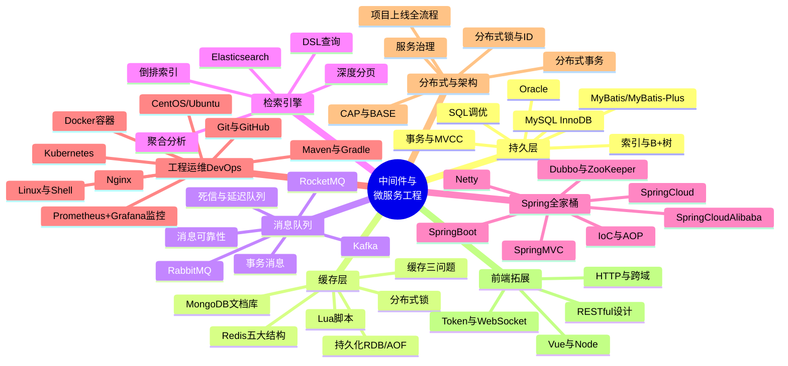
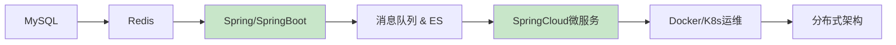

# 02 - 中间件与微服务工程思维导图

> 🎯 后端工程师的核心生产力 —— 数据存储、缓存、消息、检索、Spring 全家桶、DevOps 运维、分布式架构

---

## 📚 目录

1. [核心脑图](#1-核心脑图)
2. [知识体系导图（ASCII）](#2-知识体系导图ascii)
3. [模块深度拆解](#3-模块深度拆解)
4. [高频考点速查](#4-高频考点速查)
5. [学习顺序建议](#5-学习顺序建议)

---

## 1. 核心脑图



---

## 2. 知识体系导图（ASCII）

```text
02 后端中间件 & 微服务工程
│
├── 🗄️ 持久层（存储）
│   ├── MySQL ── InnoDB / B+树索引 / 事务 / MVCC / 锁 / SQL 调优 / 主从
│   ├── MyBatis ── 映射 / 动态 SQL / 缓存 / 插件 / MyBatis-Plus
│   └── Oracle ── 企业级特性对比
│
├── ⚡ 缓存层
│   ├── Redis ── 五大结构 / 持久化 RDB+AOF / 过期淘汰
│   │           缓存穿透·击穿·雪崩 / 分布式锁 / Lua / 集群
│   └── MongoDB ── 文档模型 / 聚合管道 / 分片副本集
│
├── 📨 消息队列
│   ├── RabbitMQ ── Exchange / 死信 / 延迟队列 / 可靠性投递
│   ├── RocketMQ ── 事务消息 / 顺序消息 / 消息回溯
│   └── Kafka ── 分区 / 副本 / 高吞吐 / 消费者组 / 零拷贝
│
├── 🔍 检索引擎
│   └── Elasticsearch ── 倒排索引 / DSL / 分词 / 聚合 / 深度分页 / ELK
│
├── 🌱 Spring 全家桶与微服务
│   ├── Spring ── IoC / AOP / 事务 / 循环依赖 / Bean 生命周期
│   ├── SpringBoot ── 自动配置 / Starter / 内嵌容器 / Actuator
│   ├── SpringMVC ── DispatcherServlet / 参数绑定 / 拦截器
│   ├── SpringCloud ── Nacos / OpenFeign / Gateway / Sentinel
│   ├── SpringCloud Alibaba ── 服务注册 / 配置中心 / 限流熔断
│   ├── Dubbo + ZooKeeper ── RPC / 注册中心 / 负载均衡
│   └── Netty ── Reactor / 编解码 / 粘包拆包 / 心跳
│
├── 🚢 工程运维 DevOps
│   ├── Docker ── 镜像 / 容器 / Compose / 网络 / 数据卷
│   ├── Kubernetes ── Pod / Service / Deployment / Ingress
│   ├── Nginx ── 反向代理 / 负载均衡 / 动静分离 / 限流
│   ├── Linux & Shell ── 常用命令 / 脚本 / 权限 / 进程
│   ├── Maven & Gradle ── 依赖管理 / 生命周期 / 多模块
│   ├── Git & GitHub ── 分支 / 合并 / rebase / 工作流
│   ├── 监控 ── Prometheus + Grafana / 告警
│   ├── CentOS ── dnf / SELinux / firewalld / 生产部署
│   ├── Ubuntu ── apt / 权限 / systemd / Shell
│   └── 测试 ── Postman / JMeter / 软件测试 / 代码质量
│
├── 🌐 分布式系统与架构
│   ├── 理论 ── CAP / BASE / 一致性协议
│   ├── 分布式事务 ── 2PC / TCC / Saga / 本地消息表
│   ├── 分布式锁 & ID ── Redis 锁 / Redisson / 雪花算法
│   ├── 服务治理 ── 限流 / 熔断 / 降级 / 灰度
│   └── 项目全流程 ── 需求 → 方案 → 编码 → 测试 → CI/CD → 上线 → 运维
│
├── 📖 知识体系搭建
│   └── Java 后端名词剖析 ── 10 大模块 300+ 名词完整体系
│
└── 🎨 前端知识拓展
    ├── HTTP 规范 / 跨域 / 状态码 / Chrome 调试
    ├── RESTful 设计 / 统一返回格式 / JSON 交互
    ├── Vue（路由/状态管理/SPA）/ Node.js / npm
    └── Token / WebSocket / Axios / BFF / SSR
```

---

## 3. 模块深度拆解

| 子模块 | 核心内容 | 难度 | 面试权重 |
|--------|---------|:---:|:---:|
| MySQL 与 MyBatis | InnoDB、B+树、MVCC、SQL 调优、动态 SQL | ⭐⭐⭐⭐ | 🔥🔥🔥 |
| Redis 缓存层 | 五大结构、持久化、缓存三问题、分布式锁 | ⭐⭐⭐ | 🔥🔥🔥 |
| 消息队列三件套 | 可靠性、死信/延迟、事务消息、高吞吐 | ⭐⭐⭐⭐ | 🔥🔥🔥 |
| Elasticsearch | 倒排索引、DSL、聚合、深度分页 | ⭐⭐⭐ | 🔥🔥 |
| Spring 全家桶 | IoC/AOP、自动配置、循环依赖、事务 | ⭐⭐⭐⭐ | 🔥🔥🔥 |
| SpringCloud 微服务 | Nacos、Feign、Gateway、Sentinel | ⭐⭐⭐⭐ | 🔥🔥🔥 |
| 工程运维 DevOps | Docker、K8s、Nginx、CI/CD、监控 | ⭐⭐⭐ | 🔥🔥 |
| 分布式系统与架构 | CAP、分布式事务/锁/ID、服务治理 | ⭐⭐⭐⭐⭐ | 🔥🔥🔥 |

> 🎯 **核心要点**：MySQL 索引与事务、Redis 缓存三问题、Spring 循环依赖与 AOP、分布式事务 是四大必问硬骨头。

---

## 4. 高频考点速查

| 主题 | 必答问题 |
|------|---------|
| MySQL 索引 | 为什么用 B+树、聚簇 vs 非聚簇、索引失效场景、回表 |
| MySQL 事务 | ACID、四种隔离级别、MVCC、间隙锁 |
| Redis | 缓存穿透/击穿/雪崩解决方案、分布式锁如何保证原子性 |
| 消息队列 | 如何保证不丢消息、如何保证幂等、顺序消息 |
| Spring | Bean 生命周期、循环依赖三级缓存、AOP 实现原理 |
| SpringBoot | 自动配置原理、`@SpringBootApplication` 组成 |
| 微服务 | 服务雪崩、限流算法、熔断降级、分布式事务方案 |
| 分布式锁 | Redis 锁的问题、Redisson 看门狗、Zookeeper 锁对比 |

---

## 5. 学习顺序建议



存储缓存打底 → Spring 生态贯通 → 消息与检索扩展 → 微服务与运维成体系 → 分布式架构收口。

---

**上一模块**：[01-Java核心底座思维导图](./01-Java核心底座思维导图.md) / **下一模块**：[03-AI大模型应用开发思维导图](./03-AI大模型应用开发思维导图.md)

