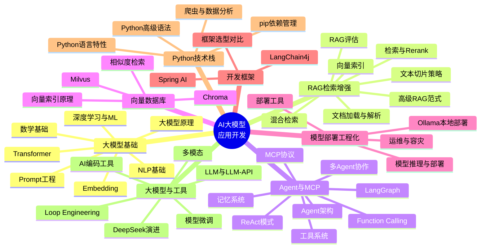
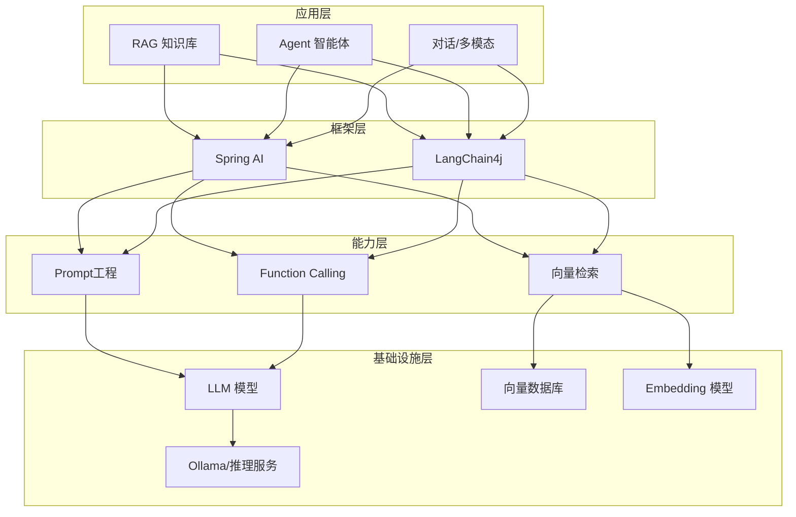
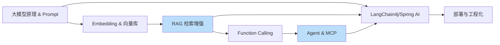

# 03 - AI 大模型应用开发思维导图

> 🎯 拉开差距的第二曲线 —— 让 Java 后端具备 AI 应用落地能力：Prompt、RAG、Agent、MCP、向量库、模型部署、LangChain4j & Spring AI

---

## 📚 目录

1. [核心脑图](#1-核心脑图)
2. [知识体系导图（ASCII）](#2-知识体系导图ascii)
3. [模块深度拆解](#3-模块深度拆解)
4. [AI 应用技术栈全景](#4-ai-应用技术栈全景)
5. [高频考点速查](#5-高频考点速查)
6. [学习顺序建议](#6-学习顺序建议)

---

## 1. 核心脑图



---

## 2. 知识体系导图（ASCII）

```text
03 AI 大模型应用开发
│
├── 🧠 大模型基础与 Prompt 工程
│   ├── 大模型原理 ── 预训练 / 微调 / RLHF / 涌现能力 / 幻觉
│   ├── Transformer ── 自注意力 / 多头 / 位置编码 / Encoder-Decoder
│   ├── Prompt 工程 ── Zero/Few-shot / CoT / 角色扮演 / 结构化输出
│   ├── Embedding ── 词向量 / 句向量 / 语义相似度
│   ├── NLP 基础 ── 分词 / 词性 / 命名实体 / 文本分类
│   ├── 深度学习 & ML ── 神经网络 / 反向传播 / 损失函数
│   └── 数学基础 ── 线性代数 / 概率 / 梯度下降
│
├── 📚 RAG 检索增强生成
│   ├── 概述与原理 ── 为什么需要 RAG / 基础架构
│   ├── 文档加载解析 ── PDF / Word / HTML / 表格
│   ├── 文本切片 ── 固定 / 递归 / 语义 / 重叠窗口
│   ├── Embedding 与索引 ── 向量化 / HNSW / IVF
│   ├── 检索优化 ── Top-K / 阈值 / 元数据过滤
│   ├── 混合检索 & Rerank ── BM25 + 向量 / 重排序模型
│   ├── RAG 评估 ── 召回率 / 忠实度 / RAGAS
│   ├── 高级范式 ── Self-RAG / GraphRAG / Agentic RAG
│   └── RAG + Agent 结合 ── 动态检索 / 多轮
│
├── 🤖 Multi-Agent 与 MCP 协议
│   ├── Agent 概念 ── 感知-决策-行动闭环
│   ├── Agent 架构 ── 规划 / 记忆 / 工具 / 行动
│   ├── ReAct 模式 ── 推理 + 行动交替
│   ├── Function Calling ── 工具定义 / 参数解析 / 调用
│   ├── 工具系统 ── 工具注册 / 权限 / 沙箱
│   ├── 记忆系统 ── 短期 / 长期 / 向量记忆
│   ├── 规划与推理 ── 任务分解 / 反思
│   ├── 多 Agent 协作 ── 主从 / 辩论 / 群体
│   ├── LangGraph ── 状态图 / 循环 / 条件分支
│   ├── MCP 协议 ── Model Context Protocol 深度解析
│   └── Agent 安全 ── 评估 / 测试 / 护栏
│
├── 🗃️ 向量数据库
│   ├── Milvus ── 分布式向量库 / 索引类型
│   ├── Chroma ── 轻量级 / 嵌入式
│   └── 原理 ── 向量索引 / 相似度度量 / ANN
│
├── 🚀 模型部署与工程化
│   ├── 模型推理与部署 ── vLLM / TGI / 量化 / KV Cache
│   ├── Ollama 本地部署 ── 模型拉取 / 量化 / API
│   ├── 运维 ── 监控 / 日志 / 弹性伸缩
│   ├── 容灾 ── 降级 / 多模型网关 / 限流
│   └── 部署工具 ── Docker / K8s / 云平台
│
├── 🧩 开发框架（Java AI）
│   ├── Spring AI ── ChatClient / RAG / Function Calling / 多模态
│   ├── LangChain4j ── AiService / ChatMemory / Tool / Agent
│   └── 选型对比 ── Spring AI vs LangChain4j / 其他框架
│
├── 🐍 Python 技术栈
│   ├── Python 语言特性 & 高级语法
│   ├── 爬虫 ── 请求 / 解析 / 反爬
│   ├── 数据分析 ── NumPy / Pandas
│   └── pip 依赖管理
│
└── 🛠️ 大模型与 AI 工具
    ├── DeepSeek ── V2 → V4 Pro 完整演进
    ├── LLM & LLM-API ── 主流模型 / API 调用
    ├── 模型微调 ── LoRA / QLoRA / PEFT
    ├── 多模态 ── 图文 / 语音 / 视频
    ├── AI 编码工具 ── Claude Code / Codex / Cursor
    └── Loop Engineering ── 智能体循环工程
```

---

## 3. 模块深度拆解

| 子模块 | 核心内容 | 难度 | 应用权重 |
|--------|---------|:---:|:---:|
| 大模型基础与 Prompt | 原理、Transformer、Prompt、Embedding、NLP | ⭐⭐⭐ | 🔥🔥🔥 |
| RAG 检索增强生成 | 加载→切片→向量→检索→Rerank→评估 | ⭐⭐⭐⭐ | 🔥🔥🔥 |
| Multi-Agent 与 MCP | Agent 架构、ReAct、工具、记忆、LangGraph、MCP | ⭐⭐⭐⭐⭐ | 🔥🔥🔥 |
| 向量数据库 | Milvus、Chroma、ANN 索引、相似度 | ⭐⭐⭐ | 🔥🔥 |
| 模型部署与工程化 | 推理部署、Ollama、量化、容灾 | ⭐⭐⭐⭐ | 🔥🔥 |
| LangChain4j & Spring AI | Java AI 两大框架、RAG、Function Calling | ⭐⭐⭐⭐ | 🔥🔥🔥 |
| Python 技术栈 | 语言特性、爬虫、数据分析 | ⭐⭐ | 🔥🔥 |
| 模型微调与多模态 | LoRA/QLoRA、图文语音 | ⭐⭐⭐⭐ | 🔥 |

> 🎯 **核心要点**：对 Java 后端而言，「RAG + Agent + LangChain4j/Spring AI」是最快能落地的 AI 应用组合，是简历上最有区分度的加分项。

---

## 4. AI 应用技术栈全景



---

## 5. 高频考点速查

| 主题 | 必答问题 |
|------|---------|
| Transformer | 自注意力机制、为什么用多头、位置编码作用 |
| RAG | 完整流程、切片策略如何选、如何提升召回、幻觉如何缓解 |
| 向量检索 | 余弦 vs 欧氏、HNSW 原理、Top-K 如何定 |
| Agent | ReAct 原理、如何做任务规划、记忆如何设计 |
| Function Calling | 工作机制、与 Agent 关系、参数如何解析 |
| MCP | 解决什么问题、与 Function Calling 区别 |
| Prompt | CoT 为什么有效、Few-shot 原理、如何防注入 |
| 框架选型 | Spring AI vs LangChain4j 如何选、各自优势 |

---

## 6. 学习顺序建议



理解原理与 Prompt → 掌握 Embedding 与向量库 → 打通 RAG 主线 → Function Calling 过渡到 Agent → 用 Java 框架落地 → 部署上线。

---

**上一模块**：[02-中间件与微服务工程思维导图](./02-中间件与微服务工程思维导图.md) / **下一模块**：[04-实战项目综合落地思维导图](./04-实战项目综合落地思维导图.md)

