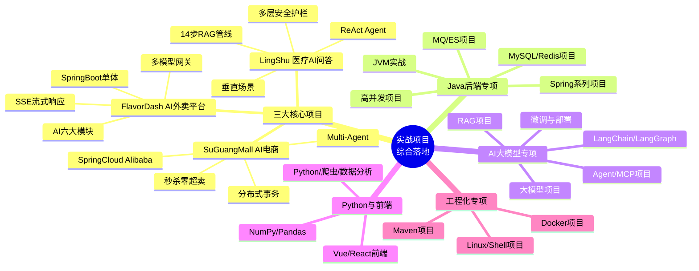
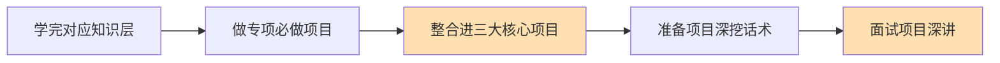

# 04 - 实战项目综合落地思维导图

> 🎯 把知识变成简历亮点 —— 三大核心项目（单体 / 微服务 / 垂直 AI）+ 45 篇技术专项练习，可讲、可深挖、可上线演示

---

## 📚 目录

1. [核心脑图](#1-核心脑图)
2. [三大核心项目](#2-三大核心项目)
3. [专项技术练习地图](#3-专项技术练习地图)
4. [项目能力矩阵](#4-项目能力矩阵)
5. [项目驱动学习建议](#5-项目驱动学习建议)

---

## 1. 核心脑图



---

## 2. 三大核心项目

> 💡 三个项目层层递进：项目一证明 Java 后端深度，项目二证明懂 AI，项目三证明能把 Java × AI 融合成商业产品。

```text
三大核心项目
│
├── 🍜 FlavorDash · AI 外卖平台（单体架构 + AI 深度集成）
│   ├── 技术栈 ── SpringBoot 3 + MyBatis-Plus + MySQL + Redis + RabbitMQ
│   ├── AI 六大模块 ── 智能推荐 / 智能客服 / 评价分析 / 文案生成 ...
│   ├── 多模型网关 ── 统一接入多家 LLM / 降级容灾
│   ├── SSE 流式响应 ── 打字机效果 / 实时输出
│   └── 卖点 ── 单体架构 + AI 深度集成，展示 AI 落地能力
│
├── 🛒 SuGuangMall · AI 微服务电商（微服务架构 + AI Agent）
│   ├── 技术栈 ── SpringCloud Alibaba + Nacos + Sentinel + Seata
│   ├── 秒杀零超卖 ── Redis 预减 + Lua + MQ 削峰 + Redisson 锁
│   ├── Multi-Agent ── 多智能体协作 / 导购 Agent
│   ├── 分布式事务 ── TCC / Saga / 本地消息表
│   └── 卖点 ── 微服务架构天花板 + AI Agent 融合
│
└── 🏥 LingShu · 医疗 AI 问答平台（垂直场景 + 高安全）
    ├── 14 步 RAG 管线 ── 加载→切片→向量→混合检索→Rerank→生成
    ├── ReAct Agent ── 推理+行动闭环 / 工具调用
    ├── 多层安全护栏 ── 输入过滤 / 输出审查 / 医疗合规
    └── 卖点 ── 医疗垂直场景，展示 RAG + Agent 生产级能力
```

| 项目 | 架构类型 | 核心能力证明 | 周期 |
|------|---------|-------------|:---:|
| FlavorDash 外卖 | 单体 + AI | AI 落地 + SSE 流式 + 多模型网关 | 4-6 周 |
| SuGuangMall 电商 | 微服务 + Agent | 高并发秒杀 + 分布式 + Multi-Agent | 6-8 周 |
| LingShu 医疗问答 | 垂直 AI | 14 步 RAG + ReAct + 安全护栏 | 4-6 周 |

---

## 3. 专项技术练习地图

> 45 篇「必做项目」按技术栈组织，可作为三大项目之外的针对性补强练习。

```text
专项技术练习（45 篇必做项目）
│
├── ☕ Java 后端专项
│   ├── Spring 系列 ── Spring / SpringMVC / SpringBoot / SpringCloud / Alibaba / SpringAI
│   ├── 持久层 ── MyBatis / MySQL / Maven
│   ├── 高并发 & JVM ── Java 高并发 / JVM 实战
│   └── 中间件 ── Redis / MongoDB / ElasticSearch / RabbitMQ
│
├── 🤖 AI 大模型专项
│   ├── 大模型 ── 大模型 / 微调 / 部署
│   ├── RAG & Prompt ── RAG / PromptEngineering / Embedding
│   ├── Agent 生态 ── MCP / LangChain / LangGraph / Transformer
│   ├── 工具 ── ClaudeCode / Cursor / Ollama
│   └── 向量库 ── Chroma / Milvus
│
├── 🐍 Python & 前端
│   ├── Python ── Python / 爬虫 / 数据分析 / NumPy / Pandas
│   └── 前端 ── 前端基础 / React / Vue
│
└── 🚢 工程化专项
    └── Docker / Linux / Shell
```

---

## 4. 项目能力矩阵

| 能力维度 | FlavorDash | SuGuangMall | LingShu |
|---------|:---:|:---:|:---:|
| Java 后端深度 | ⭐⭐⭐ | ⭐⭐⭐⭐⭐ | ⭐⭐⭐ |
| 高并发处理 | ⭐⭐ | ⭐⭐⭐⭐⭐ | ⭐⭐ |
| 微服务架构 | ⭐ | ⭐⭐⭐⭐⭐ | ⭐⭐ |
| AI 应用集成 | ⭐⭐⭐⭐ | ⭐⭐⭐⭐ | ⭐⭐⭐⭐⭐ |
| RAG 能力 | ⭐⭐ | ⭐⭐ | ⭐⭐⭐⭐⭐ |
| Agent 能力 | ⭐⭐ | ⭐⭐⭐⭐ | ⭐⭐⭐⭐ |
| 生产工程化 | ⭐⭐⭐ | ⭐⭐⭐⭐ | ⭐⭐⭐⭐ |

> 🎯 **核心要点**：简历上放 1 个高并发项目 + 1 个 AI 项目即可覆盖大部分面试；三个全做能形成「Java 后端 + AI 融合」的完整叙事。

---

## 5. 项目驱动学习建议



先用专项练习验证单点技术 → 再整合进能写进简历的三大核心项目 → 最后打磨「能深讲 30 分钟」的项目话术。对应面试深挖见 [05-面试冲刺思维导图](./05-面试冲刺思维导图.md)。

---

**上一模块**：[03-AI大模型应用开发思维导图](./03-AI大模型应用开发思维导图.md) / **下一模块**：[05-面试冲刺思维导图](./05-面试冲刺思维导图.md)

