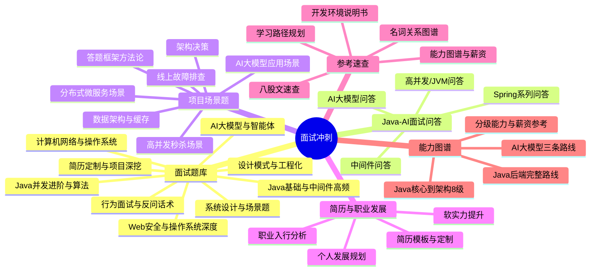
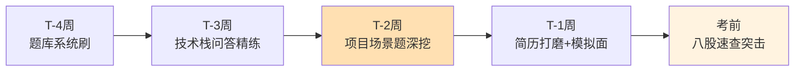

# 05 - 面试冲刺思维导图

> 🎯 把能力变成 Offer —— 152 题库、Java-AI 面试问答、简历模板、项目场景题、能力图谱与职业发展

---

## 📚 目录

1. [核心脑图](#1-核心脑图)
2. [知识体系导图（ASCII）](#2-知识体系导图ascii)
3. [面试准备模块拆解](#3-面试准备模块拆解)
4. [面试冲刺时间线](#4-面试冲刺时间线)
5. [使用建议](#5-使用建议)

---

## 1. 核心脑图



---

## 2. 知识体系导图（ASCII）

```text
05 综合输出 · 面试冲刺
│
├── 📝 面试题库（系统化 152 题）
│   ├── 01 Java 基础与主流中间件高频题
│   ├── 02 计算机网络与操作系统基础
│   ├── 03 设计模式与工程化实践
│   ├── 04 AI 大模型与智能体应用
│   ├── 05 系统设计与场景题
│   ├── 06 Java 并发进阶与补充算法
│   ├── 07 行为面试与反问话术
│   ├── 08 Web 安全与操作系统深度
│   ├── 09 简历定制与项目深挖
│   └── 附录 A/B ── 八股文速查 / 考前速记标准答案
│
├── 💬 Java-AI 大模型面试问答（按技术栈 40+ 篇）
│   ├── Spring 系列 ── Spring / MVC / Boot / Cloud / Alibaba / AI
│   ├── 核心 ── Java 后端 / 高并发 / JVM / MyBatis / Maven
│   ├── 中间件 ── MySQL / Redis / MongoDB / ES / RabbitMQ
│   └── 运维 ── Docker / Linux / Shell
│
├── 🎬 项目场景题
│   ├── 高并发与秒杀场景深度剖析
│   ├── 分布式系统与微服务场景
│   ├── AI 大模型应用场景深度剖析
│   ├── 数据架构与缓存场景
│   ├── 线上故障排查与应急响应
│   ├── 系统演进与架构决策
│   └── 场景题答题框架与方法论
│
├── 📄 简历与职业发展
│   ├── 简历 ── 模板 / 定制 / STAR 法则
│   ├── 个人发展 ── 成长规划 / 技术路线
│   └── 职业入行 ── 求职全流程 / 软实力
│
├── 🔎 参考速查
│   ├── 八股文核心考点速查
│   ├── 大模型 AI 名词关系图谱
│   ├── 深度学习 / 数学核心知识点
│   ├── 阶段性学习目标清单
│   └── 开发环境说明书（C 盘/D 盘）
│
└── 🗺️ 学习路线与能力图谱
    ├── 分级能力图谱（Java 核心 → 架构 8 级）
    ├── 分级能力与薪资参考
    ├── Java 后端完整学习路线 + 知识点索引
    └── AI 大模型三条学习路线（学习/应用/落地）
```

---

## 3. 面试准备模块拆解

| 模块 | 核心内容 | 用途 |
|------|---------|------|
| 面试题库（152 题） | 9 大专题 + 2 附录，覆盖 Java/网络/OS/设计模式/AI/并发/行为/安全 | 系统刷题 |
| Java-AI 面试问答 | 按 20+ 技术栈拆分的标准问答 | 技术栈精练 |
| 项目场景题 | 秒杀/分布式/AI/故障排查/架构决策 + 答题框架 | 项目深挖 |
| 简历与职业发展 | 简历模板、STAR、职业规划、软实力 | 包装输出 |
| 参考速查 | 八股速查、名词图谱、环境说明书 | 考前突击 |
| 能力图谱 | 8 级能力分级 + 薪资参考 + 学习路线 | 定位自查 |

> 🎯 **核心要点**：题库解决「广度」，项目场景题解决「深度」，简历与话术解决「表达」——三者缺一不可。

---

## 4. 面试冲刺时间线



- **T-4 周**：以 152 题库过一遍广度，标记薄弱项反查 [01](./01-Java核心底座思维导图.md)/[02](./02-中间件与微服务工程思维导图.md)/[03](./03-AI大模型应用开发思维导图.md)。
- **T-2 周**：主攻项目场景题，打磨三大项目深讲话术（见 [04](./04-实战项目综合落地思维导图.md)）。
- **考前**：八股速查 + 考前速记标准答案冲刺。

---

## 5. 使用建议

以本层为「面试总纲」，遇到不会的题目反查对应知识层（01-03）补漏，用项目场景题串联 04 层的实战项目，最终形成「题目 → 原理 → 项目实例」的完整回答链路。学习路线与时间规划详见 [06-学习路线全景思维导图](./06-学习路线全景思维导图.md)。

---

**上一模块**：[04-实战项目综合落地思维导图](./04-实战项目综合落地思维导图.md) / **下一模块**：[06-学习路线全景思维导图](./06-学习路线全景思维导图.md)

