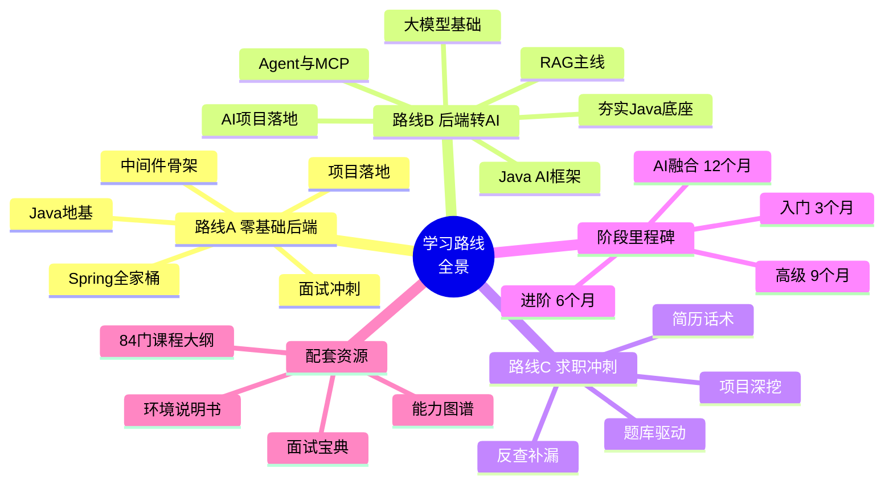
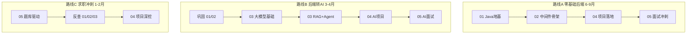

# 06 - 学习路线全景思维导图

> 🎯 知道该学什么、按什么顺序 —— 三条成长路径、阶段里程碑、时间规划，把 6 层金字塔串成一条可执行的成长曲线

---

## 📚 目录

1. [路线全景脑图](#1-路线全景脑图)
2. [三条成长路径](#2-三条成长路径)
3. [阶段里程碑](#3-阶段里程碑)
4. [能力分级与薪资参考](#4-能力分级与薪资参考)
5. [避坑与心法](#5-避坑与心法)

---

## 1. 路线全景脑图



---

## 2. 三条成长路径



| 路线 | 适合人群 | 主线 | 周期 |
|------|---------|------|:---:|
| A 零基础后端 | 应届 / 转行 | 01 → 02 → 04 → 05 | 6-9 个月 |
| B 后端转 AI | 有 Java 基础 | 巩固 01/02 → 03 → 04 → 05 | 3-4 个月 |
| C 求职冲刺 | 有基础待面试 | 05 驱动反查 01/02/03 + 04 | 1-2 个月 |

---

## 3. 阶段里程碑

```text
入门期（0-3 月）     进阶期（3-6 月）      高级期（6-9 月）      AI 融合期（9-12 月）
─────────────────  ─────────────────   ─────────────────   ─────────────────
Java 语法 + 集合    JUC + JVM 深入       SpringCloud 微服务   大模型原理 + Prompt
MySQL + Redis       Spring 全家桶        分布式架构           RAG + Agent + MCP
基础 CRUD 项目      消息队列 + ES        高并发秒杀项目       Java AI 框架落地
数据结构入门        算法 Hot100          Docker + K8s         LingShu 医疗 AI 项目
    │                   │                    │                     │
    └── 能写完整 ───────┴── 能扛面试 ─────────┴── 能做架构 ─────────┴── 能融合 AI
        Web 应用            八股 + 项目           设计 + 落地             差异化竞争力
```

| 阶段 | 关键产出 | 对应思维导图 |
|:---:|---------|-------------|
| 入门期 | 完整 Web 应用 + 基础八股 | [01](./01-Java核心底座思维导图.md) [02](./02-中间件与微服务工程思维导图.md) |
| 进阶期 | 并发/JVM 深入 + Spring 精通 | [01](./01-Java核心底座思维导图.md) [02](./02-中间件与微服务工程思维导图.md) |
| 高级期 | 微服务 + 高并发项目 | [02](./02-中间件与微服务工程思维导图.md) [04](./04-实战项目综合落地思维导图.md) |
| AI 融合期 | RAG/Agent + AI 项目 | [03](./03-AI大模型应用开发思维导图.md) [04](./04-实战项目综合落地思维导图.md) |

---

## 4. 能力分级与薪资参考

> 💡 详见 [05 层能力图谱](../../05-综合输出-面试冲刺/05-学习路线与能力图谱/09-分级能力图谱与薪资参考.md)，此处为思维导图速览。

```text
L1 初级       L2 中级         L3 高级          L4 资深/架构
──────────   ──────────     ──────────      ──────────
CRUD + 框架   并发 + 调优      分布式 + 微服务   架构设计 + AI 融合
会用          懂原理          能设计            能决策
              + 项目经验      + 高并发落地       + 技术选型/团队
```

四级能力沿「会用 → 懂原理 → 能设计 → 能决策」递进，AI 融合能力是当前拉开差距的关键加分项。

---

## 5. 避坑与心法

- **不要只学不练**：每学完一层立刻做 [04 层](./04-实战项目综合落地思维导图.md)对应项目，知识才能沉淀。
- **不要广而不深**：JUC、JVM、MySQL、Spring、RAG 这几个「深水区」要能讲原理、能画图。
- **AI 不是替代而是叠加**：先有扎实 Java 后端底座，AI 才是加分的第二曲线，别本末倒置。
- **面试驱动查漏**：用 [05 层题库](./05-面试冲刺思维导图.md)反向检验学习效果，缺什么补什么。
- **善用配套资源**：`06 课程体系` 有 84+ 门课程大纲，`面试宝典` 与 `参考速查` 是突击利器。

> 🎯 **核心要点**：6 层金字塔的正确打开方式是「地基 → 骨架 → 差异 → 证明 → 输出」层层向上，用项目和面试反复夯实每一层，最终形成「Java 后端 + AI 大模型」的复合竞争力。

---

**上一模块**：[05-面试冲刺思维导图](./05-面试冲刺思维导图.md) / **返回总览**：[00-思维导图总览](./00-思维导图总览.md)

