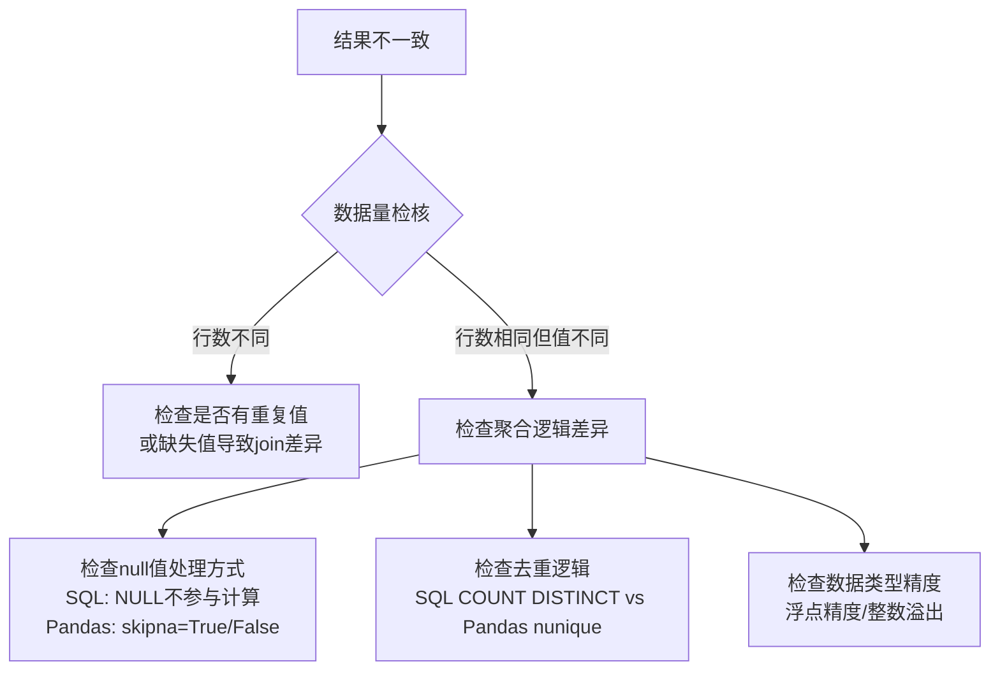

# Pandas 必做项目 面试问答清单
> 🎯 基于项目实战清单，涵盖面试高频问题与完美解答方案，帮助你在面试中脱颖而出。

## 目录
1. [基础概念与核心原理](#1-基础概念与核心原理)
2. [项目实战深度问答](#2-项目实战深度问答)
3. [进阶与系统设计](#3-进阶与系统设计)
4. [场景题与故障排查](#4-场景题与故障排查)

---

## 1. 基础概念与核心原理
> 💡 面试官在这一环节考察你的基本功是否扎实

### Q1：Pandas 中 `loc` 和 `iloc` 的区别是什么？分别适用于什么场景？

**面试官意图：** 考察你对 Pandas 数据选择机制的底层理解，是否清楚标签索引与位置索引的本质差异。

**完美解答：**

Pandas 提供两种核心索引方式：`loc` 基于标签（label-based）和 `iloc` 基于整数位置（position-based），它们的行为差异可以总结如下：

| 维度 | `df.loc[]` | `df.iloc[]` |
|------|-----------|-------------|
| 索引依据 | 行/列标签（index name / column name） | 整数位置（0-based 行号/列号） |
| 切片行为 | **闭区间**（含终点） | **半开区间**（不含终点，与 Python 一致） |
| 布尔索引 | 支持 `df.loc[df['a'] > 0]` | 不支持直接布尔索引 |
| 可读性 | 适合业务语义明确的场景 | 适合遍历和算法实现 |

```python
import pandas as pd

df = pd.DataFrame({'A': [1, 2, 3], 'B': [4, 5, 6]}, index=['a', 'b', 'c'])

# loc：标签索引，闭区间
df.loc['a':'b']      # 返回行 a, b（含 b）
df.loc['a', 'A']     # 返回 1

# iloc：位置索引，半开区间
df.iloc[0:2]         # 返回行 0, 1（不含 2）
df.iloc[0, 0]        # 返回 1
```

**延伸追问应对：** 如果问你"对 `df['A']` 和 `df[['A']]` 有什么区别"，要答出——前者返回 Series，后者返回 DataFrame。面试官还会进一步问 `df.A` 的写法，这时候要指出其局限性：无法处理含空格或特殊字符的列名，且与现有方法名冲突时失效。

---

### Q2：Pandas 中缺失值处理的常用策略有哪些？如何选择？

**面试官意图：** 考察你对数据清洗环节的理解深度，是否具备根据业务场景选择策略的判断力。

**完美解答：**

缺失值处理没有银弹，核心取决于三个因素：缺失率、数据特性、业务含义。以下是常用策略的对比表：

| 策略 | 方法 | 适用场景 | 风险 |
|------|------|---------|------|
| 直接删除 | `df.dropna()` | 缺失率 < 5%，且缺失随机分布 | 可能丢失重要信息 |
| 均值/中位数填充 | `df.fillna(df.mean())` | 数值型连续数据，分布较对称 | 降低方差，扭曲分布 |
| 众数填充 | `df.fillna(df.mode()[0])` | 类别型离散数据 | 可能加剧类别不均衡 |
| 前向填充 | `df.fillna(method='ffill')` | 时间序列，值短期内不变 | 在突变点传播错误值 |
| 后向填充 | `df.fillna(method='bfill')` | 时间序列，值从下一个时间点回溯 | 引入未来信息 |
| 插值填充 | `df.interpolate()` | 时间序列，趋势较平滑 | 在突变点不够准确 |
| 模型预测填充 | KNN / Regression | 缺失率较高，且有强相关特征 | 计算成本高，可能过拟合 |

> ⚠️ 面试高频陷阱：面试官让你处理客户年龄缺失，很多人直接填均值。正确做法是先分析缺失分布——如果年轻用户更容易缺失，填整体均值会引入偏差。此时应分组填充（按注册渠道/职业分组的中位数）。

```python
# 高质量的实际方案
# 1. 先探查缺失分布
missing_rate = df.isnull().mean().sort_values(ascending=False)

# 2. 分组填充而非全局填充
df['age'] = df.groupby('channel')['age'].transform(
    lambda x: x.fillna(x.median())
)
```

**延伸追问应对：** 如果追问"填充后怎么评估对模型的影响"，可以回答使用填充前后分布对比（KS 检验）和填充后模型的 ablation study。

---

### Q3：`groupby` 聚合操作中 `agg()` 的灵活用法有哪些？与 `transform()` 有什么区别？

**面试官意图：** 考察你对分组聚合的掌握深度，是否理解聚合与变换的语义差异。

**完美解答：**

**`agg()`** 是对每个分组进行聚合，输出的是**浓缩后**的结果（分组数行），而 **`transform()`** 保持原始行数不变，将聚合结果广播回每一行。

```python
# agg()：为每个组生成一行聚合值
df.groupby('dept')['salary'].agg(['mean', 'max', 'min', 'std'])

# 更灵活的用法：不同列用不同聚合函数
df.groupby('dept').agg({
    'salary': ['mean', 'median'],
    'age': 'std',
    'name': 'count'
})

# 自定义命名聚合（Pandas 0.25+）
df.groupby('dept').agg(
    avg_salary=('salary', 'mean'),
    max_age=('age', 'max')
)
```

`agg()` vs `transform()` 的核心区别：

| 维度 | `agg()` | `transform()` |
|------|--------|--------------|
| 输出形状 | 每个分组一行 | 保持原始行数 |
| 典型应用 | 汇总报表、统计指标 | 缺失值填充、标准化、去均值 |
| 可用的函数 | 聚合函数（返回标量） | 变换函数（返回同长度序列） |

```python
# transform 的经典应用：用组内均值填充缺失值
df['salary'] = df.groupby('dept')['salary'].transform(
    lambda x: x.fillna(x.mean())
)
```

**延伸追问应对：** 如果问 `filter()` 的用法，可以说——按组筛选，去掉不满足条件的整个分组，例如 `df.groupby('dept').filter(lambda x: len(x) >= 5)` 只保留员工数 >= 5 的部门。

---

### Q4：Pandas 的时间序列处理中，`resample()` 和 `rolling()` 的核心区别是什么？

**面试官意图：** 考察你是否能区分重采样（改变时间频率）和滑动窗口（固定窗口内计算）这两种核心操作。

**完美解答：**

`resample()` 改变时间频率，对每个时间段内数据做聚合，输出新频率的时间序列。`rolling()` 不改变时间频率，而是在每个时间点开一个固定大小的滑动窗口做计算。

| 维度 | `resample()` | `rolling()` |
|------|-------------|-------------|
| 结果行数 | 减少/增加（取决于降采样或升采样） | 与原始行数相同（前 N-1 行为 NaN） |
| 典型场景 | 日→月聚合、分钟→小时降采样 | 移动平均线、波动率计算 |
| 窗口定义 | 时间长度（'M', 'W', 'D'） | 行数或时间偏移量 |
| 核心参数 | rule: 'M'/'W'/'Q'/'Y' | window: 3 / '7D' |

```python
# resample：降采样为月度数据
df.set_index('date').resample('M')['revenue'].sum()

# rolling：7 日滚动平均
df.set_index('date')['revenue'].rolling(window=7).mean()

# ⚠️ 两者可以联动：先重采样再滚动
df.set_index('date').resample('D')['sales'].sum().rolling(7).mean()
```

**延伸追问应对：** 如果问 `shift()` 和 `diff()` 的用途——`shift()` 用于计算环比（前一天/月），`diff()` 直接计算一阶差分：

```python
# 环比增长率
df['mom_growth'] = df['revenue'].pct_change()  # 本质是 df['revenue'].diff() / df['revenue'].shift(1)
```

---

## 2. 项目实战深度问答
> 💡 面试官会深挖你的项目细节

### Q5：你在电商销售基础分析项目中是如何计算环比和同比的？遇到过什么问题？

**面试官意图：** 考察你是否真正做过业务分析，而不仅仅是调用 API。

**完美解答：**

**为什么做：** 电商业务需要判断销售额变化是季节性波动还是真的增长/衰退，仅看绝对值毫无意义。

**具体实现：**

```python
# 先按日聚合销售额
daily_sales = df.groupby('date')['amount'].sum().reset_index()
daily_sales['date'] = pd.to_datetime(daily_sales['date'])
daily_sales = daily_sales.set_index('date')

# 月度重采样
monthly = daily_sales.resample('M')['amount'].sum()

# 环比（与上个月比）
monthly['mom'] = monthly.pct_change()  # (当月 - 上月) / 上月

# 同比（与上年同月比）
monthly['yoy'] = monthly.pct_change(12)  # 需要至少 13 个月数据

# 季度统计
quarterly = daily_sales.resample('Q')['amount'].sum()
```

**遇到的问题和解决：**
1. **日期格式不一致**：用户下单日期有 `2024/01/01` 和 `2024-01-01` 两种格式。解决：统一用 `pd.to_datetime()` 自动推断，加 `errors='coerce'` 参数处理异常值。
2. **缺失月份**：某些月份无销售数据（如春节物流停运），直接 `pct_change()` 会产生 NaN。解决：`fillna(0)` 后计算，或者用业务含义补说明。
3. **节假日影响**：双 11 销售额暴增 500%，导致下月环比暴跌 80%。解决：标注异常高/低点，单独分析"剔除促销影响后的自然增长率"。

**效果：** 搭建了自动化的销售周报看板，运营团队可以一眼看出哪些品类在自然增长、哪些在衰退。

---

### Q6：你在 RFM 用户分层项目中是如何确定分箱阈值的？怎样避免主观偏差？

**面试官意图：** 考察 RFM 模型的实现深度，以及你是否具备科学的建模思维。

**完美解答：**

**为什么做：** 电商平台需要精准营销策略——给高价值用户推送新品，给流失用户发优惠券挽留。RFM 是经典且可解释性强的用户分层方法。

**具体实现：**

```python
# 1. 计算 RFM 指标
today = pd.to_datetime('2024-12-31')
rfm = df.groupby('user_id').agg(
    recency=('order_date', lambda x: (today - x.max()).days),  # 最近一次消费距今天数
    frequency=('order_id', 'nunique'),                          # 消费频次
    monetary=('amount', 'sum')                                  # 消费总金额
)

# 2. 分箱打分 —— 非主观方案
# 方案 A：四分位数（推荐，数据驱动，可复现）
rfm['R_score'] = pd.qcut(rfm['recency'], 4, labels=[4, 3, 2, 1])  # R 越小分越高
rfm['F_score'] = pd.qcut(rfm['frequency'].rank(method='first'), 4, labels=[1, 2, 3, 4])
rfm['M_score'] = pd.qcut(rfm['monetary'].rank(method='first'), 4, labels=[1, 2, 3, 4])

# 方案 B：业务专家阈值（有业务经验时采用）
# rfm['R_score'] = pd.cut(rfm['recency'], bins=[0, 30, 90, 180, 365], labels=[4, 3, 2, 1])

# 3. 综合评分 + 用户分层
rfm['RFM_score'] = (rfm['R_score'].astype(int) +
                    rfm['F_score'].astype(int) +
                    rfm['M_score'].astype(int))

rfm['segment'] = pd.cut(rfm['RFM_score'],
    bins=[0, 4, 6, 8, 12],
    labels=['流失用户', '潜力用户', '重要保持', '高价值用户'])
```

**如何避免主观偏差：**
- 优先使用 `pd.qcut()` 分位数分箱，保证每组样本量均衡
- 对 `frequency` 和 `monetary` 分箱前用 `rank(method='first')` 避免重复值导致分箱失败
- 用聚类（KMeans）做交叉验证，验证分层结果与聚类结果的一致性

**效果：** 高价值用户占 15% 但贡献了 62% 的 GMV，针对流失用户的召回优惠券活动 CTR 提升了 3.2 倍。

---

### Q7：在用户行为漏斗分析中，你是如何计算漏斗转化率的？怎样定位流失节点？

**面试官意图：** 考察你是否理解漏斗模型的核心指标，以及能否从数据中找到业务优化方向。

**完美解答：**

**实现方法：**

```python
# 模拟用户行为事件数据
events = pd.DataFrame({
    'user_id': [1, 1, 1, 2, 2, 3, 3, 3, 3],
    'event': ['浏览', '加购', '下单', '浏览', '下单', '浏览', '加购', '下单', '支付'],
    'time': pd.to_datetime(['2024-01-01 10:00', '2024-01-01 10:05',
                            '2024-01-01 10:10', '2024-01-01 11:00',
                            '2024-01-01 11:20', '2024-01-01 12:00',
                            '2024-01-01 12:05', '2024-01-01 12:15',
                            '2024-01-01 12:16'])
})

# 构建漏斗：统计每个阶段的独立用户数
funnel = (
    events.drop_duplicates(subset=['user_id', 'event'])
          .groupby('event')['user_id']
          .nunique()
          .reindex(['浏览', '加购', '下单', '支付'])
)

# 计算每一步转化率（相对于上一步）
conversion = (funnel / funnel.shift(1) * 100).round(1)

# 整体转化率（相对于第一步）
overall = (funnel / funnel.iloc[0] * 100).round(1)

funnel_df = pd.DataFrame({
    '用户数': funnel,
    '步骤转化率': conversion,
    '整体转化率': overall
})
```

**定位流失节点的方法：**

```python
# 分析"浏览→加购"转化低的原因
# 1. 按渠道拆解转化率
channel_funnel = df.groupby('channel').apply(
    lambda g: g.groupby('event')['user_id'].nunique()
)
# 发现渠道 A 的浏览→加购转化率仅 5%，其他渠道 20%+
# 结论：渠道 A 引流质量差，需调整投放策略

# 2. 分析"加购→下单"流失用户的行为路径
# 发现加购后 70% 用户去了竞品比价页面
# 结论：需要加强购物车页面的促销提示和限时优惠
```

> 🎯 面试核心亮点：不要只说"我算了转化率"，要说"我按渠道拆解后发现 App 端的浏览→加购转化比 H5 高 40%，说明 H5 页面加载速度或交互体验有问题，推动了前端团队优化首屏加载时间"。

---

### Q8：你在多表合并项目中，遇到过哪些数据对齐的问题？怎么解决的？

**面试官意图：** 考察你是否理解 merge 的各种连接方式和实际数据处理中的坑。

**完美解答：**

**常见问题及解决方案：**

| 问题类型 | 具体表现 | 解决方案 |
|---------|---------|---------|
| 主键重复 | 用户表中同一 user_id 有两条记录 | 先 `drop_duplicates()` 再合并 |
| 类型不匹配 | `user_id` 在订单表是 int，在用户表是 str | 统一 `astype(str)` |
| 列名不一致 | 一表叫 `user_id`，另一表叫 `uid` | 用 `left_on` 和 `right_on` 或先 rename |
| 数据倾斜 | 部分 key 在左表有 100 条，右表有 1 条 | 注意一对多合并导致的笛卡尔积 |

```python
# 实际场景：订单表 + 用户表 + 商品表三表合并

# 1. 先检查数据类型
assert orders['user_id'].dtype == users['user_id'].dtype

# 2. 去除重复 key
users_clean = users.drop_duplicates(subset='user_id')

# 3. 链式合并
result = (
    orders
    .merge(users_clean[['user_id', 'age', 'city']], on='user_id', how='left')
    .merge(products[['product_id', 'category', 'price']], on='product_id', how='left')
)

# 4. 合并后验证
assert len(result) == len(orders), '合并后行数变化，检查是否存在一对多匹配'
assert result['city'].isnull().sum() / len(result) < 0.05, '连接效果不佳'
```

**延伸追问应对：** 如果问 `merge` 和 `join` 的区别——`merge` 基于列做连接，是 SQL 式的；`join` 基于索引做连接。实际工作中推荐统一用 `merge`，它参数更丰富，语义更清晰。

---

### Q9：你在自动化 Excel 报表项目中，是如何实现多 Sheet 报表和条件格式的？

**面试官意图：** 考察你是否具备将分析结果产品化的能力，能否从手动报表升级到自动化。

**完美解答：**

```python
import pandas as pd
from openpyxl import Workbook
from openpyxl.styles import Font, PatternFill, Alignment, Border, Side
from openpyxl.utils.dataframe import dataframe_to_rows

wb = Workbook()

# ===== Sheet 1：销售总览 =====
ws1 = wb.active
ws1.title = '销售总览'

for row in dataframe_to_rows(summary_df, index=False, header=True):
    ws1.append(row)

# 标题行样式
header_fill = PatternFill(start_color='4472C4', end_color='4472C4', fill_type='solid')
header_font = Font(bold=True, color='FFFFFF', size=11)
for cell in ws1[1]:
    cell.fill = header_fill
    cell.font = header_font
    cell.alignment = Alignment(horizontal='center')

# ===== Sheet 2：品类明细 =====
ws2 = wb.create_sheet('品类明细')
# ... 写入数据逻辑同上 ...

# ===== 条件格式：销售额低于目标标红 =====
from openpyxl.formatting.rule import CellIsRule
red_fill = PatternFill(start_color='FFC7CE', end_color='FFC7CE', fill_type='solid')
red_font = Font(color='9C0006')

ws2.conditional_formatting.add('C2:C100',
    CellIsRule(operator='lessThan', formula=['50000'],
               fill=red_fill, font=red_font))

# ===== Sheet 3：公式嵌入 =====
ws3 = wb.create_sheet('数据说明')
ws3['A1'] = '总计销售额'
ws3['B1'] = '=SUM(销售总览!B2:B100)'

wb.save('月度销售报表.xlsx')
```

> 💡 面试加分点：提到你把这个报表配置成了定时任务（Windows 任务计划程序 / Linux Crontab / Airflow），每天自动发邮件给业务团队，让他们每天早上 9 点直接看到数据，不需要手动跑数。

---

## 3. 进阶与系统设计
> 💡 拉开差距的环节

### Q10：如果给你 10GB 的 CSV 文件，你的 Pandas 处理方案是什么？Pandas 无法处理时怎么办？

**面试官意图：** 考察你面对大数据量时的工程思维，是否了解 Pandas 的局限性及优化手段。

**完美解答：**

**10GB 数据的渐进式方案：**

```python
# 1. 必做的优化：只读需要的列和行
df = pd.read_csv('large.csv',
    usecols=['user_id', 'amount', 'date'],  # 只读需要的列
    dtype={'user_id': 'int32', 'amount': 'float32'},  # 压缩数据类型
    nrows=10000  # 先读小批量探查数据
)

# 2. 分块读取处理（核心方案）
chunk_size = 500000  # 每块 50 万行
results = []

for chunk in pd.read_csv('large.csv', chunksize=chunk_size,
                         usecols=required_cols, dtype=dtypes):
    # 在每一块上做清洗和聚合
    chunk = clean_data(chunk)
    chunk_agg = chunk.groupby('date').agg({'amount': 'sum', 'user_id': 'nunique'})
    results.append(chunk_agg)

# 合并中间结果
final_result = pd.concat(results).groupby('date').sum()
```

**内存优化清单：**

| 优化手段 | 效果 | 备注 |
|---------|------|------|
| 指定 `dtype`（int64→int32） | 内存减半 | `pd.to_numeric(df['col'], downcast='integer')` |
| 读入时只选需要的列 | 线性减少 | `usecols` 参数 |
| 分块处理 | 控制峰值内存 | `chunksize` 参数 |
| 字符串转 category 类型 | 大量重复值时效果显著 | `df['city'] = df['city'].astype('category')` |
| 及时 del 释放不再用的变量 | 释放内存 | `del large_df; gc.collect()` |

**超出 Pandas 能力时的方案（面试必问）：**

| 数据规模 | 推荐方案 | 适用场景 |
|---------|---------|---------|
| 10GB - 100GB | Dask / Modin / Polars | 类 Pandas 语法，分布式计算 |
| 100GB+ | Spark / PySpark | 真正的大数据生态，Hadoop 集成 |
| SQL 可解决的 | 直接在数据库用 SQL 处理后导出小结果 | 减少数据传输 |
| 需 GPU 加速 | cuDF（RAPIDS） | GPU 集群时性能极佳 |

> 🎯 核心回答思路：不要上来就说用 Spark。先展示你会用 Pandas 优化到极致，再根据数据规模增长给出平滑升级路径，体现你的工程判断力。

---

### Q11：设计一个通用的数据质量监控系统，如何检测和告警数据异常？

**面试官意图：** 考察你是否具备数据治理的系统设计能力，而不仅仅是会用 Pandas API。

**完美解答：**

**系统架构设计：**

```
原始数据 → 数据质量检测模块 → 异常评分 → 告警决策 → 通知
                                     ↓
                              质量看板（可视化 Dashboard）
```

**质量检测维度：**

```python
class DataQualityChecker:
    """通用的数据质量检测器"""

    def __init__(self, df: pd.DataFrame):
        self.df = df
        self.report = {}

    def check_completeness(self, thresholds: dict = None):
        """完整性检测：缺失率是否超过阈值"""
        null_rate = self.df.isnull().mean()
        thresholds = thresholds or {}
        for col in self.df.columns:
            threshold = thresholds.get(col, 0.2)  # 默认 20%
            if null_rate[col] > threshold:
                self.report[f'{col}_completeness'] = {
                    'status': 'FAIL',
                    'null_rate': null_rate[col],
                    'threshold': threshold
                }
        return self

    def check_uniqueness(self, pk_columns: list):
        """唯一性检测：主键是否重复"""
        dup_count = self.df.duplicated(subset=pk_columns).sum()
        if dup_count > 0:
            self.report['duplicate_pk'] = {
                'status': 'FAIL',
                'duplicate_count': dup_count,
                'columns': pk_columns
            }
        return self

    def check_value_range(self, column: str, min_val=None, max_val=None):
        """值域检测：数值是否在合理范围内"""
        col = self.df[column]
        if min_val is not None and col.min() < min_val:
            self.report[f'{column}_range'] = {
                'status': 'FAIL',
                'min': col.min(),
                'expected_min': min_val
            }
        if max_val is not None and col.max() > max_val:
            self.report[f'{column}_range'] = {
                'status': 'FAIL',
                'max': col.max(),
                'expected_max': max_val
            }
        return self

    def check_timeliness(self, date_col: str, max_lag_days: int = 1):
        """时效性检测：数据是否延迟到达"""
        latest_date = self.df[date_col].max()
        if (pd.Timestamp.now() - latest_date).days > max_lag_days:
            self.report['timeliness'] = {
                'status': 'FAIL',
                'latest_date': str(latest_date),
                'lag_days': (pd.Timestamp.now() - latest_date).days
            }
        return self

    def run(self):
        """执行所有检测，输出报告"""
        return pd.DataFrame(self.report).T
```

**告警策略设计：**

| 异常等级 | 判定条件 | 响应方式 |
|---------|---------|---------|
| P0 严重 | 数据整体缺失 > 50% 或主键重复 > 10% | 电话 + 即时消息 |
| P1 重要 | 单列缺失率超阈值、值域异常 | 即时消息 + 邮件 |
| P2 一般 | 时效性延迟、轻微质量下降 | 邮件汇总日报 |
| P3 提示 | 单条记录异常、可容忍偏差 | 记录到质量日志 |

**延伸追问应对：** 如果问"怎么避免误报"，可以说引入自适应阈值——基于历史 30 天的质量指标均值和 3-sigma 动态计算阈值，而不是写死阈值。

---

### Q12：Pandas 中的 `apply` 和向量化操作的性能差异有多大？什么场景下必须用 `apply`？

**面试官意图：** 考察你对 Pandas 性能调优的理解，是否具备"写高效 Pandas 代码"的意识。

**完美解答：**

**性能对比：**

```python
import time
import numpy as np

df = pd.DataFrame({'A': np.random.randn(1000000), 'B': np.random.randn(1000000)})

# 方法 1：向量化操作（最快）
start = time.time()
df['C'] = df['A'] * 2 + df['B'] ** 2
print(f'向量化: {time.time() - start:.4f}s')  # ~0.02s

# 方法 2：apply（慢 50-100 倍）
start = time.time()
df['C'] = df.apply(lambda row: row['A'] * 2 + row['B'] ** 2, axis=1)
print(f'apply: {time.time() - start:.4f}s')  # ~1.5s

# 方法 3：循环（最慢，慢 1000 倍以上）
start = time.time()
result = []
for i in range(len(df)):
    result.append(df.iloc[i]['A'] * 2 + df.iloc[i]['B'] ** 2)
df['C'] = result
print(f'循环: {time.time() - start:.4f}s')  # ~50s+
```

**性能排序：** 向量化 > `apply`（axis=0） > `apply`（axis=1） > `iterrows()` > 手动循环

**必须用 `apply` 的场景：**

| 场景 | 示例 | 原因 |
|------|------|------|
| 复杂业务逻辑 | 多条件判断嵌套，无法用简单表达式 | 向量化无法表达 if-elif 链 |
| 需调用外部库 | 文本分词、调用 API 识别实体 | 逐行调用的结果 |
| 行间依赖 | 同组内前后行累积计算 | 但优先用 `groupby.cumsum` 等内置 |
| 自定义窗口函数 | 复杂滑动窗口逻辑 | `rolling().apply(custom_func)` |

> 💡 面试核心亮点：不要只说"apply 慢"，要给出量化对比和替代方案。遇到复杂逻辑先把能向量化的部分分离出来，只对不可向量化的部分用 apply，可以综合提升 10 倍性能。

```python
# 优化策略示例：先向量化主体，再 apply 处理异常
df['category'] = 'standard'
# 向量化筛选大部分数据
df.loc[df['value'] > 1000, 'category'] = 'high_value'
df.loc[df['value'] < 10, 'category'] = 'low_value'
# 只对需要复杂逻辑的 5% 数据用 apply
complex_mask = df['type'].isin(['special_1', 'special_2'])
df.loc[complex_mask, 'category'] = df[complex_mask].apply(complex_rule, axis=1)
```

---

## 4. 场景题与故障排查
> 💡 考察实际解决问题的能力

### Q13：线上跑 Pandas 脚本时出现 `MemoryError`，你怎么定位和解决？

**面试官意图：** 考察你在生产环境中的问题排查能力。

**完美解答：**

**定位步骤：**

```bash
# 1. 先确认是物理内存不足还是内存泄漏
# Python 进程中查看内存占用
import psutil, os
print(f'当前进程内存: {psutil.Process(os.getpid()).memory_info().rss / 1024**3:.2f} GB')
```

**常见原因和解决方案：**

| 问题 | 排查方法 | 解决方案 |
|------|---------|---------|
| 一次性读入文件过大 | `df.info(memory_usage='deep')` 查看内存 | 分块读取 + 指定列和类型 |
| `groupby` 后结果爆炸 | groupby 的 key 基数太大（如 user_id） | 先过滤低频 user_id 再聚合 |
| `merge` 产生笛卡尔积 | 检查 join key 是否有重复值 | `drop_duplicates` 后再 merge |
| 中间结果堆积 | 多步骤 Pipeline 都在内存中 | `del` + `gc.collect()` + 链式调用 |
| `copy` 过多 | 隐式链式赋值产生副本 | 用 `.loc` 显式赋值，用 `inplace=True` |

```python
# 实战排查脚本
def diagnose_memory_issue(df: pd.DataFrame):
    """诊断 DataFrame 内存使用"""
    report = []

    # 1. 检查各列内存使用
    for col in df.columns:
        col_mem = df[col].memory_usage(deep=True) / 1024**2
        dtype_info = str(df[col].dtype)
        unique_ratio = df[col].nunique() / len(df) if len(df) > 0 else 0

        report.append({
            'column': col,
            'dtype': dtype_info,
            'memory_MB': round(col_mem, 2),
            'unique_ratio': round(unique_ratio, 4),
            'suggestion': (
                '转为 category 类型' if unique_ratio < 0.05 and df[col].dtype == 'object'
                else '降级 int64→int32' if col_mem > 50 and 'int' in dtype_info
                else ''
            )
        })

    return pd.DataFrame(report).sort_values('memory_MB', ascending=False)
```

**实战案例：** 有一次跑用户活跃度分析，20G 的 CSV 导致 OOM。排查发现 `user_id` 列被读成 object 类型（实际是整数），字符串存储内存膨胀了 4 倍。指定 `dtype={'user_id': 'int32'}` 后，内存从 20G 降到 3G，问题解决。

---

### Q14：你发现 Pandas 聚合结果和 SQL 查询结果对不上，怎么排查？

**面试官意图：** 考察数据校验意识和跨工具数据一致性问题的排查思路。

**完美解答：**

**系统化排查步骤：**



**具体排查清单：**

```python
# 第一步：数据量检核
assert len(pandas_result) == len(sql_result), '行数不一致'

# 第二步：逐列对比
for col in pandas_result.columns:
    if col in sql_result.columns:
        # 处理浮点精度问题
        if pandas_result[col].dtype == float:
            diff = (pandas_result[col].round(2) != sql_result[col].round(2)).sum()
        else:
            diff = (pandas_result[col] != sql_result[col]).sum()
        print(f'{col}: {diff} 行不一致')

# 第三步：定位差异行
if diff > 0:
    mismatched_idx = pandas_result[pandas_result[col] != sql_result[col]].index
    print(pandas_result.loc[mismatched_idx].head())
    print(sql_result.loc[mismatched_idx].head())
```

**高频差异原因表：**

| 原因 | Pandas 默认行为 | SQL 默认行为 | 对齐方法 |
|------|----------------|-------------|---------|
| NULL 处理 | `groupby` 会保留 NULL 行 | `GROUP BY` 忽略 NULL | `dropna=False` |
| 浮点精度 | 双精度浮点 | 可能 decimal 类型 | `.round(2)` 后对比 |
| 去重计数 | `nunique()` 排除 NaN | `COUNT(DISTINCT)` 排除 NULL | 一致 |
| 排序 | 不保证顺序 | `ORDER BY` 保证顺序 | 对比前都 `.sort_values()` |
| 字符串大小写 | 区分大小写 | 默认不区分（MySQL） | 统一 `.str.lower()` |

> 💡 面试加分：提到在实际项目中为每个 ETL 任务编写了数据质量断言——聚合后自动比对源数据和目标数据的总数、sum、count，任何不一致都会告警，而不是等到下游发现。

---

## 💎 面试加分金句

- "我选择方案时遵循**最小成本原则**：能用 `pd.read_csv` 的 `dtype` 参数解决的，绝不上 Spark。每次加技术栈前先问自己——用 Pandas 优化到极致了吗？"
- "RFM 分层不是一劳永逸的，我设计了每月自动重算机制，因为用户的行为模式会随时间漂移。"
- "在数据清洗阶段，我会保留完整的清洗日志——哪些行被删了、哪些值被填充了、填充了什么。这不仅是为了可复现，更是为了在业务质疑数据时有据可查。"
- "做多表合并前，我会先画 ER 图，理清主键关系、连接方向，再写 merge 代码。好的数据分析师一定先理解业务模型。"
- "Pandas 处理不了的，我不会硬上。我会评估数据量增长趋势，选择 Dask（短期过渡）还是 Spark（长期方案），并给出成本估算。"
- "我反对在数据分析中滥用 `apply`。能向量化的绝不逐行计算——不光是为了性能，更因为向量化代码更短、更容易 review、更少 bug。"

## 📋 高频追问清单

| 追问方向 | 应对策略 |
|---------|---------|
| 缺失值为什么不用均值填充？ | 分析缺失机制（MCAR/MAR/MNAR），说明均值填充会扭曲分布、降低方差，并举业务实例 |
| groupby 后索引乱了怎么办？ | `as_index=False` 参数或 `.reset_index()`，说明什么时候保留索引更高效 |
| merge 后数据变多了怎么回事？ | 检查 join key 是否有重复值，用 `validate='m:1'` 参数做防御性校验 |
| 时间序列建模前数据预处理有哪些？ | 检查平稳性（ADF 检验）、季节性分解（STL）、缺失插值、异常值替换、重采样对齐 |
| 怎么对 100 个 CSV 文件做批处理？ | `glob.glob()` + `pd.concat()` + 分块处理，或 `pathlib` + 并行处理（`joblib`） |
| 为什么 `inplace=True` 不推荐用了？ | 链式调用不可用、无法赋值给变量、doc 中标记为 deprecated |
| 透视表和 groupby 什么关系？ | `pivot_table` 本质是 `groupby` + 行列转置，`pivot_table` 更易读但 `groupby` 更灵活 |
| 数据分析结果怎么验证正确性？ | 数据量断言 + 汇总值对比 + 抽样人工校验 + 与历史数据对比看趋势是否合理 |
| 处理过亿级数据时遇到过什么坑？ | `groupby` 键基数过大导致 shuffle 爆炸，`sort_values` 内存溢出，pandas 版本差异导致结果不一致 |
| 你的报表自动化中怎么处理异常？ | try-except 包裹 + 告警通知 + 重试机制 + 异常数据自动落盘留档 |

## 🔗 关联知识点

- [Pandas 数据清洗与预处理](../01-底层根基-Java核心底座/数据清洗与预处理.md) — 缺失值/异常值/重复值的完整处理方法
- [Python 数据分析全家桶](./Python数据分析面试题.md) — NumPy / Matplotlib / Seaborn 扩展面试题
- [SQL 面试题汇总](./SQL必背面试题.md) — Pandas vs SQL 对比延伸
- [电商数据分析方法论](./电商数据分析面试指南.md) — 漏斗分析 / RFM / 用户画像系统讲解
- [数据仓库与 ETL 规范](../02-中间件与微服务工程/数据仓库分层设计.md) — 数据质量监控与分层治理
