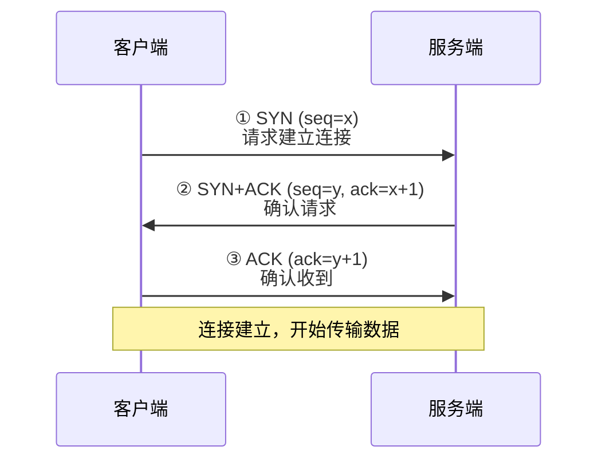
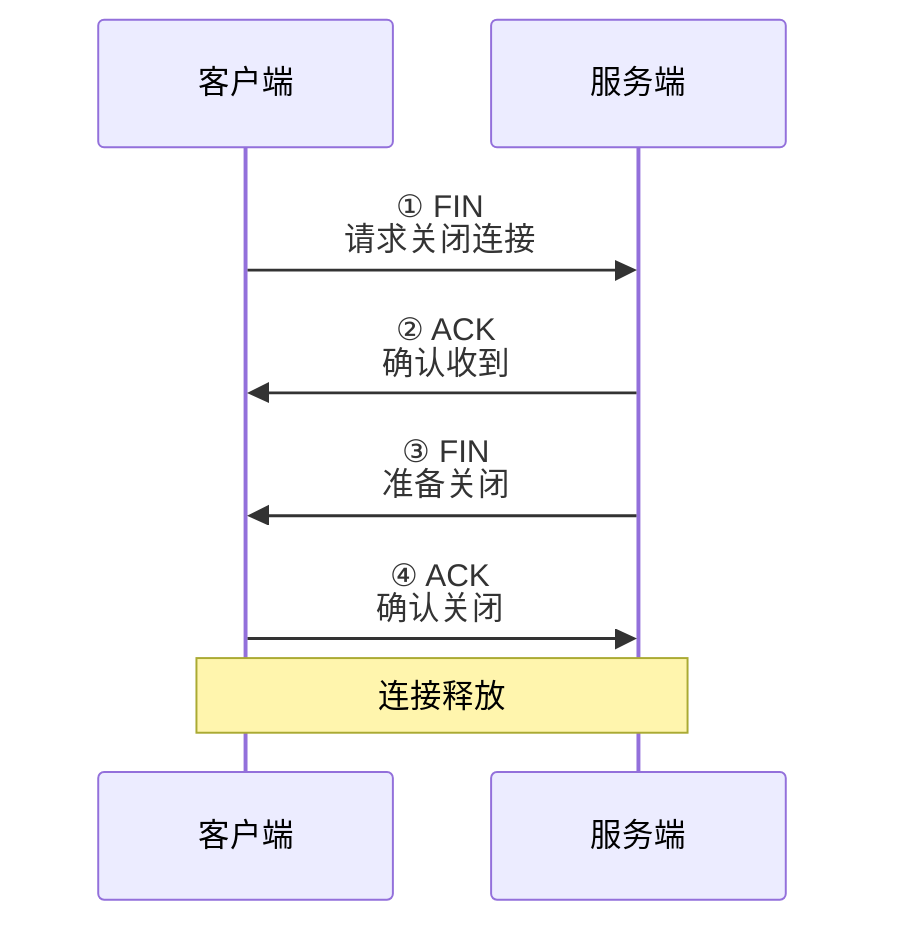
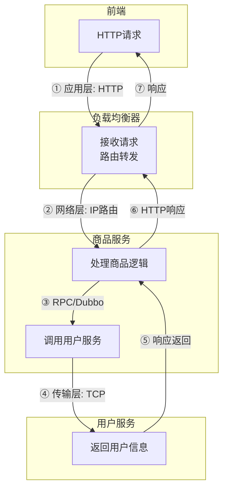
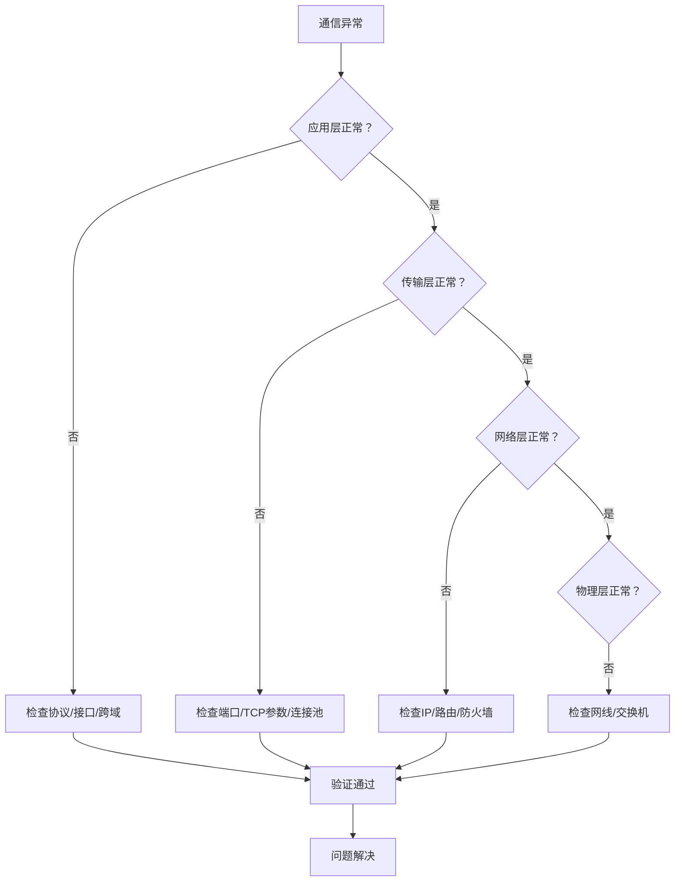

# 从Java后端开发角度深度剖析计算机网络（自顶向下：计算机网络与因特网）

## 引言

计算机网络是Java后端开发的核心基础设施，后端服务的通信、数据传输、高可用部署，均依赖计算机网络的底层支撑。本文严格遵循"自顶向下"的体系结构（应用层→传输层→网络层→数据链路层→物理层），聚焦Java后端开发场景，拆解各层核心理论，结合接口调用、服务部署、性能优化等实战场景，帮助开发者理解"网络如何支撑后端服务"，以及"如何通过网络优化提升后端系统性能与稳定性"。

---

## 第一章：自顶向下体系结构总览（Java后端视角）

自顶向下的计算机网络体系结构，将网络划分为5层，从上层的"应用交互"到底层的"物理传输"，每层承担独立职责，且通过"接口"与相邻层交互。对于Java后端开发而言，无需关注底层物理层、数据链路层的硬件实现，重点聚焦**应用层、传输层、网络层**——这三层直接决定了后端服务的通信方式、数据可靠性、部署架构。

### 自顶向下5层结构及Java后端关联度

| 层级 | 核心职责 | Java后端关联度 | 典型场景 |
|------|----------|----------------|----------|
| **应用层** | 业务通信协议 | ★★★★★ | HTTP接口、RPC调用、消息队列 |
| **传输层** | 端到端可靠传输 | ★★★★★ | TCP连接、端口监听、可靠性保障 |
| **网络层** | IP寻址、路由转发 | ★★★★ | 服务器部署、跨地域通信、负载均衡 |
| **数据链路层** | 相邻设备帧传输 | ★★ | 交换机通信、MAC寻址 |
| **物理层** | 物理介质传输 | ★ | 网线、光纤、无线信号 |

> **核心逻辑**：Java后端开发的"接口调用、服务集群、负载均衡、分布式部署"，本质上是应用层、传输层、网络层协同工作的结果。理解这三层的理论机制，是解决后端网络相关问题（如接口超时、通信异常、跨域问题）的关键。

---

## 第二章：应用层——Java后端的"业务通信入口"

应用层是自顶向下体系的最上层，直接面向后端业务，定义了应用程序之间的通信规则（协议），核心作用是"让后端服务之间、后端与前端之间能高效传递业务数据"。

### 2.1 应用层核心理论（后端必懂）

#### 应用层协议的核心作用

定义数据的格式（请求/响应格式）、交互流程（如HTTP的请求-响应模式）、状态管理（如Cookie/Session），解决"不同应用程序如何高效、规范地通信"的问题。

#### 核心协议原理（聚焦后端常用）

| 协议 | 核心特点 | 适用场景 |
|------|----------|----------|
| **HTTP** | 无状态、面向连接(TCP)、请求-响应模式 | RESTful API、前后端交互 |
| **HTTPS** | HTTP + SSL/TLS，数据加密传输 | 生产环境接口、支付/敏感数据 |
| **RPC** | 像调用本地方法一样调用远程服务 | 微服务高频通信 |

#### 应用层报文结构

```
┌─────────────────────────────────────┐
│              应用层报文              │
├─────────────────┬───────────────────┤
│     首部         │       数据        │
│ (版本/标识/长度) │ (JSON/XML/二进制) │
└─────────────────┴───────────────────┘
```

### 2.2 应用层实战（Java后端重点）

#### HTTP/HTTPS接口开发与优化

**实战开发示例（Spring Boot）：**

```java
@RestController
@RequestMapping("/api/v1/products")
public class ProductController {
    
    @Autowired
    private ProductService productService;
    
    // GET查询（幂等、可缓存）
    @GetMapping("/{id}")
    public ResponseEntity<ProductDTO> getProduct(@PathVariable Long id) {
        ProductDTO product = productService.getById(id);
        return ResponseEntity.ok(product);
    }
    
    // POST创建（非幂等、不可缓存）
    @PostMapping
    public ResponseEntity<ProductDTO> createProduct(@RequestBody @Valid ProductCreateDTO dto) {
        ProductDTO product = productService.create(dto);
        return ResponseEntity.status(HttpStatus.CREATED).body(product);
    }
    
    // 配置缓存（提升性能）
    @GetMapping("/hot/{id}")
    @Cacheable(value = "products", key = "#id")
    public ProductDTO getHotProduct(@PathVariable Long id) {
        return productService.getHotProduct(id);
    }
}
```

**HTTPS配置（生产环境必选）：**

```yaml
# application.yml
server:
  port: 443
  ssl:
    key-store: classpath:keystore.p12
    key-store-password: ${SSL_PASSWORD}
    key-store-type: PKCS12
```

**核心优化点：**

| 优化项 | 方案 | 效果 |
|--------|------|------|
| 请求方法 | GET用于查询（可缓存），POST用于提交 | 利用HTTP缓存机制 |
| 数据格式 | JSON替代XML | 简洁、解析效率高 |
| 安全传输 | 配置HTTPS + SSL证书 | 数据加密，防止窃取 |
| HTTP缓存 | Cache-Control、ETag | 减少重复请求 |

#### RPC服务开发与部署（微服务场景）

**Dubbo示例（服务提供者）：**

```java
// 定义接口
public interface UserRpcService {
    UserDTO getUserById(Long id);
}

// 服务实现
@DubboService(interfaceClass = UserRpcService.class, version = "1.0.0")
@Service
public class UserRpcServiceImpl implements UserRpcService {
    
    @Autowired
    private UserMapper userMapper;
    
    @Override
    public UserDTO getUserById(Long id) {
        return userMapper.selectById(id);
    }
}
```

**Dubbo示例（服务消费者）：**

```java
@RestController
public class OrderController {
    
    @DubboReference(version = "1.0.0")
    private UserRpcService userRpcService;
    
    @GetMapping("/order/{orderId}/user")
    public UserDTO getOrderUser(@PathVariable Long orderId) {
        // 像调用本地方法一样调用远程服务
        return userRpcService.getUserById(orderId);
    }
}
```

**核心注意点：**

| 关注点 | 建议 | 原因 |
|--------|------|------|
| 协议选择 | Dubbo协议（Java生态）/ gRPC（跨语言） | 性能、兼容性平衡 |
| 序列化优化 | protobuf、Kryo替代Java默认序列化 | 效率高、体积小 |
| 服务注册 | Nacos、Zookeeper | 解决服务发现与寻址 |

#### 应用层常见问题与解决方案

| 问题 | 现象 | 解决方案 |
|------|------|----------|
| **跨域问题** | 前端调用提示跨域 | `@CrossOrigin`或全局CORS配置 |
| **RPC超时** | 微服务调用卡顿 | 合理设置`timeout`，配置重试机制 |
| **数据泄露** | 明文传输敏感信息 | 升级HTTPS，敏感数据额外加密 |
| **性能瓶颈** | 接口请求频繁 | HTTP缓存 + 本地/分布式缓存 |

```java
// CORS配置示例
@Configuration
public class CorsConfig implements WebMvcConfigurer {
    @Override
    public void addCorsMappings(CorsRegistry registry) {
        registry.addMapping("/api/**")
                .allowedOrigins("https://www.example.com")
                .allowedMethods("GET", "POST", "PUT", "DELETE");
    }
}
```

---

## 第三章：传输层——Java后端的"可靠通信保障"

传输层位于应用层之下、网络层之上，核心作用是"为应用层提供端到端的可靠数据传输服务"。Java后端的所有通信（HTTP、RPC），最终都会依赖传输层的协议（TCP/UDP）。

### 3.1 传输层核心理论（后端必懂）

#### 传输层的核心职责

| 职责 | 说明 | Java后端关联 |
|------|------|--------------|
| 端到端通信 | 通过端口号区分应用 | 服务绑定8080/20880等端口 |
| 可靠性保障(TCP) | 不丢失、不重复、有序 | 接口调用的可靠性基础 |
| 高效传输(UDP) | 无连接、快速 | 日志收集、实时监控 |
| 数据封装 | 添加端口号、序号、校验和 | TCP报文段/UDP数据报 |

#### TCP三次握手（建立连接）



#### TCP四次挥手（关闭连接）



#### 关键机制（影响后端通信）

| 机制 | 作用 | 后端影响 |
|------|------|----------|
| **重传机制** | 数据丢失时自动重传 | 接口超时可能由重传导致 |
| **流量控制** | 防止发送过快 | 服务处理能力影响客户端发送速度 |
| **拥塞控制** | 防止网络拥塞 | 集群过载时自动缓解压力 |

#### TCP vs UDP（后端选型依据）

| 特性 | TCP | UDP | Java后端适用场景 |
|------|-----|-----|------------------|
| 连接性 | 面向连接 | 无连接 | TCP：接口调用、RPC |
| 可靠性 | 可靠（不丢失、有序） | 不可靠（可能丢失、乱序） | TCP：支付、用户核心接口 |
| 速度 | 较慢（握手、重传开销） | 较快（无额外开销） | UDP：日志收集、实时监控 |
| 端口号 | 需要 | 需要 | 服务需绑定固定端口 |

### 3.2 传输层实战（Java后端重点）

#### TCP参数优化（提升后端通信性能）

```yaml
# Spring Boot配置
server:
  tomcat:
    connection-timeout: 3000ms    # TCP连接超时
    max-connections: 10000        # 最大TCP连接数
    accept-count: 1000            # 等待队列大小
```

**系统级TCP参数优化（Linux `/etc/sysctl.conf`）：**

```bash
# 开启TCP端口复用（解决TIME_WAIT过多）
net.ipv4.tcp_tw_reuse = 1
net.ipv4.tcp_tw_recycle = 0      # 不建议开启（NAT环境有问题）

# 增大滑动窗口（提升大文件传输效率）
net.ipv4.tcp_window_scaling = 1

# 增加SYN队列大小（应对高并发）
net.ipv4.tcp_max_syn_backlog = 10240

# 调整TIME_WAIT超时时间
net.ipv4.tcp_fin_timeout = 30
```

#### 连接池配置（复用TCP连接）

```java
// Apache HttpClient连接池配置
@Bean
public HttpClient httpClient() {
    PoolingHttpClientConnectionManager cm = new PoolingHttpClientConnectionManager();
    cm.setMaxTotal(200);              // 最大连接数
    cm.setDefaultMaxPerRoute(50);     // 单路由最大连接数
    
    RequestConfig config = RequestConfig.custom()
            .setConnectTimeout(3000)   // TCP连接超时
            .setSocketTimeout(5000)    // Socket读取超时
            .build();
    
    return HttpClientBuilder.create()
            .setConnectionManager(cm)
            .setDefaultRequestConfig(config)
            .build();
}
```

#### 基于Java Socket的TCP通信实战

**TCP服务器（模拟后端服务）：**

```java
public class TcpServer {
    public static void main(String[] args) throws IOException {
        ServerSocket serverSocket = new ServerSocket(8888);
        System.out.println("TCP服务器启动，监听端口8888...");
        
        while (true) {
            Socket socket = serverSocket.accept();
            // 每连接一线程处理
            new Thread(() -> {
                try (BufferedReader br = new BufferedReader(
                        new InputStreamReader(socket.getInputStream()));
                     PrintWriter pw = new PrintWriter(socket.getOutputStream(), true)) {
                    
                    String request = br.readLine();
                    System.out.println("收到请求：" + request);
                    
                    // 业务处理
                    String response = "已处理：" + request;
                    pw.println(response);
                    
                } catch (IOException e) {
                    e.printStackTrace();
                } finally {
                    try { socket.close(); } catch (IOException e) { }
                }
            }).start();
        }
    }
}
```

**TCP客户端（模拟其他服务）：**

```java
public class TcpClient {
    public static void main(String[] args) throws IOException {
        try (Socket socket = new Socket("127.0.0.1", 8888);
             PrintWriter pw = new PrintWriter(socket.getOutputStream(), true);
             BufferedReader br = new BufferedReader(
                     new InputStreamReader(socket.getInputStream()))) {
            
            pw.println("Hello, TCP Server!");
            String response = br.readLine();
            System.out.println("服务端响应：" + response);
        }
    }
}
```

> **理解**：Socket本质是TCP连接的抽象，这也是后端接口通信的底层逻辑。

#### 传输层常见问题与解决方案

| 问题 | 现象 | 解决方案 |
|------|------|----------|
| **连接超时** | 接口调用提示超时 | 检查端口开放、防火墙，优化服务端处理速度 |
| **TIME_WAIT过多** | 高并发下端口耗尽 | 开启`tcp_tw_reuse`，使用连接池复用 |
| **TCP重传频繁** | 接口响应慢 | 排查网络延迟/丢包，调整滑动窗口 |
| **UDP数据丢失** | 日志收集不完整 | 关键日志改用TCP，或增加重试机制 |

---

## 第四章：网络层——Java后端的"部署通信基石"

网络层位于传输层之下、数据链路层之上，核心作用是"实现跨网络的主机间通信"，决定后端服务的部署架构。

### 4.1 网络层核心理论（后端必懂）

#### 网络层的核心职责

| 职责 | 说明 | Java后端关联 |
|------|------|--------------|
| **IP寻址** | 通过IP地址唯一标识主机 | 服务器IP配置 |
| **路由转发** | 跨网络传输数据 | 负载均衡、跨地域部署 |
| **数据封装** | 封装成IP数据报 | 添加源/目标IP地址 |
| **分片与重组** | 超过MTU时分片传输 | 影响大包传输效率 |

#### IP地址与子网划分

```
IPv4地址示例：192.168.1.100/24
├── 网络位：192.168.1 (24位)
├── 主机位：100 (8位)
└── 子网掩码：255.255.255.0
```

| 概念 | 说明 | 后端关联 |
|------|------|----------|
| **IP地址** | 唯一标识网络中的主机 | 服务器固定IP或绑定域名 |
| **子网掩码** | 区分网络位和主机位 | 同子网内可直接通信 |
| **网关** | 连接不同子网的设备 | 跨子网通信必经之路 |
| **NAT转换** | 内网IP转外网IP | 内网服务器对外提供服务 |

#### 核心协议

| 协议 | 作用 | 后端常用场景 |
|------|------|--------------|
| **IP协议** | IP寻址和路由转发 | 基础通信协议 |
| **ICMP协议** | 网络故障排查 | `ping`命令检测连通性 |
| **ARP协议** | IP转MAC地址 | 底层通信，无需关注 |

### 4.2 网络层实战（Java后端重点）

#### 常用网络排查命令

| 命令 | 用途 | 示例 |
|------|------|------|
| `ip addr` / `ifconfig` | 查看IP配置 | 确认服务器IP地址 |
| `ping` | 检测主机可达性 | `ping 192.168.1.100` |
| `telnet` | 检测端口开放 | `telnet 192.168.1.100 8080` |
| `traceroute` | 追踪路由路径 | `traceroute www.baidu.com` |
| `netstat` | 查看端口状态 | `netstat -an \| grep 8080` |

#### 分布式部署中的网络配置

**场景1：同子网微服务集群**

```
子网：192.168.1.0/24
├── 网关：192.168.1.1
├── 服务器A：192.168.1.100:8080 (订单服务)
├── 服务器B：192.168.1.101:8080 (用户服务)
├── 服务器C：192.168.1.102:8080 (商品服务)
└── Nacos：192.168.1.50:8848 (注册中心)
```

**场景2：Nginx负载均衡配置**

```nginx
upstream backend_servers {
    server 192.168.1.100:8080 weight=3;   # 权重3
    server 192.168.1.101:8080 weight=2;   # 权重2
    server 192.168.1.102:8080 weight=1;   # 权重1
}

server {
    listen 80;
    server_name api.example.com;
    
    location / {
        proxy_pass http://backend_servers;
        proxy_set_header Host $host;
        proxy_set_header X-Real-IP $remote_addr;
        proxy_connect_timeout 3s;
        proxy_read_timeout 30s;
    }
}
```

#### 网络层常见问题与解决方案

| 问题 | 现象 | 解决方案 |
|------|------|----------|
| **服务无法访问** | 前端提示无法连接 | 检查IP、端口、防火墙/安全组、NAT配置 |
| **微服务调用失败** | 服务间无法通信 | 确认同子网、ping测试、检查路由表 |
| **跨地域延迟高** | 接口响应慢 | 就近部署、CDN加速、优化路由 |
| **IP地址冲突** | 服务器通信异常 | 确保IP唯一，使用DHCP自动分配 |

---

## 第五章：数据链路层与物理层（简要认知）

### 5.1 数据链路层

| 核心职责 | 实现相邻设备之间的帧传输 |
|----------|--------------------------|
| 封装 | 将IP数据报封装成"帧"，添加MAC地址 |
| 核心协议 | 以太网协议、PPP协议 |
| 常用设备 | 交换机（同一子网内帧转发） |

**Java后端关联**：几乎无需直接操作，但需了解MTU（最大传输单元）概念——默认1500字节，IP数据报超过MTU时会分片，影响大包传输效率。

### 5.2 物理层

| 核心职责 | 将帧转换为电信号/光信号 |
|----------|--------------------------|
| 物理介质 | 网线、光纤、无线信号 |
| 传输速率 | 100Mbps、1000Mbps、10Gbps |

**Java后端关联**：服务器突然无法通信时，排除软件配置后需排查物理层问题（网线松动、交换机故障）。

---

## 第六章：端到端通信全流程（完整示例）

**场景**：前端查询商品详情，商品服务需调用用户服务获取用户信息。



### 各层职责分解

| 步骤 | 层级 | 操作 | 数据单元 |
|------|------|------|----------|
| 前端发请求 | 应用层 | 封装HTTP请求报文 | HTTP报文 |
| 负载均衡器接收 | 传输层→网络层 | TCP解包→IP路由转发 | TCP段→IP数据报 |
| 商品服务接收 | 网络层→传输层→应用层 | IP解包→TCP解包→HTTP解析 | 还原HTTP请求 |
| 商品服务调用用户服务 | 应用层→传输层→网络层 | RPC封装→TCP→IP | RPC数据 |
| 用户服务响应 | 应用层→传输层→网络层 | 业务处理→封装响应 | RPC响应 |
| 返回前端 | 全链路 | 逐层封装/解封 | 最终HTTP响应 |

---

## 第七章：Java后端网络优化总结

### 7.1 分层优化核心要点

| 层级 | 优化重点 | 具体措施 |
|------|----------|----------|
| **应用层** | 协议选择、数据格式、缓存策略 | HTTPS、JSON、HTTP缓存、RPC |
| **传输层** | TCP参数、连接复用、超时控制 | 端口复用、连接池、合理超时 |
| **网络层** | IP配置、路由优化、负载均衡 | 同子网部署、Nginx、CDN加速 |
| **运维层** | 监控、排查、物理链路 | ping/telnet、交换机检查 |

### 7.2 网络问题排查思路（自顶向下）



### 7.3 核心结论

1. **分层负责、协同工作**：自顶向下五层各司其职，Java后端重点关注应用层、传输层、网络层
2. **应用层是业务入口**：核心是协议选择（HTTP/HTTPS/RPC），实战重点是接口开发、缓存优化
3. **传输层是可靠保障**：核心是TCP协议，实战重点是参数优化、连接池配置、问题排查
4. **网络层是部署基石**：核心是IP寻址和路由，实战重点是服务器网络配置、分布式部署
5. **优化本质**：减少通信开销、提升可靠性、降低延迟——结合各层理论落地到业务场景

### 7.4 实战建议清单

| 分类 | 建议 |
|------|------|
| **开发层面** | 使用成熟框架（Spring MVC、Dubbo、gRPC），关注性能、安全、可扩展性 |
| **部署层面** | 合理配置IP、端口、子网，高并发启用连接池和TCP参数优化 |
| **排查层面** | 掌握ping、telnet、traceroute，从应用层→传输层→网络层逐层排查 |
| **安全层面** | 生产环境必须HTTPS，配置安全组/防火墙，敏感数据额外加密 |
| **性能层面** | 减少不必要通信（缓存优化），优化数据格式（protobuf），合理设置TCP参数 |