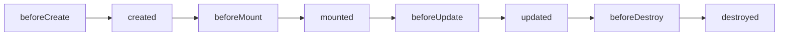

# Vue详细知识点梳理

## 一、Vue简介

### 1.1 什么是Vue

Vue（读音 /vjuː/，类似于 view）是一套用于构建用户界面的**渐进式JavaScript框架**。与其他重量级框架不同，Vue被设计为可以**自底向上逐层应用**——核心只关注视图层，易于上手，同时可以与现有项目整合，也能支持复杂的单页应用（SPA）开发。

**Vue的核心特点**：易用性、灵活性、高效性，基于**MVVM（Model-View-ViewModel）**架构模式，实现数据与视图的双向绑定，减少DOM操作，提升开发效率。

### 1.2 Vue的版本区别（Vue2 vs Vue3）

| 对比维度 | Vue2 | Vue3 |
|----------|------|------|
| **核心架构** | Options API（选项式API），通过data、methods、computed等选项组织代码 | Composition API（组合式API），通过setup函数、响应式API组织代码，兼容Options API |
| **响应式原理** | `Object.defineProperty`，数组下标修改、对象新增属性无法响应 | `Proxy + Reflect`，完美支持数组、对象的所有操作，性能更优 |
| **性能** | 虚拟DOM更新效率一般，打包体积较大 | 虚拟DOM重写，Tree-Shaking优化，打包体积更小 |
| **TypeScript** | 不支持 | 原生支持 |
| **其他特性** | 生命周期钩子固定 | 新增Teleport、Suspense、Fragment等特性 |

---

## 二、Vue基础（Vue2+Vue3通用）

### 2.1 环境搭建

#### 2.1.1 CDN引入（快速测试）

```html
<!-- Vue2 -->
<script src="https://cdn.jsdelivr.net/npm/vue@2.7.14/dist/vue.js"></script>

<!-- Vue3 -->
<script src="https://cdn.jsdelivr.net/npm/vue@3.4.21/dist/vue.global.js"></script>
```

#### 2.1.2 Vue CLI（工程化开发）

```bash
# 安装Vue CLI
npm install -g @vue/cli

# 创建Vue2项目
vue create 项目名
# 选择Vue2模板

# 创建Vue3项目
vue create 项目名 -b vue@next

# 启动项目
cd 项目名
npm run serve
```

#### 2.1.3 Vite（Vue3推荐）

```bash
# 创建Vue3项目（Vite）
npm create vite@latest 项目名 -- --template vue

# 安装依赖并启动
cd 项目名
npm install
npm run dev
```

### 2.2 核心概念：实例与挂载

#### Vue2实例

```javascript
const vm = new Vue({
  el: '#app',           // 挂载点（CSS选择器）
  data: {               // 数据中心（响应式）
    message: 'Hello Vue!'
  }
})

// 或手动挂载
// vm.$mount('#app')
```

#### Vue3实例

```javascript
const { createApp } = Vue

const app = createApp({
  data() {              // Vue3中data必须是函数
    return {
      message: 'Hello Vue3!'
    }
  }
})

app.mount('#app')
```

### 2.3 模板语法

#### 2.3.1 插值表达式（Mustache语法）

```html
<div id="app">
  <!-- 渲染文本 -->
  <p>{{ message }}</p>
  
  <!-- 简单表达式 -->
  <p>1+1={{ 1+1 }}</p>
  <p>{{ age > 18 ? '成年' : '未成年' }}</p>
  
  <!-- 不支持复杂逻辑（如if语句） -->
</div>
```

#### 2.3.2 核心指令

| 指令 | 缩写 | 作用 | 示例 |
|------|------|------|------|
| `v-text` | - | 渲染文本 | `<p v-text="message"></p>` |
| `v-html` | - | 渲染HTML（慎防XSS） | `<div v-html="htmlContent"></div>` |
| `v-bind` | `:` | 动态绑定属性 | `` |
| `v-on` | `@` | 事件监听 | `<button @click="handleClick">` |
| `v-model` | - | 双向数据绑定 | `<input v-model="message">` |
| `v-if` | - | 条件渲染（销毁/创建） | `<div v-if="isShow">显示</div>` |
| `v-show` | - | 条件渲染（隐藏/显示） | `<div v-show="isShow">显示</div>` |
| `v-for` | - | 列表渲染 | `<li v-for="item in list" :key="item.id">` |
| `v-pre` | - | 跳过编译 | `<div v-pre>{{ raw }}</div>` |
| `v-cloak` | - | 解决插值闪烁 | `<div v-cloak>{{ message }}</div>` |

##### v-bind 详解

```html
<!-- 基础绑定 -->


<!-- 绑定class（对象语法） -->
<div :class="{ active: isActive, 'text-danger': hasError }"></div>

<!-- 绑定class（数组语法） -->
<div :class="[activeClass, errorClass]"></div>

<!-- 绑定style -->
<div :style="{ color: textColor, fontSize: fontSize + 'px' }"></div>
```

##### v-on 详解

```html
<!-- 基础用法 -->
<button @click="handleClick">点击</button>
<button @click="handleClick(123, $event)">传参</button>

<!-- 事件修饰符 -->
<button @click.stop="handleClick">阻止冒泡</button>
<button @click.prevent="handleSubmit">阻止默认行为</button>
<button @click.once="handleClick">只触发一次</button>
<button @click.self="handleClick">只有自身触发</button>

<!-- 按键修饰符 -->
<input @keyup.enter="handleEnter" placeholder="按回车提交">
<input @keyup.esc="handleEsc" placeholder="按ESC">
```

##### v-model 详解

```html
<!-- 文本输入框 -->
<input v-model="message">
<p>输入内容：{{ message }}</p>

<!-- 复选框（单个） -->
<input type="checkbox" v-model="isAgree"> 同意协议

<!-- 复选框（多个，绑定数组） -->
<input type="checkbox" v-model="hobbies" value="game"> 游戏
<input type="checkbox" v-model="hobbies" value="music"> 音乐

<!-- 单选框 -->
<input type="radio" v-model="gender" value="male"> 男
<input type="radio" v-model="gender" value="female"> 女

<!-- 下拉框 -->
<select v-model="selected">
  <option value="">请选择</option>
  <option value="1">选项1</option>
  <option value="2">选项2</option>
</select>
```

##### v-if vs v-show

| 特性 | v-if | v-show |
|------|------|--------|
| 原理 | 销毁/创建DOM | 隐藏/显示（display: none） |
| 初始渲染成本 | 低（条件为false时不渲染） | 高（总是渲染） |
| 切换成本 | 高（销毁重建） | 低（仅切换display） |
| 适用场景 | 条件很少改变 | 条件频繁切换 |

##### v-for 详解

```html
<!-- 循环数组 -->
<ul>
  <li v-for="(item, index) in list" :key="item.id">
    {{ index + 1 }}. {{ item.name }}
  </li>
</ul>

<!-- 循环对象 -->
<div v-for="(value, key, index) in user" :key="key">
  {{ index }}. {{ key }}: {{ value }}
</div>

<!-- 循环数字（1-10） -->
<option v-for="n in 10" :key="n">{{ n }}</option>
```

> **重要**：`v-for`必须配合`:key`，且key值必须唯一（推荐使用id，避免使用index）

---

## 三、Vue核心特性

### 3.1 响应式原理

#### Vue2响应式原理（Object.defineProperty）

```javascript
// 简化版原理
function defineReactive(obj, key, value) {
  Object.defineProperty(obj, key, {
    get() {
      // 收集依赖
      return value
    },
    set(newValue) {
      if (newValue !== value) {
        value = newValue
        // 通知视图更新
        updateView()
      }
    }
  })
}
```

**Vue2响应式的局限性：**

| 问题 | 示例 | 解决方案 |
|------|------|----------|
| 数组下标修改 | `arr[0] = 1` | 使用变异方法：`push/pop/shift/unshift/splice/sort/reverse` |
| 修改数组长度 | `arr.length = 0` | 使用`splice` |
| 新增对象属性 | `obj.newKey = 'value'` | `Vue.set(obj, 'newKey', 'value')` |
| 删除对象属性 | `delete obj.key` | `Vue.delete(obj, 'key')` |

#### Vue3响应式原理（Proxy + Reflect）

```javascript
// 简化版原理
function reactive(obj) {
  return new Proxy(obj, {
    get(target, key, receiver) {
      const value = Reflect.get(target, key, receiver)
      // 收集依赖
      track(target, key)
      // 递归代理嵌套对象
      return typeof value === 'object' && value !== null 
        ? reactive(value) 
        : value
    },
    set(target, key, newValue, receiver) {
      const oldValue = Reflect.get(target, key, receiver)
      if (newValue !== oldValue) {
        Reflect.set(target, key, newValue, receiver)
        // 通知视图更新
        trigger(target, key)
      }
      return true
    },
    deleteProperty(target, key) {
      const hasKey = Reflect.has(target, key)
      const result = Reflect.deleteProperty(target, key)
      if (hasKey) {
        trigger(target, key)
      }
      return result
    }
  })
}
```

**Vue3响应式的优势：**
- 无需手动处理数组、对象的新增/删除操作
- 自动递归代理嵌套对象
- 性能更优，支持TypeScript

### 3.2 组件化开发

#### 组件注册

**Vue2：**

```javascript
// 全局注册
Vue.component('MyComponent', {
  template: '<div>全局组件</div>',
  data() {
    return { count: 0 }
  }
})

// 局部注册
new Vue({
  el: '#app',
  components: {
    LocalComponent: { template: '<div>局部组件</div>' }
  }
})
```

**Vue3：**

```javascript
const app = createApp({})

// 全局注册
app.component('MyComponent', {
  template: '<div>全局组件</div>',
  data() {
    return { count: 0 }
  }
})

// 局部注册
const LocalComponent = { template: '<div>局部组件</div>' }
app.component('Parent', {
  components: { LocalComponent }
})
```

#### 组件通信

| 通信方式 | 适用场景 | 方向 |
|----------|----------|------|
| `props` + `emit` | 父子组件 | 父→子（props），子→父（emit） |
| `provide` / `inject` | 祖孙组件（跨级） | 祖先→后代 |
| EventBus / mitt | 兄弟组件、任意组件 | 双向 |
| Vuex / Pinia | 大型项目全局状态 | 双向 |
| `$refs` | 父访问子实例 | 父→子 |
| `$parent` | 子访问父实例（不推荐） | 子→父 |

**props（父传子）：**

```javascript
// 子组件
export default {
  props: {
    name: {
      type: String,
      required: true,
      default: '未知'
    },
    age: {
      type: Number,
      validator: (value) => value > 0
    }
  }
}
```

**$emit（子传父）：**

```javascript
// 子组件（Vue2）
this.$emit('childEvent', data)

// 父组件
<ChildComponent @childEvent="handleEvent" />
```

**provide/inject（跨级通信）：**

```javascript
// 祖先组件（Vue3）
import { ref, provide } from 'vue'
setup() {
  const data = ref('祖先数据')
  provide('key', data)
}

// 后代组件
import { inject } from 'vue'
setup() {
  const data = inject('key')
  return { data }
}
```

### 3.3 生命周期

#### Vue2生命周期



| 钩子 | 时机 | 常用操作 |
|------|------|----------|
| `beforeCreate` | 实例创建前 | 无（data/methods不可用） |
| `created` | 实例创建完成 | 数据初始化、请求接口 |
| `beforeMount` | 挂载前 | 最后一次修改数据的机会 |
| `mounted` | 挂载完成 | DOM操作、初始化第三方库 |
| `beforeUpdate` | 数据更新前 | 获取更新前的DOM状态 |
| `updated` | 数据更新后 | DOM操作（谨慎修改数据） |
| `beforeDestroy` | 销毁前 | 清理定时器、解绑事件 |
| `destroyed` | 销毁完成 | 资源释放 |

#### Vue3生命周期（Composition API）

```javascript
import { 
  onBeforeMount, onMounted, 
  onBeforeUpdate, onUpdated,
  onBeforeUnmount, onUnmounted 
} from 'vue'

export default {
  setup() {
    // setup 相当于 beforeCreate + created
    
    onBeforeMount(() => { /* 挂载前 */ })
    onMounted(() => { /* DOM已挂载 */ })
    onBeforeUpdate(() => { /* 更新前 */ })
    onUpdated(() => { /* 更新后 */ })
    onBeforeUnmount(() => { /* 销毁前 */ })
    onUnmounted(() => { /* 销毁后 */ })
  }
}
```

---

## 四、Vue进阶特性

### 4.1 计算属性（computed）

**特点**：基于依赖缓存，依赖不变时不重新计算

**Vue2写法：**

```javascript
export default {
  data() {
    return { firstName: '张', lastName: '三' }
  },
  computed: {
    fullName() {
      return this.firstName + this.lastName
    },
    fullNameWithSet: {
      get() {
        return this.firstName + this.lastName
      },
      set(newVal) {
        const arr = newVal.split('')
        this.firstName = arr[0]
        this.lastName = arr.slice(1).join('')
      }
    }
  }
}
```

**Vue3写法：**

```javascript
import { ref, computed } from 'vue'

export default {
  setup() {
    const firstName = ref('张')
    const lastName = ref('三')
    
    // 只读
    const fullName = computed(() => firstName.value + lastName.value)
    
    // 可读写
    const fullName2 = computed({
      get: () => firstName.value + lastName.value,
      set: (newVal) => {
        const arr = newVal.split('')
        firstName.value = arr[0]
        lastName.value = arr.slice(1).join('')
      }
    })
    
    return { firstName, lastName, fullName }
  }
}
```

**computed vs methods：**

| 特性 | computed | methods |
|------|----------|---------|
| 缓存 | 有（依赖不变则取缓存） | 无 |
| 性能 | 高（避免重复计算） | 低（每次调用都计算） |
| 适用场景 | 依赖数据的计算 | 事件处理、无缓存需求 |

### 4.2 侦听器（watch）

#### Vue2写法

```javascript
export default {
  data() {
    return {
      message: 'Hello',
      user: { name: '张三', age: 20 }
    }
  },
  watch: {
    // 监听简单数据
    message(newVal, oldVal) {
      console.log('message变化:', newVal, oldVal)
    },
    // 深度监听
    user: {
      handler(newVal, oldVal) {
        console.log('user变化:', newVal)
      },
      deep: true,      // 深度监听
      immediate: true  // 立即执行
    },
    // 监听对象属性
    'user.name'(newVal, oldVal) {
      console.log('user.name变化:', newVal)
    }
  }
}
```

#### Vue3写法

```javascript
import { ref, reactive, watch } from 'vue'

export default {
  setup() {
    const message = ref('Hello')
    const user = reactive({ name: '张三', age: 20 })
    
    // 监听ref
    watch(message, (newVal, oldVal) => {
      console.log('message变化:', newVal, oldVal)
    })
    
    // 监听reactive（自动深度监听）
    watch(user, (newVal, oldVal) => {
      console.log('user变化:', newVal)
    })
    
    // 监听对象属性（使用函数返回）
    watch(() => user.name, (newVal, oldVal) => {
      console.log('user.name变化:', newVal)
    })
    
    // 监听多个
    watch([message, () => user.age], ([newMsg, newAge], [oldMsg, oldAge]) => {
      console.log('message或age变化')
    })
    
    return { message, user }
  }
}
```

#### watchEffect（Vue3新增）

```javascript
import { ref, watchEffect } from 'vue'

export default {
  setup() {
    const message = ref('Hello')
    const count = ref(0)
    
    // 自动收集依赖，依赖变化时自动执行
    const stop = watchEffect(() => {
      console.log('依赖变化:', message.value, count.value)
    })
    
    // 停止监听
    // stop()
  }
}
```

### 4.3 自定义指令

**Vue2：**

```javascript
// 全局指令
Vue.directive('focus', {
  inserted(el) {
    el.focus()      // 元素插入DOM时自动聚焦
  }
})

// 局部指令
export default {
  directives: {
    focus: {
      inserted(el) { el.focus() }
    }
  }
}
```

**Vue3：**

```javascript
const app = createApp({})

app.directive('focus', {
  mounted(el) {      // 对应Vue2的inserted
    el.focus()
  }
})

// 局部指令
export default {
  directives: {
    focus: { mounted(el) { el.focus() } }
  }
}
```

### 4.4 插槽（Slot）

#### 匿名插槽

```html
<!-- 子组件 -->
<template>
  <div>
    <slot>默认内容</slot>
  </div>
</template>

<!-- 父组件 -->
<Child>
  <p>插入到插槽的内容</p>
</Child>
```

#### 具名插槽

```html
<!-- 子组件 -->
<template>
  <slot name="header">默认头部</slot>
  <slot name="content">默认内容</slot>
  <slot name="footer">默认底部</slot>
</template>

<!-- 父组件 -->
<Child>
  <template v-slot:header>头部内容</template>
  <template #content>内容区域</template>     <!-- 缩写 -->
  <template #footer>底部内容</template>
</Child>
```

#### 作用域插槽

```html
<!-- 子组件（传递数据给父组件） -->
<template>
  <slot :user="user" :count="count"></slot>
</template>

<script>
export default {
  data() {
    return { user: { name: '张三' }, count: 10 }
  }
}
</script>

<!-- 父组件 -->
<Child>
  <template v-slot:default="{ user, count }">
    <p>用户名：{{ user.name }}，数量：{{ count }}</p>
  </template>
</Child>
```

---

## 五、Vue2与Vue3差异速查表

| 项目 | Vue2 | Vue3 |
|------|------|------|
| **data** | 对象或函数 | 必须是函数 |
| **响应式** | `Object.defineProperty` | `Proxy` |
| **API风格** | Options API | Composition API（兼容Options） |
| **TypeScript** | 支持有限 | 原生支持 |
| **生命周期** | beforeDestroy/destroyed | beforeUnmount/unmounted |
| **事件总线** | `new Vue()` | mitt库 |
| **过滤器** | 支持 | 移除（用computed/methods替代） |
| **多根节点** | 不支持（必须有根元素） | 支持（Fragment） |
| **Teleport** | 无 | 有（传送DOM节点） |
| **Suspense** | 无 | 有（异步组件） |
| **Tree-Shaking** | 较差 | 优秀 |

---

## 六、总结

| 核心知识点 | 要点 |
|------------|------|
| **Vue本质** | 渐进式JavaScript框架，MVVM架构 |
| **核心特性** | 响应式、组件化、双向绑定、虚拟DOM |
| **模板语法** | 插值`{{ }}`、指令`v-*`、事件`@`、属性`:` |
| **响应式原理** | Vue2：`Object.defineProperty`；Vue3：`Proxy` |
| **生命周期** | 创建→挂载→更新→销毁 |
| **组件通信** | props/emit、provide/inject、EventBus、Vuex |
| **性能优化** | computed缓存、key属性、懒加载、keep-alive |
