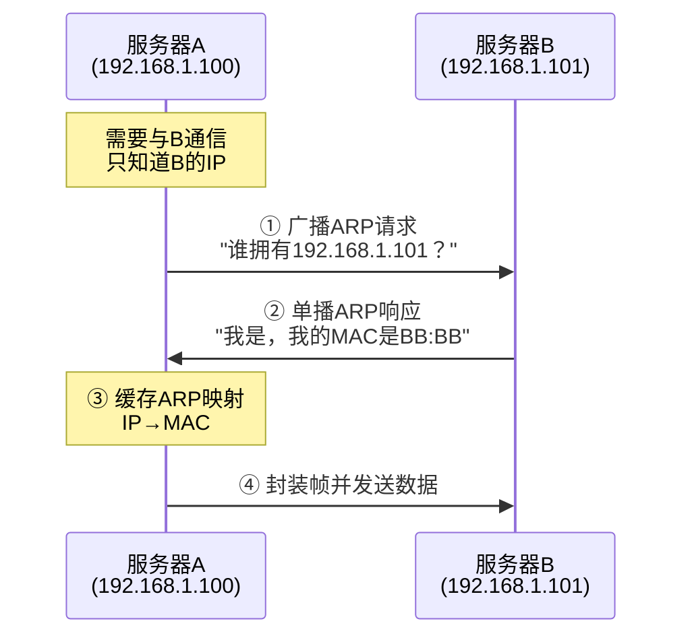
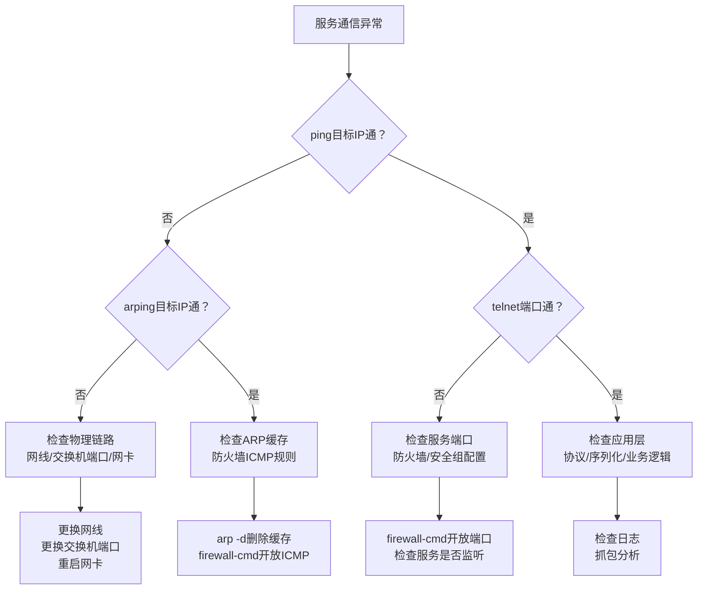

# 从Java后端开发角度深度剖析计算机网络（自顶向下：链路层和局域网）

## 引言

计算机网络是Java后端开发的核心基础设施，后端服务的通信、数据传输、高可用部署，均依赖计算机网络的底层支撑。

前文已重点剖析应用层、传输层、网络层的核心理论与实战场景，本文将聚焦自顶向下体系中的**数据链路层（简称链路层）与局域网**，结合Java后端部署、运维、故障排查场景，拆解链路层核心机制、局域网特性及后端关联要点，打破"链路层与后端无关"的认知，让底层网络知识落地到后端实操。

---

## 第一章：链路层——Java后端通信的"底层传输载体"

链路层位于网络层之下、物理层之上，是"分层通信"的关键衔接层，核心作用是**实现相邻设备之间的可靠帧传输**。

### 1.1 链路层核心理论（后端必懂）

#### 链路层的核心职责

| 职责 | 说明 | Java后端关联 |
|------|------|--------------|
| **帧封装与解封装** | 将IP数据报封装成数据帧（添加帧头、帧尾） | 所有后端通信的最终封装形式 |
| **差错控制** | CRC校验，检测传输错误，丢弃错误帧 | 错误帧由TCP触发重传，影响接口响应 |
| **流量控制** | 控制相邻设备帧传输速率 | 避免后端服务器缓存溢出 |
| **链路管理** | 建立、维护、释放相邻设备链路 | 链路异常导致通信中断 |

#### 核心概念（后端排查故障必备）

**MAC地址（硬件地址）**：

| 特性 | 说明 |
|------|------|
| 分配方式 | 网卡厂商分配，全球唯一 |
| 格式示例 | `00:16:3E:77:88:99` |
| 作用范围 | **仅在同一链路（同一局域网）内有效** |
| 查看命令 | `ifconfig` 或 `ip addr`（ether字段） |

**数据帧结构**：

```
┌─────────────────────────────────────────────────────────────┐
│                        数据帧                                │
├───────────────┬─────────────────────────────┬───────────────┤
│    帧头(14B)   │        IP数据报(46-1500B)    │   帧尾(4B)    │
├───────────────┼─────────────────────────────┼───────────────┤
│ 源MAC(6B)     │                             │              │
│ 目标MAC(6B)   │        业务数据封装其中        │  CRC校验码    │
│ 帧类型(2B)    │                             │              │
└───────────────┴─────────────────────────────┴───────────────┘
```

#### 链路层核心协议

| 协议 | 全称 | 作用 | 后端关联 |
|------|------|------|----------|
| **以太网协议** | Ethernet | 局域网帧传输，支持双绞线/光纤 | 机房内服务器通信的基础 |
| **PPP协议** | Point-to-Point Protocol | 广域网点对点传输 | 跨地域机房专线连接 |
| **ARP协议** | Address Resolution Protocol | IP地址 → MAC地址转换 | **局域网通信的前提** |

#### ARP协议工作原理（重点理解）



#### 链路层与后端服务的关联逻辑

```
业务数据 → 应用层报文 → 传输层报文段 → 网络层IP数据报 → 链路层数据帧 → 物理层信号
                    ↑
            链路层问题会导致：
            • 帧丢失 → TCP重传 → 接口超时
            • 帧出错 → CRC校验失败 → 数据重传
            • MAC冲突 → 通信混乱
            • ARP异常 → 无法连接同局域网设备
```

### 1.2 链路层实战（Java后端运维、故障排查重点）

#### 核心排查命令

| 命令 | 用途 | 示例 |
|------|------|------|
| `ifconfig` / `ip addr` | 查看MAC地址、网卡状态 | 确认网卡`ether`字段 |
| `arp -a` | 查看ARP缓存表 | 查看IP-MAC映射关系 |
| `arp -d <IP>` | 删除ARP缓存 | `arp -d 192.168.1.101` |
| `arping <IP>` | 链路层连通性检测 | `arping 192.168.1.101` |
| `netstat -i` | 查看网卡帧传输统计 | 查看错误帧、丢弃帧数 |

**实战示例：查看网卡统计信息**

```bash
$ netstat -i
Kernel Interface table
Iface      MTU    RX-OK RX-ERR RX-DRP RX-OVR    TX-OK TX-ERR TX-DRP TX-OVR
eth0      1500  1234567      0      0      0  2345678      0      0      0
# RX-ERR: 接收错误帧数  RX-DRP: 接收丢弃帧数
# 这两个值过高说明链路层存在问题
```

#### 后端常见链路层问题与解决方案

**问题1：同一局域网内无法连接数据库（IP正确、端口开放，但telnet失败）**

| 排查步骤 | 命令 | 解决方案 |
|----------|------|----------|
| ① 检查ARP映射 | `arp -a \| grep 数据库IP` | 映射错误时删除：`arp -d 数据库IP` |
| ② 链路层连通性 | `arping 数据库IP` | 不通则检查网线、交换机端口 |
| ③ 检查MAC冲突 | `ifconfig` 查看所有设备MAC | 修改冲突设备的MAC地址 |

**问题2：接口频繁超时，但网络层正常（ping正常）**

| 排查方向 | 命令 | 解决方案 |
|----------|------|----------|
| 网卡丢帧统计 | `netstat -i` 查看RX-DRP/TX-DRP | 数值过高则检查网线、重启网卡 |
| 网卡错误帧 | `netstat -i` 查看RX-ERR/TX-ERR | 检查网卡驱动、更换网卡 |
| 交换机端口 | 登录交换机管理界面 | 确认端口速率匹配、未禁用 |

**问题3：ARP缓存老化导致周期性通信中断**

```bash
# 临时解决方案：添加静态ARP映射
arp -s 192.168.1.101 00:16:3E:77:88:99

# 永久生效：配置 /etc/ethers 文件
echo "00:16:3E:77:88:99 192.168.1.101" >> /etc/ethers
# 开机自动加载：在 /etc/rc.local 中添加 arp -f
```

**问题4：链路层帧校验失败，TCP重传频繁**

| 排查方向 | 具体措施 |
|----------|----------|
| 传输介质 | 更换高质量网线/光纤，远离强电干扰 |
| 网卡驱动 | 更新网卡驱动到最新版本 |
| 速率匹配 | 确认网卡与交换机端口速率一致（均为千兆） |

#### Java后端开发中的链路层注意事项

| 场景 | 注意事项 |
|------|----------|
| **部署时** | 确保网卡正常启用，MAC地址唯一（尤其虚拟机部署） |
| **高并发场景** | 使用千兆网卡（1000Mbps），避免百兆网卡成为瓶颈 |
| **分布式部署** | 同局域网服务器使用同一品牌/速率交换机，避免兼容性问题 |

---

## 第二章：局域网——Java后端分布式部署的"基础环境"

局域网（LAN）是指在某一区域内由多台计算机、服务器、交换机等设备组成的网络，核心特点是**地理范围小、传输速率高、延迟低、安全性高**。

### 2.1 局域网核心理论（后端部署必备）

#### 局域网的核心特性

| 特性 | 说明 | 后端关联 |
|------|------|----------|
| **地理范围有限** | 几十米到几公里（机房/企业内网） | 集群部署在同一局域网，避免跨公网高延迟 |
| **传输速率高** | 100Mbps/1000Mbps/10Gbps | 满足微服务高频通信、缓存读写需求 |
| **延迟低、丢包率低** | 延迟<1ms，丢包率≈0 | Redis集群、Nacos依赖低延迟特性 |
| **封闭性强** | 防火墙/路由器隔离，不直接暴露公网 | 提升服务安全性，通过负载均衡器对外暴露 |

#### 局域网核心架构

**星型架构（最常用）**：

```
                    ┌─────────────┐
                    │   核心交换机  │
                    └──────┬──────┘
                           │
           ┌───────────────┼───────────────┐
           │               │               │
      ┌────┴────┐     ┌────┴────┐     ┌────┴────┐
      │ 服务器A │     │ 服务器B │     │ 服务器C │
      │192.168.1.100│ │192.168.1.101│ │192.168.1.102│
      └─────────┘     └─────────┘     └─────────┘
```

**树形架构（大型机房）**：

```
                    ┌─────────────┐
                    │  核心交换机  │
                    └──────┬──────┘
                           │
           ┌───────────────┼───────────────┐
           │               │               │
      ┌────┴────┐     ┌────┴────┐     ┌────┴────┐
      │汇聚交换机│     │汇聚交换机│     │汇聚交换机│
      └────┬────┘     └────┬────┘     └────┬────┘
     ┌─────┼─────┐     ┌─────┼─────┐
   ┌─┴─┐ ┌─┴─┐ ┌─┴─┐ ┌─┴─┐ ┌─┴─┐
   │服 │ │服 │ │服 │ │服 │ │服 │
   │务 │ │务 │ │务 │ │务 │ │务 │
   │器 │ │器 │ │器 │ │器 │ │器 │
   └───┘ └───┘ └───┘ └───┘ └───┘
```

> **建议**：后端集群部署在同一汇聚交换机下，减少层级，降低延迟。

#### 局域网与后端分布式部署的关联

| 组件 | 部署要求 | 原因 |
|------|----------|------|
| 微服务集群（订单/用户） | 同一局域网 | RPC高频通信，需要低延迟 |
| 数据库集群 | 同一局域网 | 数据读写延迟敏感 |
| Redis集群 | 同一局域网 | 缓存读写依赖低延迟 |
| 注册中心（Nacos/Zookeeper） | 同一局域网 | 服务注册发现需实时高效 |
| 负载均衡器（Nginx） | 与后端服务器同局域网 | 请求转发低延迟 |

### 2.2 局域网实战（Java后端部署、优化重点）

#### 后端服务器局域网配置

**Linux静态IP配置（CentOS `/etc/sysconfig/network-scripts/ifcfg-eth0`）：**

```bash
TYPE=Ethernet
BOOTPROTO=static          # 静态IP（避免DHCP导致IP变化）
IPADDR=192.168.1.100      # 服务器静态IP
NETMASK=255.255.255.0     # 子网掩码（确保同子网）
GATEWAY=192.168.1.1       # 网关
DNS1=8.8.8.8              # DNS服务器
ONBOOT=yes                # 开机自启
```

```bash
# 配置完成后重启网卡
systemctl restart network
```

#### 防火墙配置（开放业务端口）

```bash
# 开放常用端口
firewall-cmd --permanent --add-port=8080/tcp   # HTTP接口
firewall-cmd --permanent --add-port=20880/tcp  # Dubbo RPC
firewall-cmd --permanent --add-port=3306/tcp   # MySQL
firewall-cmd --permanent --add-port=6379/tcp   # Redis
firewall-cmd --permanent --add-port=8848/tcp   # Nacos

# 重新加载配置
firewall-cmd --reload

# 查看已开放端口
firewall-cmd --list-ports
```

#### 局域网性能优化

| 优化项 | 具体措施 | 效果 |
|--------|----------|------|
| **交换机优化** | 千兆/万兆交换机，端口聚合 | 提升传输带宽 |
| **网卡优化** | 千兆/万兆网卡，开启RSS多队列 | 分散CPU中断，提升处理能力 |
| **网卡模式** | 关闭节能模式，设置全双工 | 保证传输性能稳定 |
| **子网划分** | 合理划分子网，减少每子网设备数 | 减少广播风暴 |
| **端口隔离** | 配置交换机端口隔离 | 避免广播帧在所有端口转发 |
| **冗余部署** | 双网卡绑定，双交换机冗余 | 提升链路可靠性 |

**网卡多队列（RSS）开启方法：**

```bash
# 查看网卡队列数
ethtool -l eth0

# 开启多队列（设置队列数=CPU核心数）
ethtool -L eth0 combined 8
```

#### 局域网常见问题与解决方案

**问题1：局域网内部分服务器无法通信（同子网，ping不通）**

| 排查步骤 | 命令 | 解决方案 |
|----------|------|----------|
| ① 检查IP配置 | `ip addr` | 确认IP/子网掩码/网关正确 |
| ② 检查物理连接 | 观察网口指示灯 | 更换网线、检查交换机端口 |
| ③ 检查防火墙 | `firewall-cmd --list-all` | 开放ICMP协议 |
| ④ 检查ARP缓存 | `arp -a` | 删除错误ARP缓存 |

**问题2：微服务调用超时、Redis读写延迟高**

| 排查方向 | 方法 | 解决方案 |
|----------|------|----------|
| 交换机负载 | 登录交换机管理界面 | 升级交换机或端口聚合 |
| 网卡利用率 | `sar -n DEV 1` | 升级万兆网卡 |
| 广播风暴 | `netstat -i` 查看广播帧数 | 划分子网、端口隔离 |
| 链路质量 | 更换网线测试 | 使用Cat6以上网线 |

**问题3：局域网内IP地址冲突**

```bash
# 1. 查找冲突设备
arp -a | grep 冲突IP

# 2. 根据MAC定位冲突设备
# 3. 修改冲突设备的IP地址
```

**问题4：局域网与外网连通异常**

| 排查步骤 | 命令 | 解决方案 |
|----------|------|----------|
| ① 检查网关 | `ping 192.168.1.1` | 确认网关配置正确 |
| ② 检查路由器 | 登录路由器管理界面 | 确认公网出口配置 |
| ③ 检查防火墙 | `firewall-cmd --list-all` | 开放出站规则 |

---

## 第三章：链路层、局域网与后端服务的协同工作

### 3.1 协同工作流程（自顶向下视角）

**场景**：订单服务（192.168.1.101）通过Dubbo调用用户服务（192.168.1.102）

```mermaid
flowchart TD
    subgraph 订单服务
        A[应用层: Dubbo封装业务数据]
        B[传输层: TCP报文段<br/>源端口20880→目标端口20881]
        C[网络层: IP数据报<br/>源IP 192.168.1.101→目标IP 192.168.1.102]
        D[链路层: 查询ARP缓存<br/>获取目标MAC，封装帧]
    end
    
    subgraph 交换机
        E[根据目标MAC<br/>转发帧]
    end
    
    subgraph 用户服务
        F[链路层: 解帧、CRC校验]
        G[网络层: 解IP数据报]
        H[传输层: 解TCP报文段]
        I[应用层: Dubbo解析业务数据]
    end
    
    A → B → C → D → E → F → G → H → I
```

### 3.2 后端实战优化建议

| 优化维度 | 具体建议 |
|----------|----------|
| **部署优化** | 微服务、数据库、缓存部署在同一局域网、同一汇聚交换机下；核心服务配备双网卡、双链路 |
| **故障排查顺序** | 应用层 → 传输层 → 网络层 → 链路层 → 局域网（自顶向下逐层排查） |
| **性能优化** | 千兆/万兆交换机+网卡；端口聚合+网卡多队列；合理划分子网；定期清理ARP缓存 |
| **安全优化** | 局域网内服务隔离（微服务子网/数据库子网）；防火墙限制端口访问；禁用不必要端口 |

### 3.3 故障排查决策树



---

## 第四章：总结（Java后端视角）

### 核心要点

| 层级 | 核心概念 | 后端关联 | 关键命令/工具 |
|------|----------|----------|---------------|
| **链路层** | MAC地址、ARP协议、数据帧 | 局域网通信基础、帧丢失导致TCP重传 | `arp`、`arping`、`netstat -i` |
| **局域网** | 星型/树型架构、子网划分 | 分布式部署环境、服务间通信载体 | `ifconfig`、`ping`、`telnet` |

### 理论与实践对照

| 理论概念 | 后端实践场景 |
|----------|--------------|
| MAC地址唯一性 | 虚拟机部署时避免MAC冲突 |
| ARP协议 | 局域网内IP→MAC映射，排查通信问题 |
| 帧校验CRC | 网卡错误帧过多时更换网线/网卡 |
| 局域网低延迟 | 微服务、Redis集群部署在同局域网 |
| 交换机端口聚合 | 高并发服务绑定多网卡提升带宽 |
| 子网划分 | 不同服务（微服务/数据库）隔离部署 |

### 后端开发者的链路层/局域网认知清单

- [ ] 能用 `ifconfig` 查看MAC地址和网卡状态
- [ ] 能用 `arp -a` 查看ARP缓存，`arp -d` 删除错误缓存
- [ ] 能用 `arping` 检测链路层连通性
- [ ] 能用 `netstat -i` 查看帧错误/丢弃统计
- [ ] 理解同一局域网内通信依赖ARP协议
- [ ] 知道高并发场景需要千兆/万兆网卡和交换机
- [ ] 会配置Linux静态IP和防火墙规则
- [ ] 知道分布式集群部署在同一局域网的原因
- [ ] 能按"链路层→局域网→上层协议"顺序排查底层故障

### 最终结论

链路层和局域网是Java后端分布式部署的**底层基石**，看似与后端开发无关，实则直接影响服务的稳定性、通信效率和安全性。对于Java后端开发者而言：

1. **无需深入链路层协议实现细节**，但必须掌握核心概念、排查方法和优化技巧
2. **链路层核心**：帧传输、差错控制、ARP寻址；掌握 `arp`、`arping`、`netstat -i` 命令
3. **局域网核心**：低延迟、高速率、封闭性；掌握IP配置、子网划分、性能优化
4. **协同逻辑**：链路层是局域网通信的"载体"，局域网是分布式集群的"部署环境"，二者与上层协议协同构成完整通信链路

让底层网络成为后端服务的**助力**，而非**瓶颈**。
