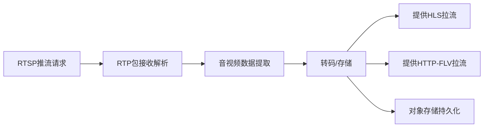
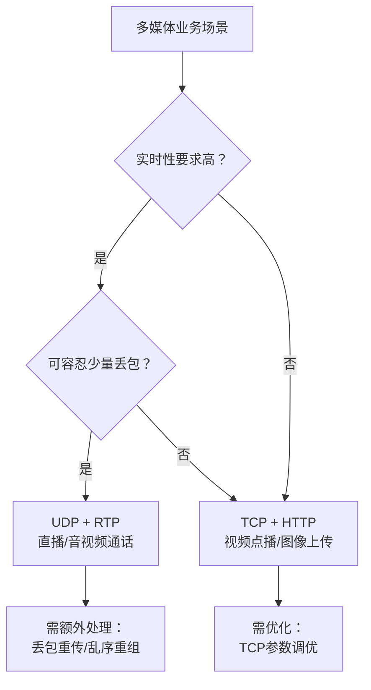
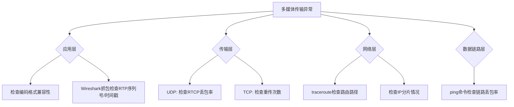
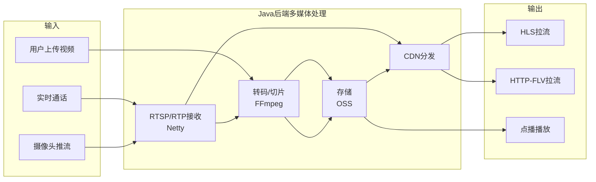

# 从Java后端开发角度深度剖析计算机网络（自顶向下）：多媒体网络

## 引言

多媒体网络是计算机网络与多媒体技术的融合，核心是**高效、可靠地传输多媒体数据**（音频、视频、图像等）。自顶向下可分为应用层、传输层、网络层、数据链路层的多媒体适配，其中**应用层与传输层是Java后端开发的核心关联层**。

对于Java后端而言，多媒体网络的实战场景贯穿**音视频通话、直播、文件点播、图像识别接口**等核心业务，理解其理论逻辑与实战要点，能帮助开发者解决多媒体传输中的延迟、卡顿、丢包等核心问题。

---

## 一、多媒体网络核心定位（Java后端视角）

### 核心价值

> 打破传统文本数据的传输局限，实现音频、视频、图像等**大容量、实时性**多媒体数据的端到端传输

### Java后端与多媒体网络的直接关联

| 职责 | 说明 |
|------|------|
| **接收** | 从推流端/客户端接收多媒体数据 |
| **处理** | 转码、解析、合成等业务逻辑 |
| **转发** | 推流端→后端→拉流端的中转 |
| **存储** | 对象存储、文件系统持久化 |
| **异常处理** | 丢包重传、超时处理、降级策略 |

> 后端开发中遇到的"直播卡顿""音视频不同步""高清图像传输超时"等问题，均与多媒体网络的传输特性、协议选择、性能优化直接相关。

---

## 二、自顶向下剖析多媒体网络

### 分层架构总览

```mermaid
flowchart TD
    subgraph 应用层【Java后端核心】
        RTSP[RTSP<br/>实时流控制]
        RTP[RTP<br/>实时数据传输]
        RTCP[RTCP<br/>传输质量监控]
        HLS[HTTP-FLV/HLS<br/>浏览器适配]
    end
    
    subgraph 传输层【性能优化重点】
        UDP[UDP<br/>低延迟/实时]
        TCP[TCP<br/>可靠/点播]
    end
    
    subgraph 网络层【部署关键】
        IP[IP分片优化]
        QoS[QoS优先级]
        Route[路由优化]
    end
    
    subgraph 数据链路层【排障参考】
        MTU[MTU配置]
        Link[链路质量]
    end
    
    RTSP --> UDP --> IP --> MTU
    RTP --> UDP
    RTCP --> UDP
    HLS --> TCP
```

### 各层适配多媒体数据的核心挑战

| 层级 | 核心挑战 | 解决方案 |
|------|----------|----------|
| **应用层** | 编码格式多样、协议繁杂 | 标准化协议(RTSP/RTP) + 统一编码(H.264/AAC) |
| **传输层** | 实时性vs可靠性的平衡 | 实时用UDP、点播用TCP |
| **网络层** | 大容量数据导致IP分片 | 应用层主动分片(≤1400字节) |
| **数据链路层** | MTU限制、链路丢包 | 合理配置MTU、监控链路质量 |

---

## 三、分层深度剖析

### ① 应用层：多媒体网络的核心入口（Java后端实战核心层）

应用层是多媒体数据的**"产生与消费入口"**，定义了多媒体数据的编码、封装、传输规范。

#### 多媒体应用层核心协议

| 协议 | 全称 | 作用 | Java后端场景 |
|------|------|------|--------------|
| **RTSP** | 实时流协议 | 音视频控制（播放/暂停/推流控制） | 对接摄像头、推流设备，直播流拉取与中转 |
| **RTP** | 实时传输协议 | 多媒体数据实时传输，添加时间戳/序列号 | 接收推流端音视频数据，转发给拉流端 |
| **RTCP** | 实时传输控制协议 | 监控RTP传输质量（延迟/丢包率） | 获取传输异常，动态调整码率/传输路径 |
| **HTTP-FLV** | HTTP + FLV | 基于HTTP的流媒体传输 | Spring Boot提供FLV拉流接口 |
| **HLS** | HTTP Live Streaming | Apple主导的流媒体协议（m3u8+ts分片） | 提供HLS分片拉流，适配移动端 |

#### 多媒体编码格式

| 类型 | 主流编码 | 特点 | Java后端处理工具 |
|------|----------|------|------------------|
| **视频编码** | H.264 | 主流，兼容性好 | FFmpeg、Xuggler |
| | H.265 | 高清优化，压缩率更高 | 需转码为H.264适配低配置终端 |
| **音频编码** | AAC | 主流，音质好 | FFmpeg编解码 |
| | MP3 | 兼容性广 | 传统格式 |

> **核心机制**：RTP包中的**时间戳**用于音视频同步，**序列号**用于排序和检测丢包

#### Java后端应用层核心职责



---

### ② 传输层：多媒体数据的可靠/实时传输保障（后端性能优化重点）

传输层是多媒体数据传输的**"核心枢纽"**，核心需平衡**实时性**与**可靠性**。

#### 传输层协议选择（后端核心决策）

| 协议 | 特点 | 适用场景 | Java后端实现 |
|------|------|----------|--------------|
| **UDP** | 无连接、无可靠保障、低延迟 | 直播、音视频通话 | DatagramSocket、Netty DatagramChannel |
| **TCP** | 面向连接、可靠传输（重传/排序/流量控制） | 高清图像传输、视频点播、文件上传 | Socket、Netty SocketChannel |

#### 协议选型决策树



#### 传输层优化（Java后端实战重点）

**UDP场景优化：**

| 优化点 | 方案 | 效果 |
|--------|------|------|
| 多路复用 | Netty实现UDP多路复用 | 减少端口占用，提升并发 |
| 丢包监控 | 结合RTCP监控丢包率 | 丢包率>5%时通知推流端降低码率 |
| 缓冲区调优 | `ChannelOption.SO_RCVBUF`配置 | 避免缓冲区溢出丢包 |

**TCP场景优化：**

| 优化点 | 方案 | Java代码 |
|--------|------|----------|
| 增大滑动窗口 | 提升吞吐量 | `Socket.setReceiveBufferSize()` |
| 关闭Nagle算法 | 减少延迟（适合小分片） | `Socket.setTcpNoDelay(true)` |
| 快速重传 | 减少丢包导致的卡顿 | 操作系统参数：`tcp_early_retrans` |

```java
// TCP参数优化示例（Netty）
ServerBootstrap bootstrap = new ServerBootstrap();
bootstrap.option(ChannelOption.SO_RCVBUF, 1024 * 512)  // 增大接收缓冲区
         .childOption(ChannelOption.TCP_NODELAY, true) // 关闭Nagle算法
         .childOption(ChannelOption.SO_KEEPALIVE, true);
```

---

### ③ 网络层：多媒体数据的路由转发（后端部署关键）

网络层负责多媒体数据的**"端到端路由转发"**。

#### 网络层核心适配

| 问题 | 解决方案 | 后端操作 |
|------|----------|----------|
| **IP分片过多** | 应用层主动分片（≤1400字节，适配MTU=1500） | 发送前拆分大帧 |
| **路由绕路延迟高** | 部署CDN节点或边缘节点 | 选择靠近用户的云服务区域 |
| **网络拥堵导致卡顿** | QoS优先级标记 | 运维配置，后端需了解原理 |

```java
// 应用层主动分片示例（避免IP层分片）
private static final int MTU_SIZE = 1400; // 适配以太网MTU=1500

public List<byte[]> fragmentPacket(byte[] data) {
    List<byte[]> fragments = new ArrayList<>();
    for (int i = 0; i < data.length; i += MTU_SIZE) {
        int end = Math.min(i + MTU_SIZE, data.length);
        byte[] fragment = Arrays.copyOfRange(data, i, end);
        fragments.add(fragment);
    }
    return fragments;
}
```

#### 后端排障命令

| 命令 | 用途 | 示例 |
|------|------|------|
| `traceroute` | 跟踪路由路径，排查绕路 | `traceroute直播服务器IP` |
| `ping` | 检测丢包率、延迟 | `ping -c 100 目标IP` |
| `tcpdump` / Wireshark | 抓包分析IP分片 | `tcpdump -i eth0 -s 0 -w capture.pcap` |

---

### ④ 数据链路层：多媒体数据的底层传输（后端排障参考）

| 核心概念 | 说明 | 后端关联 |
|----------|------|----------|
| **MTU（最大传输单元）** | 默认1500字节 | 确保服务器MTU=1500，避免手动修改 |
| **链路质量** | 光纤/WiFi稳定性 | 通过`ping`丢包率排查，>1%需联系运维 |

---

## 四、Java后端实战：多媒体网络的落地与问题排查

### ① 实战1：基于Netty实现UDP+RTP接收（直播推流场景）

```java
import io.netty.bootstrap.Bootstrap;
import io.netty.channel.ChannelHandlerContext;
import io.netty.channel.ChannelInboundHandlerAdapter;
import io.netty.channel.ChannelInitializer;
import io.netty.channel.nio.NioEventLoopGroup;
import io.netty.channel.socket.DatagramChannel;
import io.netty.channel.socket.nio.NioDatagramChannel;

public class RtpUdpServer {
    
    private static final int RTP_PORT = 5004;  // RTP默认端口范围：5004-5005
    
    public static void start() {
        NioEventLoopGroup group = new NioEventLoopGroup();
        try {
            Bootstrap bootstrap = new Bootstrap();
            bootstrap.group(group)
                    .channel(NioDatagramChannel.class)
                    .handler(new ChannelInitializer<DatagramChannel>() {
                        @Override
                        protected void initChannel(DatagramChannel ch) {
                            ch.pipeline().addLast(new RtpHandler());
                        }
                    });
            bootstrap.bind(RTP_PORT).sync().channel().closeFuture().sync();
        } catch (InterruptedException e) {
            e.printStackTrace();
        } finally {
            group.shutdownGracefully();
        }
    }
    
    // RTP包解析处理器
    static class RtpHandler extends ChannelInboundHandlerAdapter {
        
        @Override
        public void channelRead(ChannelHandlerContext ctx, Object msg) {
            byte[] rtpData = (byte[]) msg;
            parseRtpPacket(rtpData);
            // 后续：转发给拉流端、存储到OSS等
        }
        
        private void parseRtpPacket(byte[] rtpData) {
            // RTP首部固定12字节结构
            int version = (rtpData[0] & 0xC0) >> 6;        // 版本号(应为2)
            int payloadType = rtpData[1] & 0x7F;           // 负载类型(96=H.264, 97=AAC)
            int sequenceNumber = ((rtpData[2] & 0xFF) << 8) | (rtpData[3] & 0xFF);
            long timestamp = ((long)(rtpData[4] & 0xFF) << 24) |
                            ((long)(rtpData[5] & 0xFF) << 16) |
                            ((long)(rtpData[6] & 0xFF) << 8) |
                            (rtpData[7] & 0xFF);
            
            // 提取负载数据（跳过12字节首部）
            byte[] payload = new byte[rtpData.length - 12];
            System.arraycopy(rtpData, 12, payload, 0, payload.length);
            
            System.out.printf("RTP包: 类型=%d, 序列号=%d, 时间戳=%d, 数据长度=%d%n",
                    payloadType, sequenceNumber, timestamp, payload.length);
        }
        
        @Override
        public void exceptionCaught(ChannelHandlerContext ctx, Throwable cause) {
            cause.printStackTrace();
            ctx.close();
        }
    }
    
    public static void main(String[] args) {
        System.out.println("RTP UDP服务器启动，监听端口：" + RTP_PORT);
        start();
    }
}
```

> **关键点**：Netty相比原生Socket更适合高并发多媒体场景；RTP解析的核心是提取**时间戳**（音视频同步）和**序列号**（检测丢包）。

---

### ② 实战2：基于Spring Boot实现HLS直播拉流接口

HLS协议结构：
```
index.m3u8 (索引文件)
├── chunk_001.ts (分片1)
├── chunk_002.ts (分片2)
└── chunk_003.ts (分片3)
```

```java
@RestController
@RequestMapping("/hls")
public class HlsStreamController {
    
    private static final String HLS_STORAGE_PATH = "/data/hls-stream/";
    
    // 提供m3u8索引文件
    @GetMapping("/{streamId}/index.m3u8")
    public ResponseEntity<Resource> getM3u8File(@PathVariable String streamId) {
        File m3u8File = new File(HLS_STORAGE_PATH + streamId + "/index.m3u8");
        if (!m3u8File.exists()) {
            return ResponseEntity.notFound().build();
        }
        
        Resource resource = new FileSystemResource(m3u8File);
        return ResponseEntity.ok()
                .contentType(MediaType.parseMediaType("application/x-mpegURL"))
                .body(resource);
    }
    
    // 提供TS分片
    @GetMapping("/{streamId}/{chunkName}.ts")
    public ResponseEntity<Resource> getTsChunk(
            @PathVariable String streamId,
            @PathVariable String chunkName) {
        
        File tsFile = new File(HLS_STORAGE_PATH + streamId + "/" + chunkName + ".ts");
        if (!tsFile.exists()) {
            return ResponseEntity.notFound().build();
        }
        
        Resource resource = new FileSystemResource(tsFile);
        return ResponseEntity.ok()
                .contentType(MediaType.parseMediaType("video/mp2t"))
                .body(resource);
    }
}
```

> **优化建议**：TS分片时长建议≤10秒；结合对象存储（OSS）和CDN加速拉流。

---

### ③ 实战3：多媒体传输异常排查（后端高频问题）

#### 排查框架（自顶向下）



#### 常见问题速查表

| 问题现象 | 可能原因 | 排查命令 | 解决方案 |
|----------|----------|----------|----------|
| **直播卡顿** | 丢包率过高、码率过高 | `ping -c 100`、RTCP统计 | 降低推流码率、开启CDN |
| **音视频不同步** | RTP时间戳偏差 | Wireshark抓包分析 | 基于时间戳同步播放逻辑 |
| **首屏加载慢** | HLS分片过大、TCP慢启动 | 抓包分析TCP握手 | 减小分片时长、优化TCP参数 |
| **传输超时** | 路由绕路、跨运营商 | `traceroute` | 部署CDN、选择就近节点 |
| **图像模糊/花屏** | IP分片丢失 | `tcpdump`抓包 | 应用层主动分片(≤1400B) |

---

### ④ 实战4：多媒体后端性能优化（生产环境必备）

#### 优化维度总览

| 维度 | 优化措施 | 预期效果 |
|------|----------|----------|
| **并发优化** | Netty多路复用 + 线程池 + 集群部署 + Nginx负载均衡 | 提升并发处理能力 |
| **传输优化** | CDN加速 + TCP/UDP参数调优 + 自适应码率 | 降低延迟、减少卡顿 |
| **存储优化** | 对象存储(OSS/S3) + 分片过期清理策略 | 避免本地存储瓶颈 |
| **编码优化** | FFmpeg实时转码 + 多码率适配 | 适配不同网络环境 |

#### 自适应码率策略

```java
// 根据用户网络质量选择码率
public String selectBitrate(int clientRtt, double lossRate) {
    if (lossRate > 0.05) {        // 丢包率 >5%
        return "low";              // 低码率(480p)
    } else if (clientRtt > 100) { // 延迟 >100ms
        return "medium";           // 中码率(720p)
    } else {
        return "high";             // 高码率(1080p)
    }
}
```

---

## 五、核心总结（Java后端视角）

### 理论核心

> 多媒体网络的核心是**自顶向下各层协同**，实现多媒体数据的**高效、实时、可靠传输**

| 层级 | 核心职责 | 关键机制 |
|------|----------|----------|
| 应用层 | 定义协议与编码格式 | RTSP/RTP、H.264/AAC |
| 传输层 | 平衡实时性与可靠性 | UDP vs TCP 选型 |
| 网络层 | 优化路由转发 | 分片优化、CDN部署 |
| 数据链路层 | 保障底层传输稳定 | MTU配置、链路监控 |

### 实战重点

- Java后端**无需开发底层**网络层、数据链路层
- **核心聚焦**：应用层（协议解析、编码转码）+ 传输层（UDP/TCP实现、性能优化）
- **核心技能**：RTSP/RTP协议、Netty通信、FFmpeg转码、异常排查

### 核心痛点与解决方案

| 痛点 | 解决方案 |
|------|----------|
| 直播卡顿 | 优化码率、开启CDN、调整TCP/UDP参数 |
| 音视频不同步 | 基于RTP时间戳同步 |
| 丢包 | 应用层分片、RTCP反馈重传 |
| 传输超时 | 优化路由、部署边缘节点 |

### 一图总结


